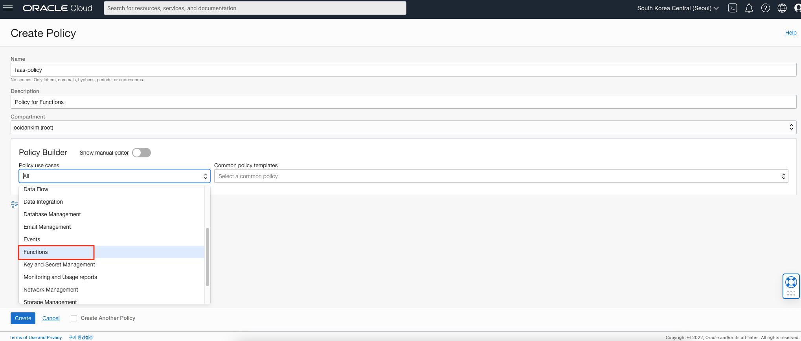
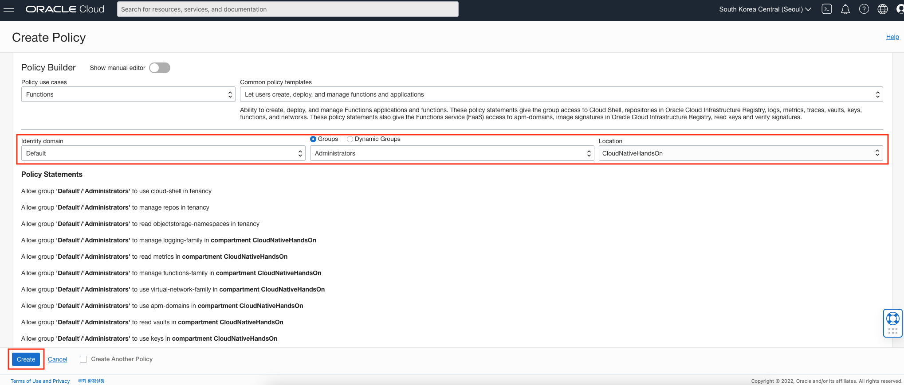
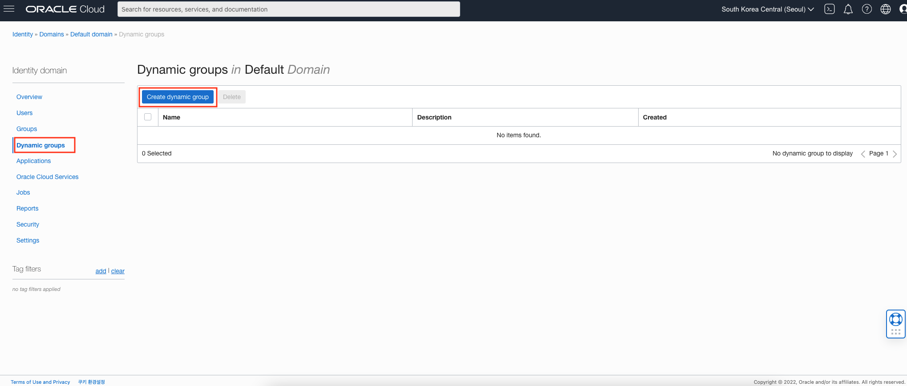

# Functions을 위한 사전준비

## 소개

Functions 실습을 진행하기 전에 사전에 준비해야 하는 내용을 설명합니다.

소요시간: 10 minutes

### 목표

- Functions를 위한 VCN 생성
- Oracle Functions를 사용하기 위한 Policy 생성
- 다이나믹 그룹 생성

### 사전 준비사항

1. 실습을 위한 노트북 (Windows, MacOS)
1. Oracle Free Tier 계정
1. Lab 1 완료 (Compartment 생성 필요)

## Task 1: VCN과 Subnet 생성

1. 좌측 상단의 **햄버거 아이콘**을 클릭하고, **Networking**, **Virtual Cloud Networks** 선택

  

1. 이전 랩에서 생성한 Compartment (CloudNativeHandsOn) 선택를 선택.
1. **Start VCN Wizard**를 클릭하고, **VCN with Internet Connectivity** 선택, **Start VCN Wizard** 클릭
  

1. 생성할 VCN 이름 입력 (e.g. `myvcn-1`)후 **Next** 클릭 (CIDR 블럭은 기본 값을 사용합니다.)

  

1. **Create** 클릭

  

## Task 2: Oracle Functions 서비스를 위한 Policy 구성

> **Note**: Policy 생성을 위해서는 관리자 그룹이 필요합니다.

1. 좌측 상단의 **햄버거 아이콘 메뉴** 클릭, **Identity & Security**, **Policies** 선택

  

1. Compartment는 **root compartment** 선택
1. **Create Policy** 클릭
1. Policy 이름 입력 (e.g. `faas-policy`)
1. Description 입력 (e.g. `Policy for Functions`)
1. Policy Builder 영역에서 **Policy use cases**로 Functions 선택
  
1. 그룹 (Administrators)과 Compartment (CloudNativeHandsOn) 선택
1. Policy 정책 확인 후 **Create** 버튼 클릭
  

사용자가 위의 Policy 구문에서 사용된 그룹(Administrators)에 속하는지 확인합니다. 만약 추가적으로 그룹을 생성하고 그룹에 사용자를 추가하려면 [Create a group](https://docs.cloud.oracle.com/en-us/iaas/Content/Identity/Tasks/managinggroups.htm#To)을 참조하세요.

> **Note**: 클라우드 계정을 처음 생성할 때 등록한 사용자는 기본적으로 Administrators 그룹에 속한 사용자입니다. 추가적으로 사용자를 생성하거나, 다른 그룹을 생성하여 사용하는 경우에는 해당 그룹으로 Policy를 정의합니다.

## Task 3: 동적 그룹 (Dynamic Group) 생성

다른 OCI 서비스와 연동하기 위해서는 Function이 **Dynamic Group**에 속해야 합니다. Dynamic Group 생성에 대한 자세한 내용은 [documentation](https://docs.cloud.oracle.com/iaas/Content/Identity/Tasks/managingdynamicgroups.htm#To)를 참조하십시오.

Dynamic Group을 생성하기 위해서는 Compartment의 OCID가 필요합니다.

1. 좌측 상단의 **햄버거 아이콘 메뉴** 클릭, **Identity & Security**, **Compartments** 선택

1. Compartment 목록에서 생성한 Compartment (CloudNativeHandsOn)의 OCID 항목에 마우스를 올리면 OCID를 확인할 수 있습니다. Copy를 클릭하면 클립보드에 복사됩니다. OCID값은 Dynamic Group생성 시 사용됩니다.

  

1. Dynamic Group 생성을 위해서 **Identity & Security**의 **Domains**를 클릭합니다.

  

1. Default 도메인을 클릭한 후 **Dynamic Group**을 클릭, **Create dynamic group**을 클릭합니다.

  

1. Dynamic Group 이름을 입력합니다 (e.g. `functions-dynamic-group`)
1. Description을 입력합니다 (e.g. `Group with all functions in a compartment`)
1. Functions를 Dynamic Group에 속하도록 [Matching Rules](https://docs.cloud.oracle.com/en-us/iaas/Content/Identity/Tasks/managingdynamicgroups.htm#Writing)을 작성합니다. 지정한 Compartment내의 모든 Functions 애플리케이션에 적용되도록 다음과 같이 규칙을 작성합니다.

    ```shell
    <copy>
    All {resource.type = 'fnfunc', resource.compartment.id = 'ocid1.compartment.oc1..example'}
    </copy>
    ```

  *Note:* 위 (`ocid1.compartment.oc1..example`) 는 이전에 복사한 Compartment OCID로 대체합니다.

1. **Create** 버튼을 클릭하여 Dynamic Group을 생성합니다.

[다음 랩으로 이동](#next).
