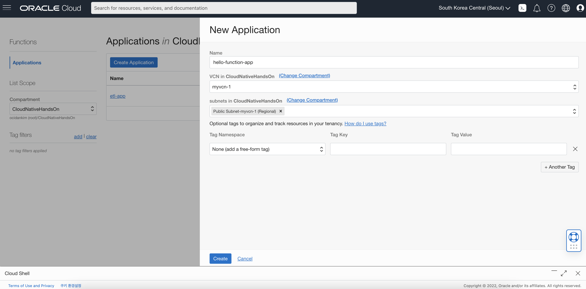

# Hello Java Function

## 소개

이 실습에서는 Oracle Function을 생성하고 파일이 Object Storage에 업로드 될 때마다 Function을 트리거하도록 구성합니다. Function에서는 파일의 내용을 읽어서 Oracle Autonomous Database로 전달하는 역할을 합니다.

소요시간: 20 minutes

### 목표

- Function 애플리케이션 생성
- Function 배포
- Event Rule 생성
- Function 테스트

### 사전 준비사항

1. 실습을 위한 노트북 (Windows, MacOS)
1. Oracle Free Tier 계정
1. **Functions 사전준비** 실습 완료
1. **Lab 5** 실습 완료

## Task 1: Function 애플리케이션 생성

이번 단계에서는 OCI Console에서 Function 애플리케이션을 생성하고 Cloud Shell에서 Fn CLI를 셋업합니다.

1. 좌측 상단의 **햄버거 아이콘 메뉴**를 클릭하고 **Developer Services**, **Applications**을 선택합니다.

    

1. 앞서 생성한 Compartment (CloudNativeHandsOn)를 선택합니다.
1. **Create Application**을 클릭합니다.
1. 이름을 입력합니다. (e.g. `hello-function-app`)
1. 앞서 생성한 VCN을 선택합니다. (e.g. `myvcn-1`).
1. Public Subnet을 선택합니다.
1. **Create** 버튼을 클릭합니다.

    

1. Application 상세화면에서 **Cloud Shell Setup**을 선택하고 **Begin your Cloud Shell session** 의 내용을 순서대로 실행하기 위해 Cloud Shell을 오픈합니다.

    

1. **Setup fn CLI on Cloud Shell** 하위 단계를 진행합니다. 본 과정을 진행하기 위해서는 Compartment OCID(단계3), repo-name-prefix(단계4), Auth Token(단계6)값이 필요합니다. Compartment OCID(Functions 사전준비 실습)와 Auth Token(Lab 2)은 앞 실습에서 사용한 값을 사용합니다.  

> **Note**: Functions을 사용하기 위해서는 클라이언트에 fn cli툴을 설치해야 합니다. (Cloud Shell에는 기본 설치) fn cli에는 OCI와 연동하기 위한 정보를 담고 있는 Context를 사전에 구성하여야 합니다. 이번 단계에서 하는 작업이 바로 Context를 구성하는 작업입니다.

**repo-name-prefix** 값은 `hellofunction`를 사용합니다.
    
> **Note**: Functions을 사용하기 위해서는 클라이언트에 fn cli툴을 설치해야 합니다. (Cloud Shell에는 기본 설치) fn cli에는 OCI와 연동하기 위한 정보를 담고 있는 Context를 사전에 구성하여야 합니다. 이번 단계에서 하는 작업이 바로 Context를 구성하는 작업입니다.

    2. fn cli에 설정된 Context 목록 조회 및 Context의 Region을 서울로 설정
    ````shell
    fn list context

    CURRENT NAME            PROVIDER        API URL                                                 REGISTRY
    *       ap-seoul-1      oracle-cs       https://functions.ap-seoul-1.oci.oraclecloud.com
            default         oracle-cs

    fn use context ap-seoul-1

    Fn: Context ap-seoul-1 currently in use
    ````

    3. Function Context의 Compartment OCID 값을 설정
    ````shell
    fn update context ocid1.compartment.oc1..example......
    ````

    4. Function 이미지가 업로드 될 Container Registry 정보
    ````shell
    fn update context registry icn.ocir.io/cnpw4jstunvc/hellofunction

    Current context updated registry with icn.ocir.io/cnpw4jstunvc/hellofunction
    ````

    6. OCIR 로그인
    ````shell
    docker login -u 'cnpw4jstunvc/oci.dan.kim@gmail.com' icn.ocir.io
    Password: 

    Login Succeeded
    ````

    7. Functions 애플리케이션 조회
    ````shell
    fn list apps

    NAME    ID
    hello-function-app      ocid1.fnapp.oc1.ap-seoul-1.aaaaaaaarnwhptydcx55k36ayzozdgflzeyx5usebidzlcpzzygr6x4x52uq
    ````

    Oracle Functions
## Task 2: function 생성, 배포, 테스트

fn cli를 위한 Context 구성이 완료되면, 이제 `fn deploy` 명령어를 사용하여 배포를 진행합니다. 배포 단계에서는 기본적을 OCIR로 이미지를 업로드하기 때문에 Docker Login이 되어 있어야 합니다.

1. OCI Functions에서 제공하는 Function Template을 생성합니다. 현재 제공되는 Function Template은 현재 go, java, node, python,  ruby를 지원합니다. Java Function을 생성합니다.

    ```shell
    <copy>
    fn init --runtime java hello-java
    </copy>
    ```

1. 생성된 Java Function 폴더로 이동합니다.

    ```shell
    <copy>
    cd hello-java
    </copy>
    ```

1. Function을 바로 배포합니다.

    ```shell
    <copy>
    fn -v deploy --app hello-function-app
    </copy>
    ```

1. 배포한 Function을 호출합니다.

    ```shell
    <copy>
    fn invoke hello-function-app hello-java
    </copy>
    ```

1. 응답 결과를 확인합니다.

    ```shell
    <copy>
    Hello, world!
    </copy>
    ```

> **Note**: Function을 외부로 오픈해야 하는 경우에는 API Gateway를 활용하여야 합니다.