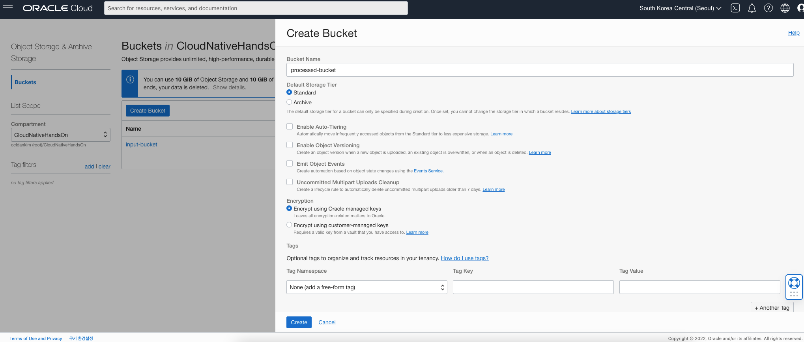
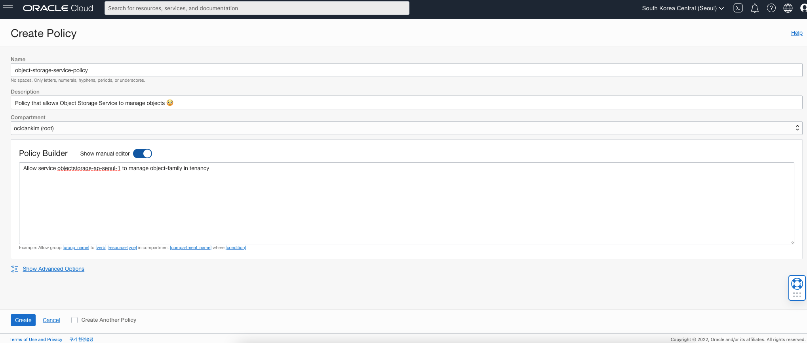
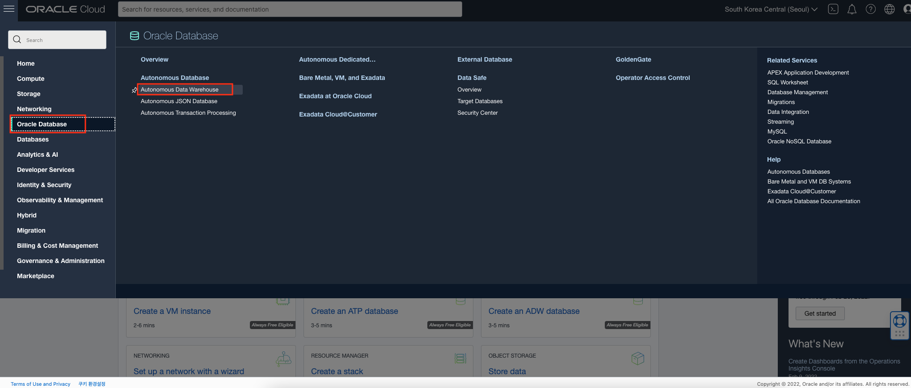
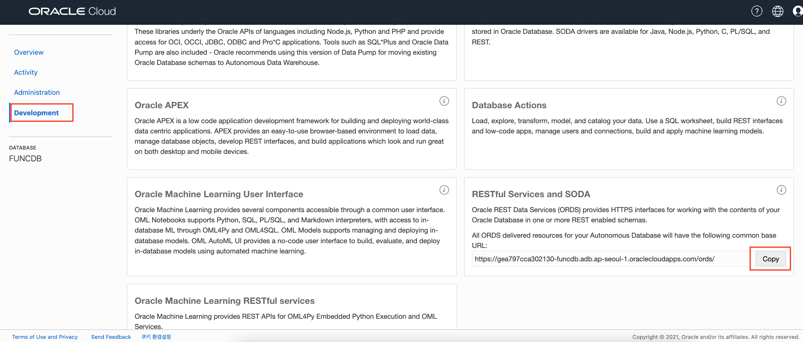

# Functions for ETL (Object Storage to ADW) #1 - 준비

## Introduction

Oracle Functions을 활용하여 Object Storage와 Autonomous Database를 연동하는 시나리오입니다. 이 실습에서는 Functions에서 연동할 객체 스토리지 버킷 및 자율 데이터베이스를 생성합니다. 

소요시간: 20 minutes

### 목표

- Object Storage Bucket 생성
- Functions에서 Bucket에 접속하기 위한 Policy 생성
- Obejct를 관리할 수 있는 Policy 생성
- Autonomous Data Warehouse Database 생성

### 사전 준비사항

1. 실습을 위한 노트북 (Windows, MacOS)
1. Oracle Free Tier 계정
1. **Functions 사전준비** 실습 완료

## Task 1: CSV 업로드를 위한 Object Storage Bucket 생성

Object Storage에 'input-bucket' Bucket을 생성합니다. 'input-bucket'으로 CSV 파일을 업로드할 것입니다. 파일이 업로드되면 Functions을 통해서 Autonomous Data Warehouse로 데이터를 전송합니다.

우선 `input-bucket`을 생성합니다.

1. 좌측 상단의 **햄버거 메뉴** 버튼을 클릭하고, **Storage**, **Buckets**을 순서대로 클릭합니다.

    

1. 생성한 Compartment (CloudNativeHandsOn)를 선택합니다.
1. **Create Bucket** 을 클릭합니다.
1. Bucket 이름을 **input-bucket** 로 입력합니다.
1. Storage tier로 **Standard** 를 선택합니다.
1. **Emit Object Events** 를 체크합니다.
1. **Create** 버튼을 클릭합니다.

    

## Task 2: 처리 완료된 파일을 위한 Object Storage Bucket 생성

Object Storage에 `processed-bucket` Bucket을 생성합니다. Functions에서 Autonomous Data Warehouse로 데이터 전송이 완료되면 해당 파일을 `processed-bucket`으로 이동합니다.

`processed-bucket`을 생성합니다.

1. 좌측 상단의 **햄버거 메뉴** 버튼을 클릭하고, **Storage**, **Buckets**을 순서대로 클릭합니다.

    

1. 생성한 Compartment (CloudNativeHandsOn)를 선택합니다.
1. **Create Bucket** 을 클릭합니다.
1. Bucket 이름을 **processed-bucket** 로 입력합니다.
1. Storage tier로 **Standard** 를 선택합니다.
1. **Create** 버튼을 클릭합니다.

    

## Task 3: Functions에서 Bucket에 접근할 수 있도록 Policy 생성

Dynamic Group(`functions-dynamic-group`)이 Bucket의 객체를 관리하도록 허용하는 정책을 생성합니다.

1. 좌측 상단의 **햄버거 메뉴** 버튼을 클릭하고, **Identity & Security**, **Policies**을 순서대로 클릭합니다.

    

1. Compartment 생성한 Compartment (CloudNativeHandsOn)을 선택합니다.
1. **Create Policy**를 클릭합니다.
1. Policy 이름을 입력합니다. (e.g. `functions-buckets-policy`)
1. Description을 입력합니다. (e.g `Policy that allows functions dynamic group to manage objects in the bucket`)
1. Policy Builder에서 `Show manual editor`를 활성화합니다.
1. 아래의 Policy 구문을 입렵합니다.:

    ```shell
    <copy>
    Allow dynamic-group functions-dynamic-group to manage objects in compartment CloudNativeHandsOn where target.bucket.name='input-bucket'
    </copy>
    ```

    ```shell
    <copy>
    Allow dynamic-group functions-dynamic-group to manage objects in compartment CloudNativeHandsOn where target.bucket.name='processed-bucket'
    </copy>
    ```

1. **Create** 클릭

    

## Task 4: Object Storage service를 위한 Policy 생성

특정 리전의 Object Storage 서비스에서 Tenancy내의 모든 Object를 관리할 수 있는 Policy를 생성합니다.

1. 좌측 상단의 **햄버거 메뉴** 버튼을 클릭하고, **Identity & Security**, **Policies**을 순서대로 클릭합니다.

1. **Create Policy**를 클릭합니다.
1. Policy 이름을 입력합니다. (e.g. `object-storage-service-policy`)
1. Description을 입력합니다. (e.g `Policy that allows Object Storage Service to manage objects 😳`)
1. Compartment는 `(root)`를 선택합니다.
1. Policy Builder에서 `Show manual editor`를 활성화합니다.
1. 아래의 Policy 구문을 입렵합니다.:

    구문의 형태는 다음과 같습니다. 여기서 region-name을 대체합니다. Region Name은 [Regions and Availability Domains](https://docs.oracle.com/en-us/iaas/Content/General/Concepts/regions.htm) 에서 확인 가능합니다. 서울의 Region Name은 **ap-seoul-1**입니다.

    `Allow service objectstorage-<region-name> to manage object-family in tenancy`

    서울로 입력
    ```shell
    <copy>
    Allow service objectstorage-ap-seoul-1 to manage object-family in tenancy
    </copy>
    ```

1. **Create** 클릭

    

## Task 5: Oracle Autonomous Data Warehouse 생성

1. 좌측 상단의 **햄버거 메뉴** 버튼을 클릭하고, **Oracle Database**, **Autonomous Data Warehouse**을 순서대로 클릭합니다.

    

1. **Create Autonomous Database** 클릭합니다.
1. Compartment는 앞에서 생성한 Compartment를 선택합니다. (CloudNativeHandsOn).
1. Display name과 Database name을 입력합니다. (e.g. `funcdb`)
1. workload type을 **Data Warehouse**로 선택합니다.
1. deployment type을 **Shared Infrastructure**로 선택합니다.
1. admin password를 입력합니다.
1. license type은 **License Included**로 선택합니다.
1. **Create Autonomous Database** 클릭합니다.

    

    Autonomous Database 프로비저닝이 완료된 후, **Service Console** 버튼을 클릭합니다.

1. 좌측의 **Development** 메뉴를 클릭합니다.
1. RESTful Services and SODA 항목에서, **Copy URL**을 클릭합니다.

    

1. OCI Cloud Shell을 오픈합니다.

    

1. OCI Cloud Shell에서 아래 명령을 실행하여 'regionsnumbers'라는 컬렉션을 만듭니다. `<ORDS_BASE_URL>`은 이전 단계에서 복사한 값으로, `<DB_PASSWORD>`는 Autonomous Database 생성 시 설정한 관리자 비밀번호로 변경합니다.

    - export env variable `ORDS_BASE_URL`:

        ```shell
        <copy>
        export ORDS_BASE_URL=<ORDS_BASE_URL>
        </copy>
        ```

    - export env variable DB_PASSWORD:

        ```shell
        <copy>
        export DB_PASSWORD=<DB_PASSWORD>
        </copy>
        ```

    - Collection 생성 `regionsnumbers`:

        ```shell
        <copy>
        curl -X PUT -u 'ADMIN:"'$DB_PASSWORD'"' -H "Content-Type: application/json" $ORDS_BASE_URL/admin/soda/latest/regionsnumbers
        </copy>
        ```

1. Collection이 생성되었는지 다시 확인하기 위해서 다음과 같이 Collection을 조회합니다.

    ```shell
    <copy>
    curl -u 'ADMIN:"'$DB_PASSWORD'"' -H "Content-Type: application/json" $ORDS_BASE_URL/admin/soda/latest/
    </copy>
    ```

    아래와 같이 결과값을 확인할 수 있습니다.

    ```bash
    {"items":[{"name":"regionsnumbers","properties":{"schemaName":"ADMIN","tableName":"REGIONSNUMBERS","keyColumn":{"name":"ID","sqlType":"VARCHAR2","maxLength":255,"assignmentMethod":"UUID"},"contentColumn":{"name":"JSON_DOCUMENT","sqlType":"BLOB","jsonFormat":"OSON"},"versionColumn":{"name":"VERSION","type":"String","method":"UUID"},"lastModifiedColumn":{"name":"LAST_MODIFIED"},"creationTimeColumn":{"name":"CREATED_ON"},"readOnly":false},"links":[{"rel":"canonical","href":"https://gea797cca302130-funcdb.adb.ap-seoul-1.oraclecloudapps.com:443/ords/admin/soda/latest/regionsnumbers"}]}],"hasMore":false}
    ```

[다음 랩으로 이동](#next).

