# OCI DevOps - Build Pipeline 실습

## 소개

OCI Build Pipeline을 구성하고 실습예제를 Build 하고 Docker 이미지를 생성하여 OCI Container Registry에 업로드하는 실습을 진행 합니다.

소요시간: 30 minutes

### 목표

- OCI DevOps 서비스의 Build Pipeline 구성 방법 및 실행 방법 학습
- OCI DevOps 서비스의 Build Pipeline 를 통해 Java 프로젝트 빌드 및 결과물 저장
- OCI DevOps 서비스의 Trigger를 이용하여 Code Repository 또는 외부 SCM에 소스코드가 Push되면 빌드를 실행 방법 학습

### 사전 준비사항

1. 실습을 위한 노트북 (Windows, MacOS)
2. Oracle Free Tier 계정
3. GitHub 계정

## Task 1: Build Pipeline 생성

> **Note**: 화면 언어는 English로 설정하고 진행합니다. 언어 변경은 우측 상단의 **Language** 아이콘을 선택하고 변경할 수 있습니다.

1. 좌측 상단의 **햄버거 아이콘**을 클릭하고, **Developer Services**을 선택한 후 **DevOps** 하위의 **Projects**를 클릭합니다.
   

2. **Create Build Pipeline**를 클릭합니다.
   

3. 다음과 같이 입력:
   - Name: Enter **SpringBootDockerPipeline**
   - **Create** 클릭
   
   

## Task 2: Container Registry Repository 생성 (개인 구획)
1. 좌측 상단의 **햄버거 아이콘**을 클릭하고, **Developer Services**을 선택한 후 **Containers & Artifacts** 하위의 **Container Registry**를 클릭합니다.
   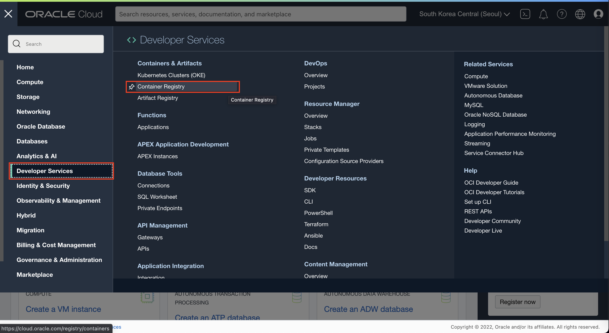
2. 좌측에 Compartment 선택 상자에서 개인별 구획 하위의 **OCIDevOpsHandsOn** 구획을 선택합니다.
   
> **Note**: Container Registry의 Repository Name은 테넌시의 모든 구획에서 유일해야 하며 동일한 이름으로 중복 생성이 불가합니다.
**_만약 업로드하려는 Repository가 존재하지 않는 경우 자동으로 root 구획 하위에 Repository가 생성 됩니다_**.

3. **Create repository** 버튼을 클릭하여 다음과 같이 입력하여 repository를 생성합니다
   - Compartment : **OCIDevOpsHandsOn**
   - Repository Name : **devops-handson-[개인 구분을 위한 이니셜]/spring-boot-docker**

   
   
   

## Task 3: Build Stage 추가

1. 생성된 Build Pipeline에서 **Add Stage**를 클릭합니다.
   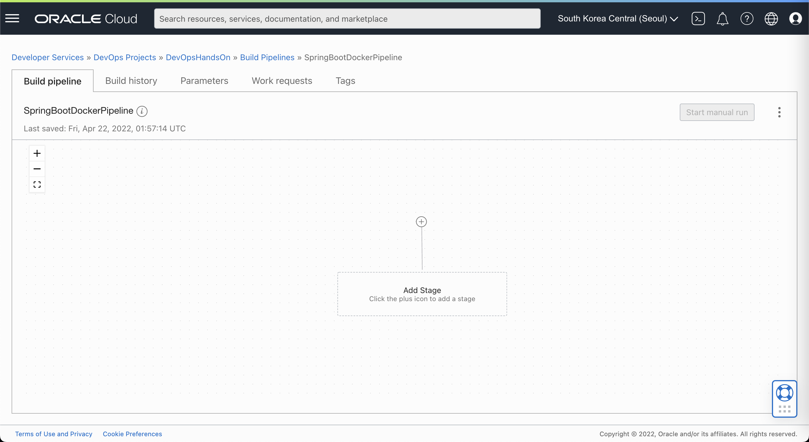

2. **Managed Build**를 선택 후 **Next**를 클릭합니다.
   

3. 다음과 같이 입력:
   - Stage Name: Enter **BuildProject**
   - Base container image : Select **Oracle Linux 7 x86_64 standard:1.0** [Default]
   - Build Spec file path : **build_spec.yml**
   - Primary code repository : **Select** 클릭

   
   - **OCI Code Repository** 선택 후 **spring-boot-docker** 선택
   - Select Branch : **main**
   - Build source name : **spring-boot-docker-source**
   - **Save** 클릭
   
   
   - **Add** 클릭 하여 Stage 추가

   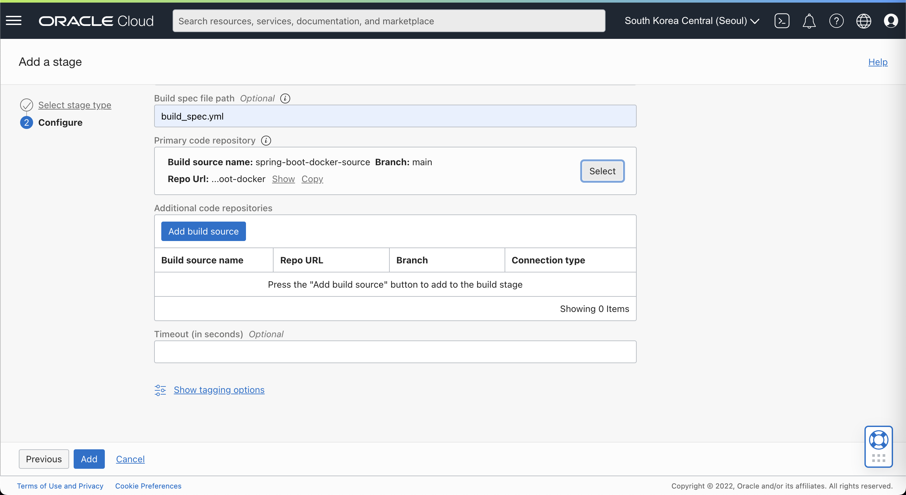

4. build_spec.yml 파일 예시
    ````yml
    version: 0.1
    component: build
    timeoutInSeconds: 6000
    shell: bash
    env:
      variables:
        appName: "spring-boot-docker"
        repoName: "devops-handson-yhcho"  #각자 경로에 맞게 수정이 필요합니다.
   
      exportedVariables:
        - APP_NAME
        - OCIR_PATH
        - TAG
   
    steps:
      - type: Command
        name: "Init exportedVariables"
        timeoutInSeconds: 4000
        command: |
        APP_NAME=$appName
        echo $APP_NAME
   
     - type: Command
       name: "Build Source"
       timeoutInSeconds: 4000
       command: |
       echo "build"
       mvn clean install

     - type: Command
       timeoutInSeconds: 400
       name: "Build Source - Post"
       command: |
       echo "add dependency"
       mkdir -p target/dependency && (cd target/dependency; jar -xf ../*.jar)

     - type: Command
       name: "Define Image Tag - Commit ID"
       timeoutInSeconds: 30
       command: |
       COMMIT_ID=`echo ${OCI_TRIGGER_COMMIT_HASH} | cut -c 1-7`
       BUILDRUN_HASH=`echo ${OCI_BUILD_RUN_ID} | rev | cut -c 1-7`
       [ -z "$COMMIT_ID" ] && TAG=$BUILDRUN_HASH || TAG=$COMMIT_ID

     - type: Command
       name: "Define OCIR Path"
       timeoutInSeconds: 30
       command: |
       TENANCY_NAMESPACE=`oci os ns get --query data --raw-output`
       REPO_NAME=$repoName/$appName
       OCIR_PATH=$OCI_RESOURCE_PRINCIPAL_REGION.ocir.io/$TENANCY_NAMESPACE/$REPO_NAME

     - type: Command
       timeoutInSeconds: 400
       name: "Containerize"
       command: |
       docker build -t new-generated-image .
       docker images

     - type: Command
       name: "Check exportedVariables"
       timeoutInSeconds: 30
       command: |
       [ -z "$APP_NAME" ] && APP_NAME=unknown          
       [ -z "$OCIR_PATH" ] && OCIR_PATH=unknown    
       [ -z "$TAG" ] && TAG=unknown
       echo "APP_NAME: " $APP_NAME      
       echo "OCIR_PATH: " $OCIR_PATH
       echo "TAG: " $TAG

    outputArtifacts:
      - name: output-image
        type: DOCKER_IMAGE
        location: new-generated-image
   ````

5. Cloud Shell을 이용하여 build_spec.yml 파일의 **repoName** 을 각자 경로에 맞게 수정합니다.
   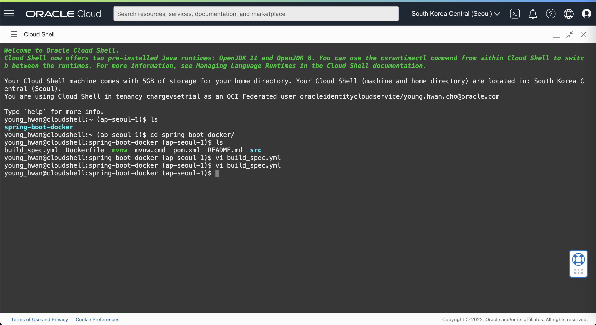
   

6. 수정 후 아래 명령어를 이용하여 변경사항을 Commit & Push 합니다.
      ````shell
       <copy>
       git add .
       git commit -m "repoName change"
       git push -u origin main
       </copy>
      ````
   - UserName은 [Tenancy ID]/[User ID] 로 구성됩니다. (예시, dudghks34/oracleidentitycloudservice/dudghks34@gmail.com)
   - Password는 생성한 Auth Token을 입력합니다

## Task 3: Deliver Artifacts Stage 추가

1. 생성된 BuildProject Stage 하단에 **(+)** 버튼을 클릭하여 **Add Stage** 메뉴를 클릭합니다.
   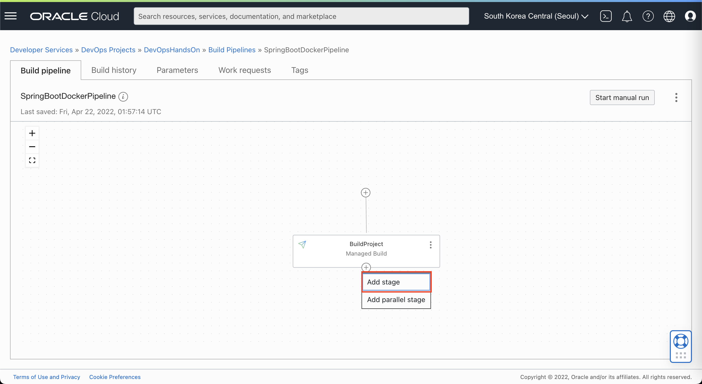

2. **Deliver Artifacts** 선택 후 **Next** 버튼을 클릭합니다.
   

3. **Create artifact** 를 클릭하여 생성한 Image를 저장할 Artifact를 2개 추가합니다. 
      
   
4. 다음과 같이 입력:
   - Name : **generated\_image\_with\_tag**
   - Type : Container image repository
   - Artifact source : **${OCIR_PATH}:${TAG}**
   - **Add** 버튼을 클릭하여 Artifact를 추가합니다

   
5. 다음과 같이 입력:
   - Name : **generated\_image\_latest**
   - Type : Container image repository
   - Artifact source : **${OCIR_PATH}:latest**
   - **Add** 버튼을 클릭하여 Artifact를 추가합니다

   
6. 다음과 같이 입력:
   - generated\_image\_latest (Build config/result artifact name): **output-image**
   - generated\_image\_with\_tag (Build config/result artifact name): **output-image**
   - **Add** 버튼을 클릭하여 Artifact를 추가합니다

   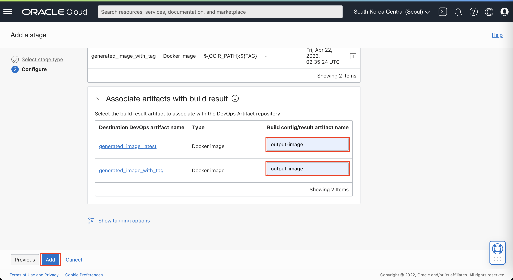

## Task 4: Trigger 생성 및 빌드 실행 결과 확인

1. DevOps 프로젝트 우측 메뉴에서 **Triggers** 를 클릭 후 **Create Trigger** 버튼을 클릭합니다.
   

2. 다음과 같이 입력합니다:
   - Name : **TriggerForSpringBootDocker**
   - Source connection : **OCI Code repository**
   - **Select** 클릭

   

3. **spring-boot-docker** 선택 후 **Save** 버튼을 클릭합니다.
   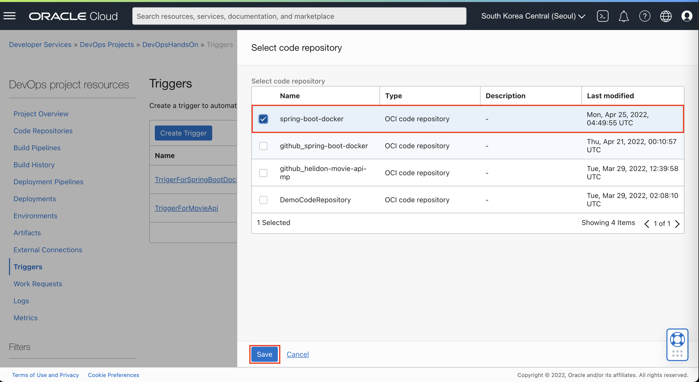

4. **Add action** 버튼을 클릭합니다.
   

5. build pipeline을 선택하는 화면에서 **Select** 버튼을 클릭하여 **[SpringBootDockerPipeline]**을 선택 후 **Save** 버튼을 클릭합니다.
   
   

6. Event 의 **Push**를 선택 후 다음과 같이 입력합니다:
   - Source branch : **main**
   - **Save** 버튼을 클릭합니다.

   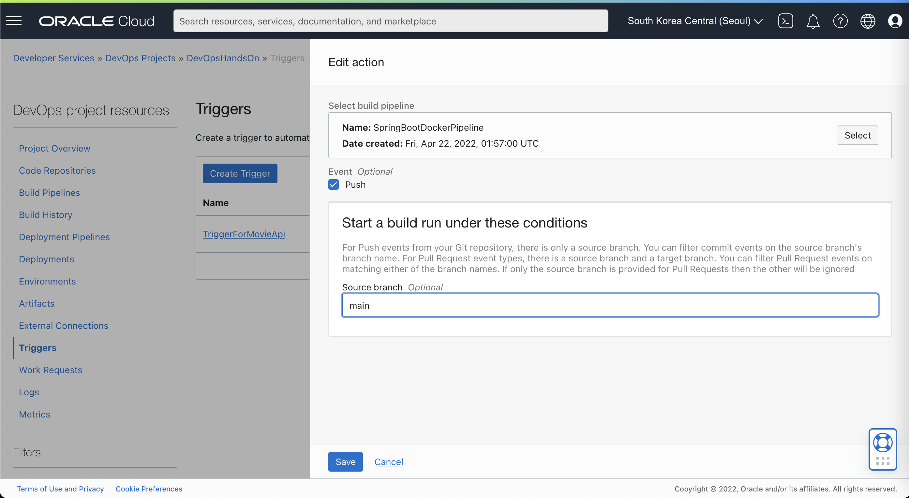
   - **Create** 버튼을 클릭하여 Trigger를 생성합니다.

   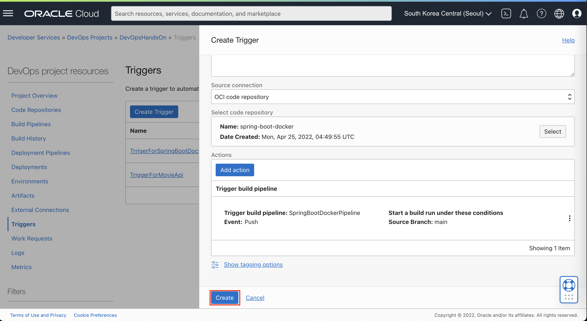

7. Cloud Shell을 실행하여 아래 경로로 이동하여 소스코드의 메시지를 변경 후 저장합니다.
      ````shell
      <copy>
      cd spring-boot-docker/src/main/java/hello
      vi Application.java
      </copy>
      ````
   
8. 수정 후 아래 명령어를 입력하여 변경된 소스를 Commit & Push 합니다.
      ````shell
      <copy>
      git add .
      git commit -m "change message"
      git push -u origin main
      </copy>
      ````
   - UserName은 [Tenancy ID]/[User ID] 로 구성됩니다. (예시, dudghks34/oracleidentitycloudservice/dudghks34@gmail.com)
   - Password는 생성한 Auth Token을 입력합니다
9. Push 후 Build가 Trigger 되었는지 확인합니다.
   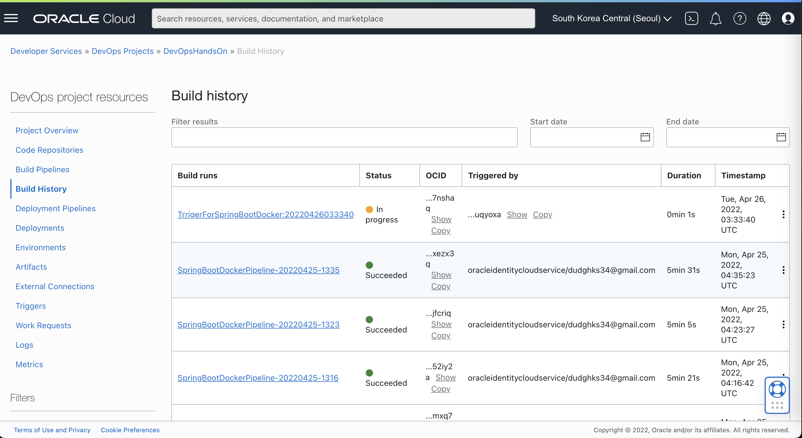

10. 빌드 실행 결과 확인 및 우측상단 더보기 버튼 클릭 후 **View Detail** 버튼을 클릭하여 빌드 실행 결과를 확인합니다.
    
    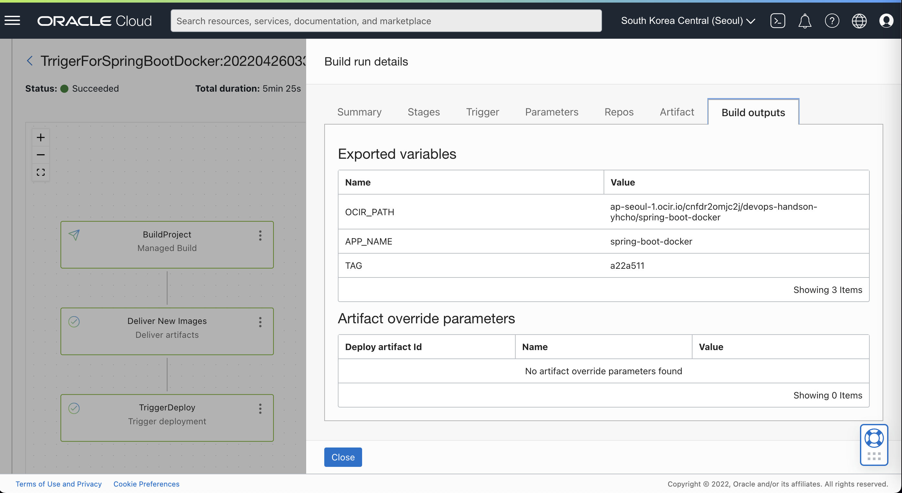
   
11. 빌드 결과가 Container Registry에 저장되었는지 확인 합니다.
   
   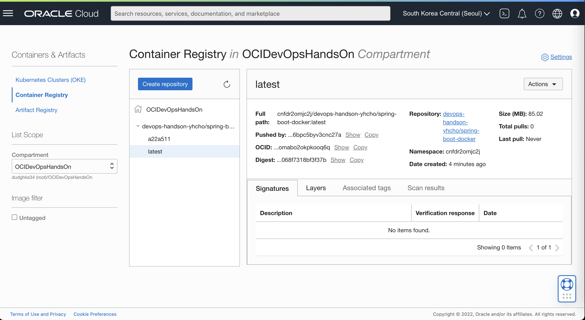

## Task 5:(Option) Build Pipeline 수동실행

1. Build Pipeline 우측 상단의 **Manual Run**을 클릭하여 빌드 실행
   

2. 좌측 하단  **Start manual run** 버튼을 클릭하여 수동 빌드 실행
   


[다음 랩으로 이동](#next)
