# Deployment Pipeline을 이용하여 OCI 환경에 배포하기

## 소개
OCI에서는 OCI DevOps나 Jenkins와 같은 CI 도구를 통해 생성된 결과를 배포하기 위한 서비스인 Deployment Pipeline을 제공하고 있습니다.
Instance Group이나 OKE(Oracle Kubernetes Engine), Funtions 과 같은 환경에 간편하게 배포할 수 있는 Pipeline을 구성 할 수 있으며, 본 실습에서는 Instance Group에 배포하는 실습을 진행합니다.


소요시간: 30 minutes

### 목표

- Oracle Cloud Infrastructure (OCI) DevOps Deployment Pipeline 구성
- Rolling Deploy 단계 구성 및 실습
- Blue/Green Deploy 단계 구성 및 실습
- Canary Strategy Deploy 단계 구성 및 실습

### 사전 준비사항

1. 실습을 위한 노트북 (Windows, MacOS)
1. Oracle Free Tier 계정


## Task 1: Deployment Pipeline 생성
1. 좌측 상단의 **햄버거 아이콘**을 클릭하고, **Developer Services**을 선택한 후 **DevOps - Projects**를 클릭합니다.
   
2. **Create pipeline** 버튼을 클릭 후 다음과 같이 입력합니다:
   - Pipeline name : **DeploySpringBootImagePipeline**
   - **Create pipeline** 버튼을 클릭하여 pipeline을 생성합니다.
   
   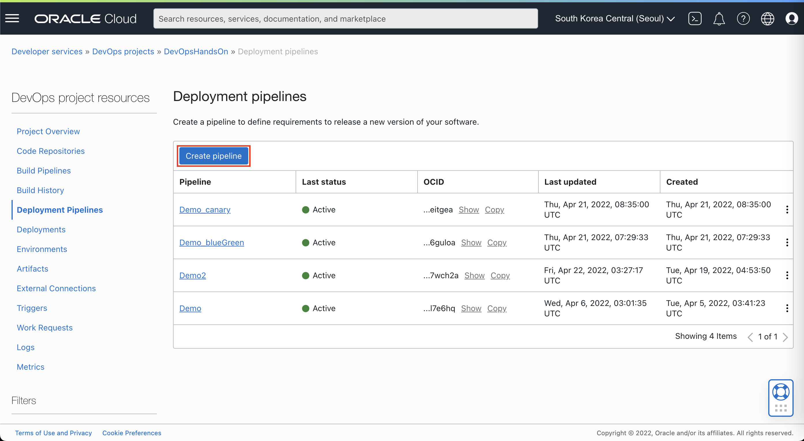
   
3. Pipeline 생성 완료
   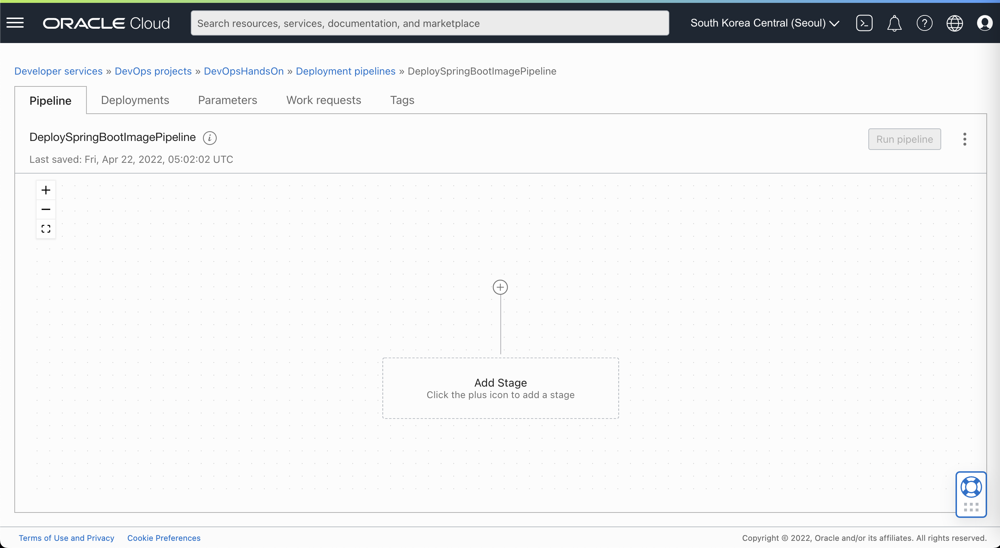
4. Pipeline 상세보기 화면에서 Parameter Tab을 클릭 하여 다음과 같이 파라미터를 추가 합니다.
   - REGISTRY_USERNAME : **cnfdr2omjc2j/oracleidentitycloudservice/dudghks34@gmail.com** [tenancy object storage namespace]/[사용자ID] 입력합니다.
   - Tenancy Object Storage Namespace 확인
     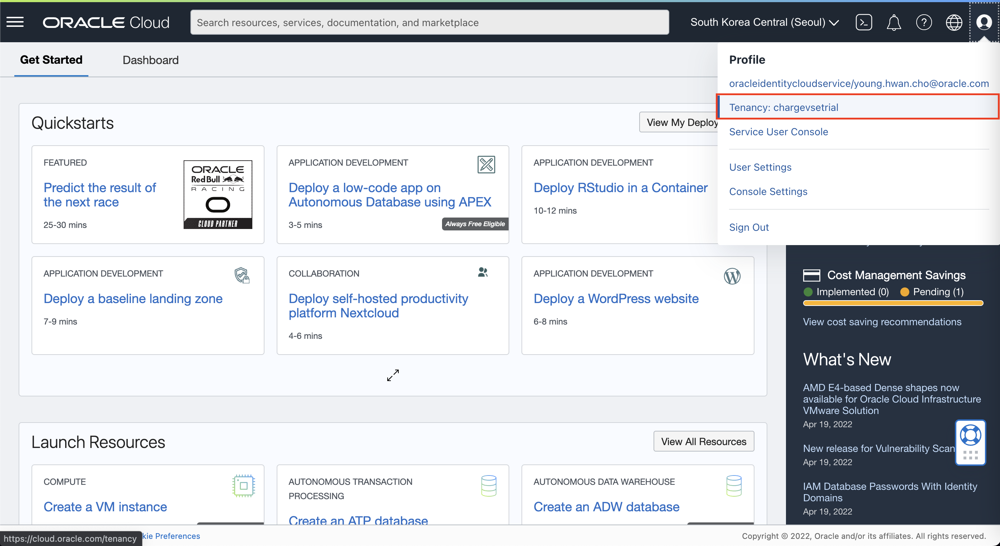
     
   - REGISTRY_TOKEN : 앞서 생성한 Auth Token 값을 입력합니다.
   - DOCKER_REGISTRY : **ap-seoul-1.ocir.io**
   
   

## Task 2: Environments 생성 (Instance Group)
1. DevOps 프로젝트 좌측 메뉴중 **Environments** 를 클릭합니다.
   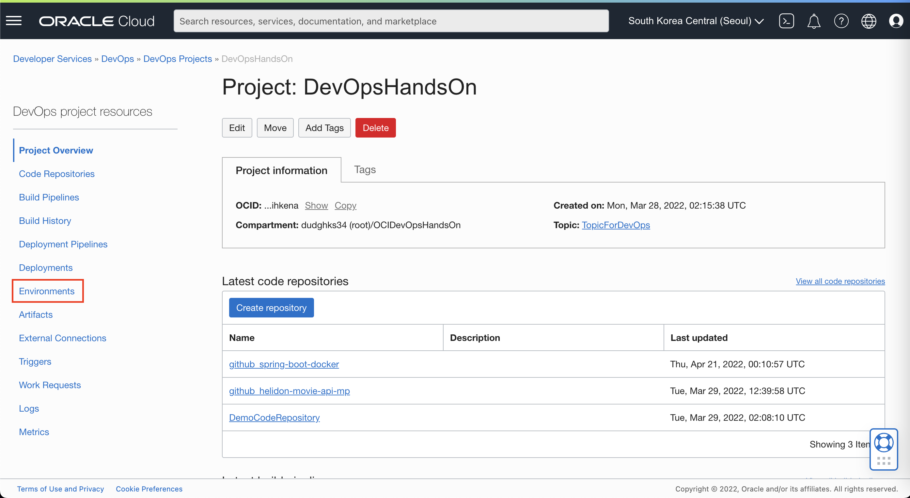
2. **Create environment** 버튼을 클릭합니다
   
3. Instance Group를 선택 후 다음과 같이 입력하여 **Next**를 클릭합니다.
   - Name : **instanceGroupForRolling**
   
   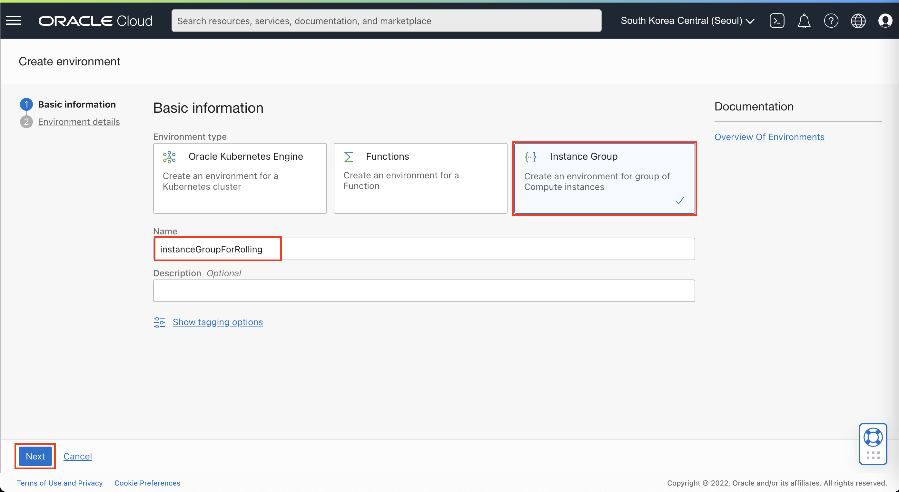
4. Filter 방식을 선택 후 **Add Instance** 버튼을 클릭합니다
   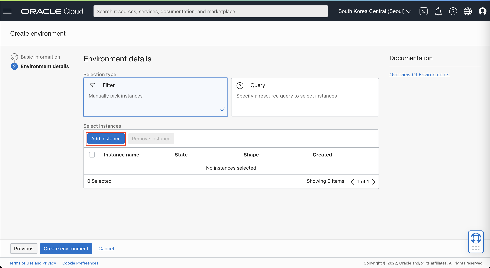
5. Comparment를 확인 후 사전에 생성한 **instanceForDemoApp** 인스턴스를 선택하여 **Add Instance** 버튼을 클릭합니다
   
6. **Create environment** 버튼을 클릭하여 환경을 생성합니다.
   
   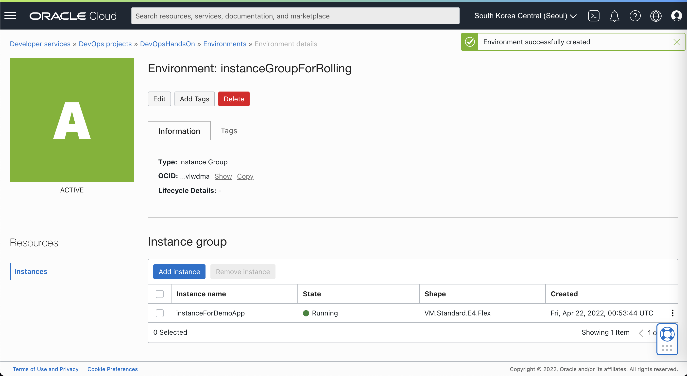

## Task 3: Deployment Configuration Artifact 생성

### Artifact Registry 생성

1. **햄버거 메뉴**를 클릭한 후, **Developer Services**, **Artifact Registry**를 선택합니다.
   

2. **OCIDevOpsHandsOn** 컴파트먼트를 선택한 후에 **Create repository**를 클릭합니다.
3. 다음과 같이 입력:
   - Name: Enter **artifactRegistryForDevOps**
   - Compartment : **OCIDevOpsHandsOn**
   - **Immutable artifacts 선택 활성화**
   - **Create** 클릭

   

4. 생성된 Artifact Registry에서 **Upload artifacts** 클릭하여 artifact 업로드
   - [remove\_all\_container.sh](files/remove_all_container.sh) 파일 다운로드
      ````shell
      #!/bin/bash

      if [ -z "`docker ps -qa`" ]; then
         echo "No Docker Container Running"
      else
         docker rm -f $(docker ps -qa)
      fi
      ````
   - Artifact path : **remove\_all\_container.sh**
   - Version : **0.1**
   - **Upload** 클릭

   
   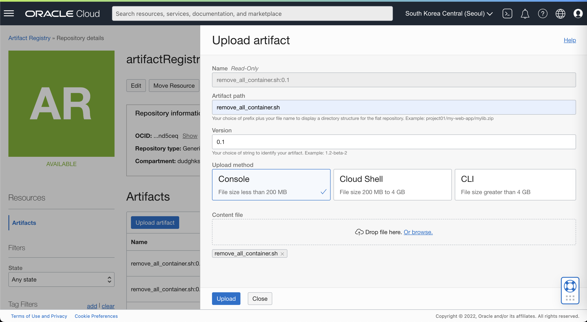
   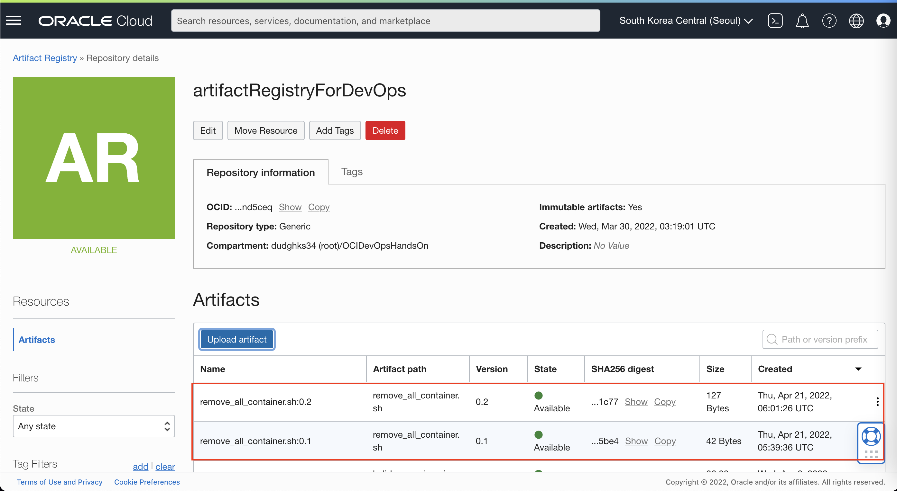

5. DevOps Project의 **Artifacts** 메뉴로 이동하여 **Add artifact** 버튼을 클릭합니다.
6. 다음과 같이 입력 후 순차적으로 진행 합니다.
   - Name : **remove\_all\_container.sh**
   - Type : **General artifact**
   - Artifact source : **Artifact Registry repository**
   - **Select** 클릭
   
   

7. **artifactRegistryForDevOps**를 선택 후 **Select** 버튼을 클릭합니다.
   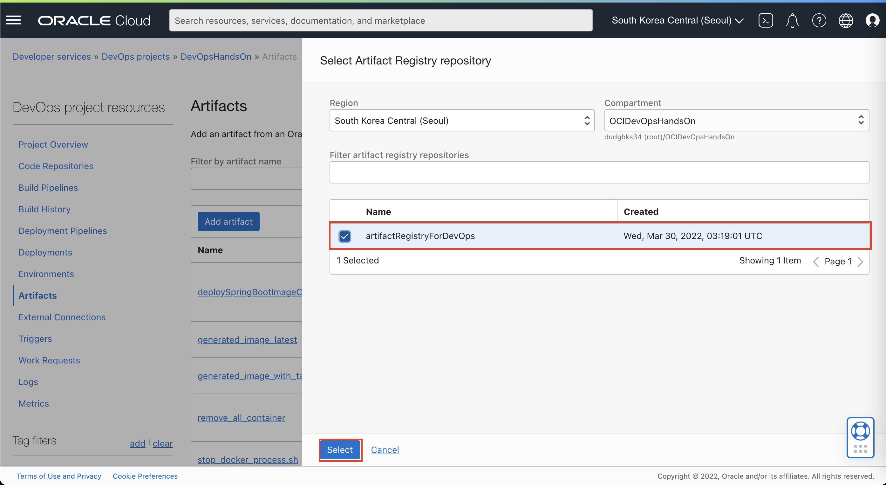

8. **Select Existing Location** 선택 후 **Select** 버튼을 클릭합니다.
   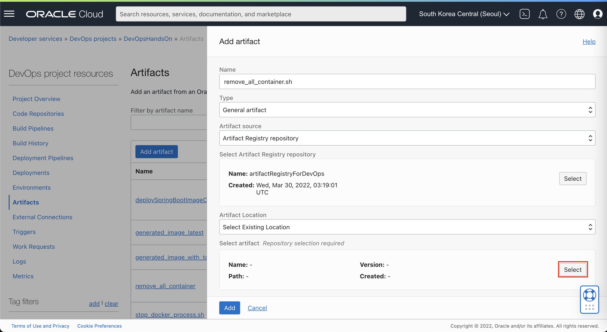

9. **remove_all_container.sh** 선택 후 **Select** 버튼을 클릭합니다.
   

10. **add** 버튼을 클릭하여 Artifact를 추가 합니다.
   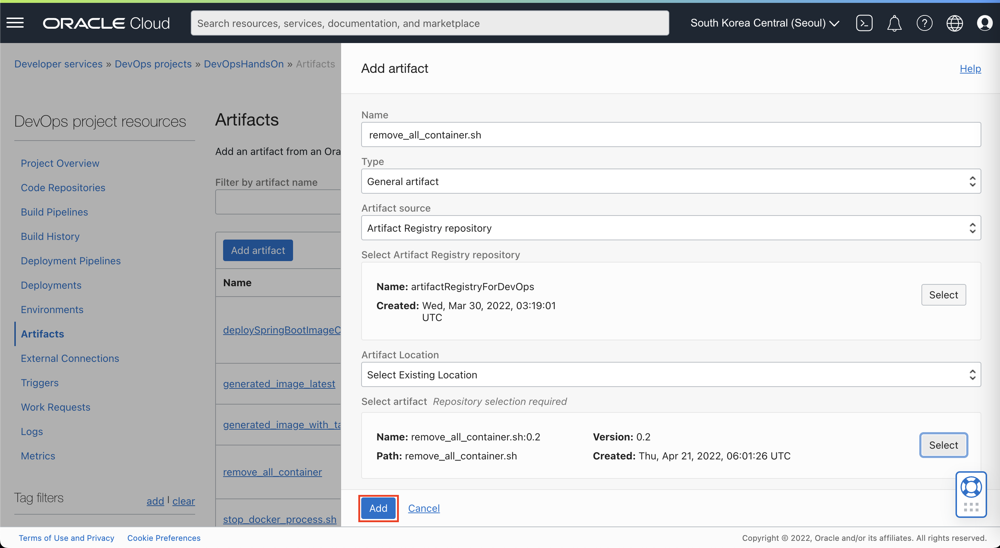

### Deployment Configuration Artifact  생성
1. DevOps Project의 **Artifacts** 메뉴로 이동하여 **Add artifact** 버튼을 클릭합니다.
2. 다음과 같이 입력 후 순차적으로 진행 합니다.
   - Name : **deploySpringBootImageConfig**
   - Type : **Instance group deployment configuration**
   - Artifact source : **inline**
   - Config 내용 [파일 다운로드](files/deploy_config.yml)
      ````yml
        <copy>
        version: 1.0
        component: deployment
        runAs: root
        env:
          variables:
            version: 0.1
        files:
          # This section is to define how the files in the artifact shall
          # be put on the compute instance
          - source: /
            destination: /tmp/genericArtifactDemo
        steps:
          - stepType: Command
            name: stop & remove all docker container
            command: /tmp/genericArtifactDemo/remove_all_container.sh
            runAs: root
            timeoutInSeconds: 600
          - stepType: Command
            name: Login to OCI Registry
            command: |
              docker login -u ${REGISTRY_USERNAME} -p '${REGISTRY_TOKEN}' ${DOCKER_REGISTRY}
            runAs: root
            timeoutInSeconds: 600
          - stepType: Command
            name: pull Docker Image from OCI Registry
            command: |
              docker pull ${OCIR_PATH}:${TAG}
            runAs: root
            timeoutInSeconds: 600
          - stepType: Command
            name: Run spring boot docker demo
            command: |
              docker run -d -p 8080:8080 -t ${OCIR_PATH}:${TAG}
            runAs: root
            timeoutInSeconds: 600
        </copy>
      ````
   - **Add** 버튼을 클릭하여 Artifact를 추가합니다

   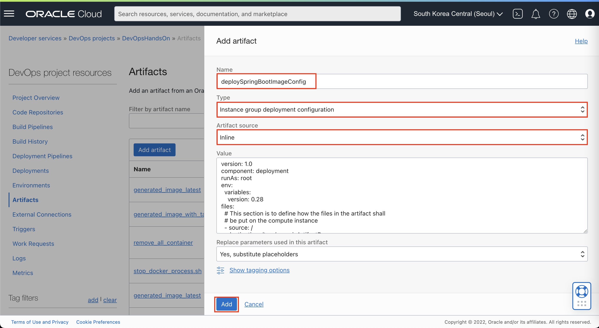

## Task 4: Instance Group: Rolling Deploy Stage 생성 및 반영 테스트
1. **_Task 1_**에서 생성한 DeploySpringBootImagePipeline 상세보기 화면으로 이동합니다.
2. **Add Stage** 버튼을 클릭 후 Rolling Deploy Type을 선택하여 **Next** 를 클릭합니다.
   
   
3. 다음과 같이 입력합니다:
   - Name : **DeploySpringBootApp**
   - Environment : **instanceGroupForRolling**
   - Deployment configuration : **Select Artifact** 클릭

   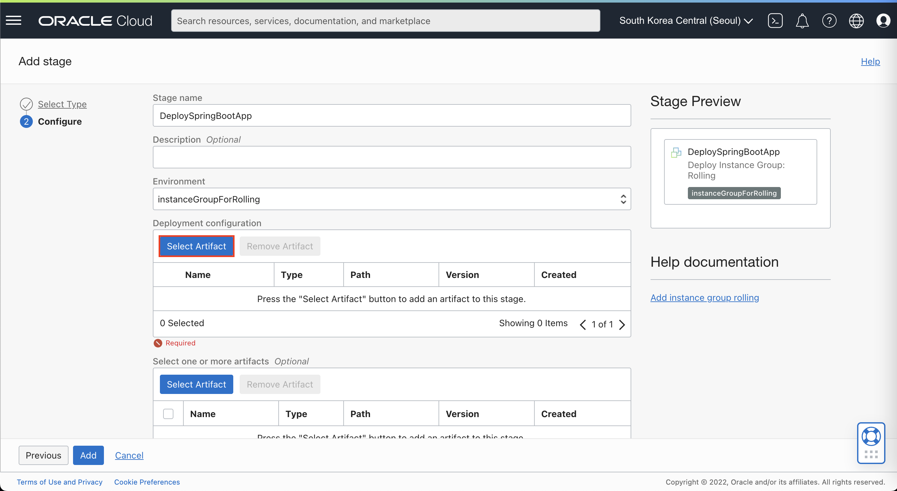
   - deploySpringBootImageConfig 선택 후 **Save Change** 클릭
   
   
   - Select one or more artifacts : **Select Artifact** 클릭
   
   
   - **remove_all_container.sh** 선택 후 **Save Change** 클릭   

   
   - 하단 스크롤 이동 후,
   - Instance rollout by percentage : **100**
   - **Add** 버튼 클릭

   

4. Build Pipeline에서 Deploy Pipeline을 실행 시키기 위해 [SpringBootDockerPipeline] 으로 이동 후 아래 순서대로 Stage를 추가 합니다.
   - **Deliver New Images** 하단 (+) **Add stage** 버튼 클릭
   
   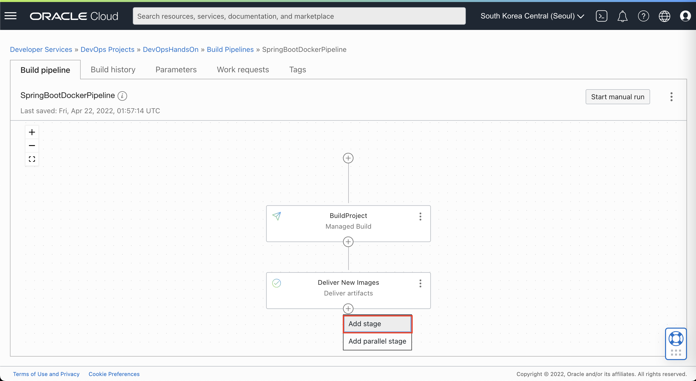
   - Trigger deployment 선택 후 **Next** 버튼 클릭

   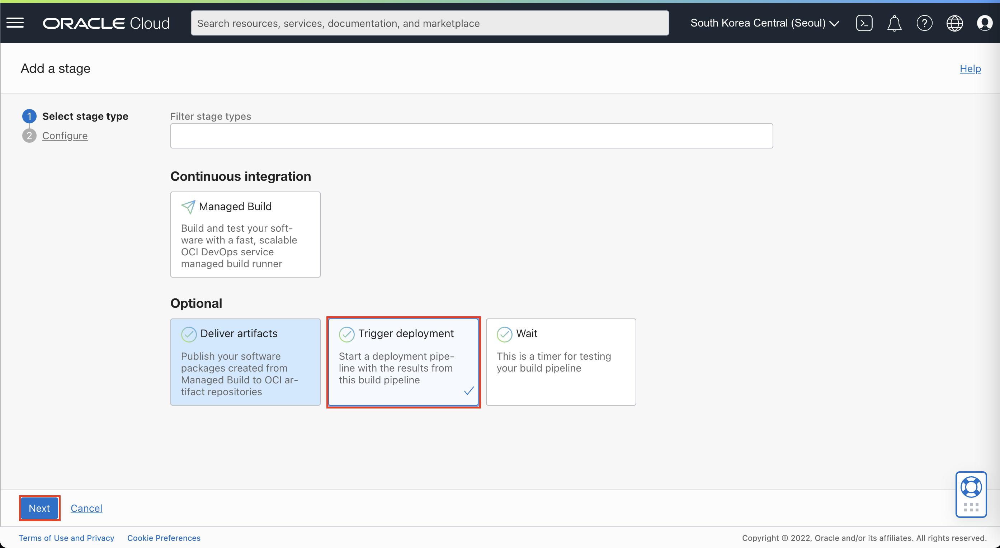
   - Name : **TriggerDeploy**
   - **Select deployment pipeline** 클릭

   
   - **DeploySpringBootImagePipeline** 선택 후 **Save** 버튼 클릭

   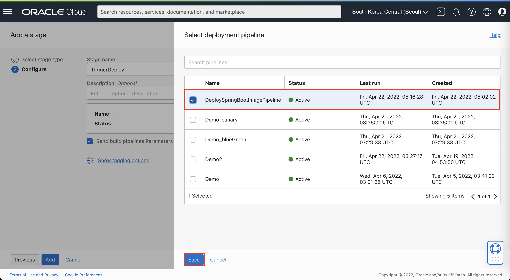
   - **Send build pipeline Parameters** 선택 후 **Add** 버튼 클릭

   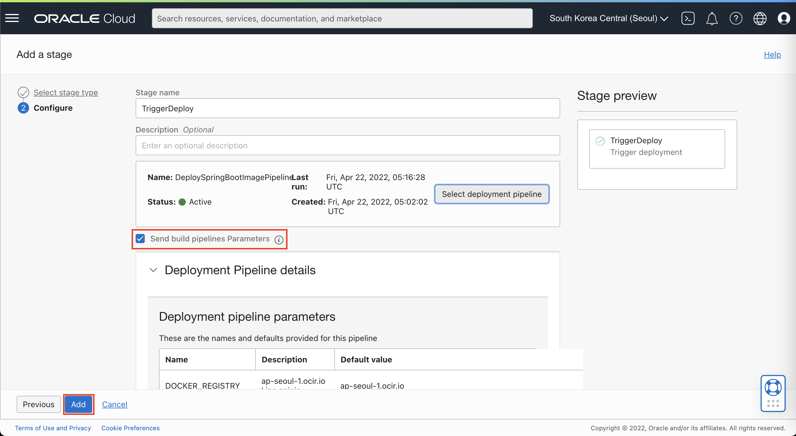

5. Build Pipeline & Deploy Pipeline 실습
   - Build Pipeline으로 이동 후 우측 상단 **Start manual run** 클릭

   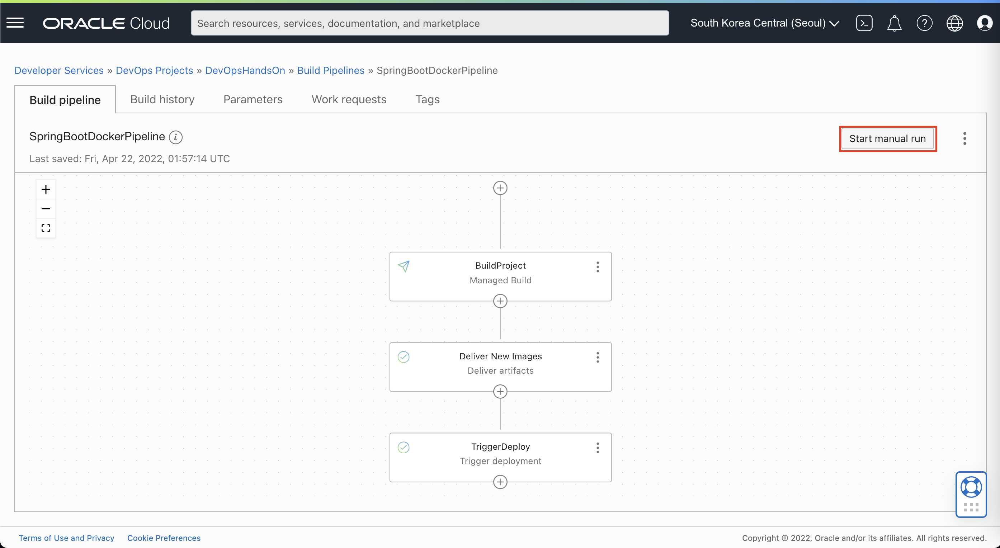
   - 좌측 하단 **Start manual run** 클릭   

   
   - Build Pipeline 실행 완료 후 Deploy Trigger 여부 / Deploy 빌드 정상 실행 확인

   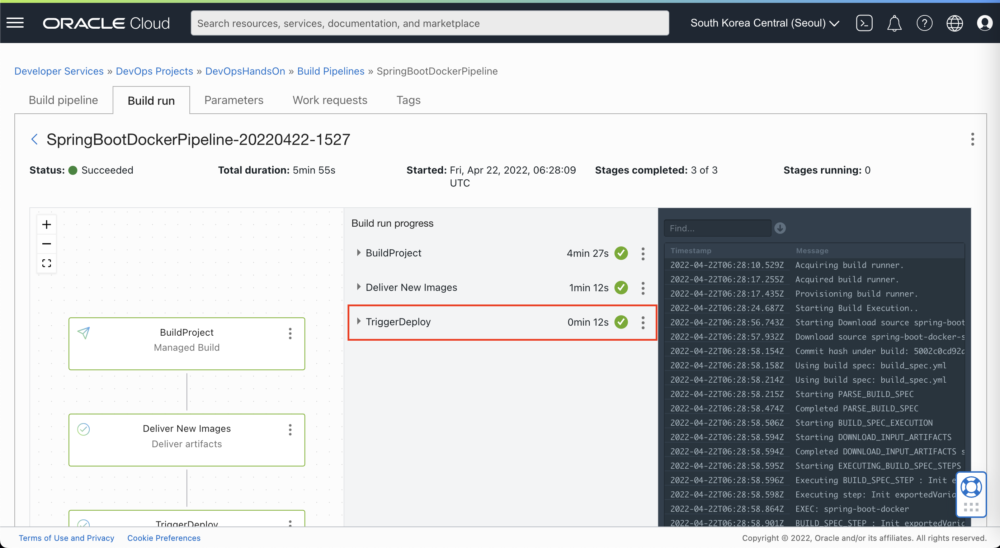
   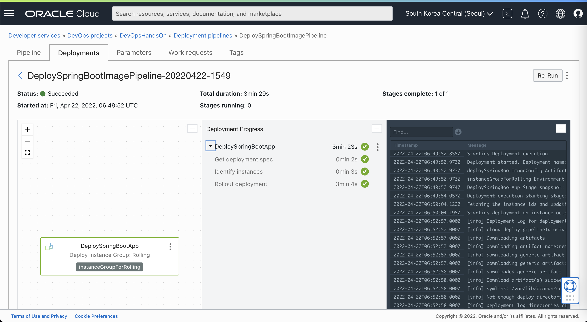
   - Docker Container 확인 및 Spring boot 접속 확인
    ````
     docker ps -aa
    ````

   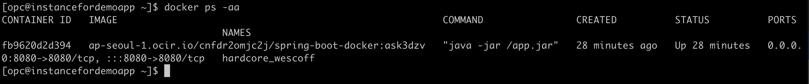
    ````
     http://instance-public-ip-address:8080/
    ````

   

## Task 5: (Option) Instance Group: Blue/Green Deploy Stage 생성 및 반영 테스트

### 커스텀 이미지 생성
1. instanceForDemoApp 인스턴스 상세보기 화면에서 **Stop** 버튼을 클릭하여 인스턴스를 중지 합니다.
   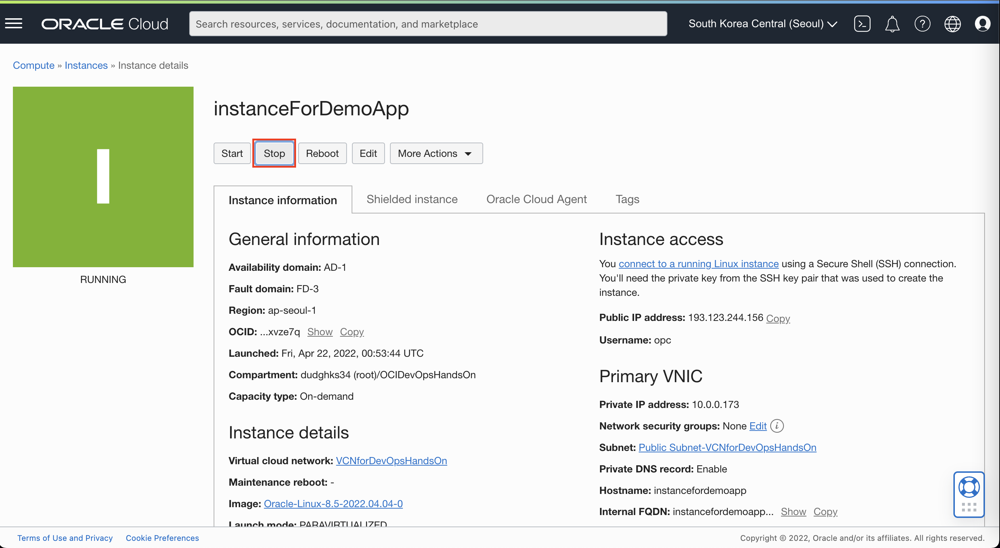
   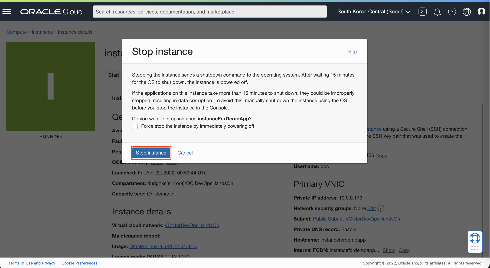
2. **More Action** 버튼 클릭 후 **Create Custom Image** 를 클릭합니다.
   
   - 다음과 같이 입력:
   - Create in Compartment : **OCIDevOpsHandsOn**
   - Name : **DevOpsHandsOn**
   - **Create customer image** 버튼을 클릭하여 Custom Image를 생성합니다 (2~3분 소요됨)
   
   
   
3. 좌측 상단의 **햄버거 아이콘**을 클릭하고, **Compute**을 선택한 후 **Instances**를 클릭합니다.
   
4. Custom Image 생성 완료 후 해당 이미지를 사용하여 인스턴스를 추가로 생성합니다.
   - **Create Instance** 버튼을 클릭합니다.
   
   
5. 다음과 같이 입력합니다:
   - Name : **instanceForBlueGreenDemo**
   - Create in compartment : **OCIDevOpsHandsOn**
   
   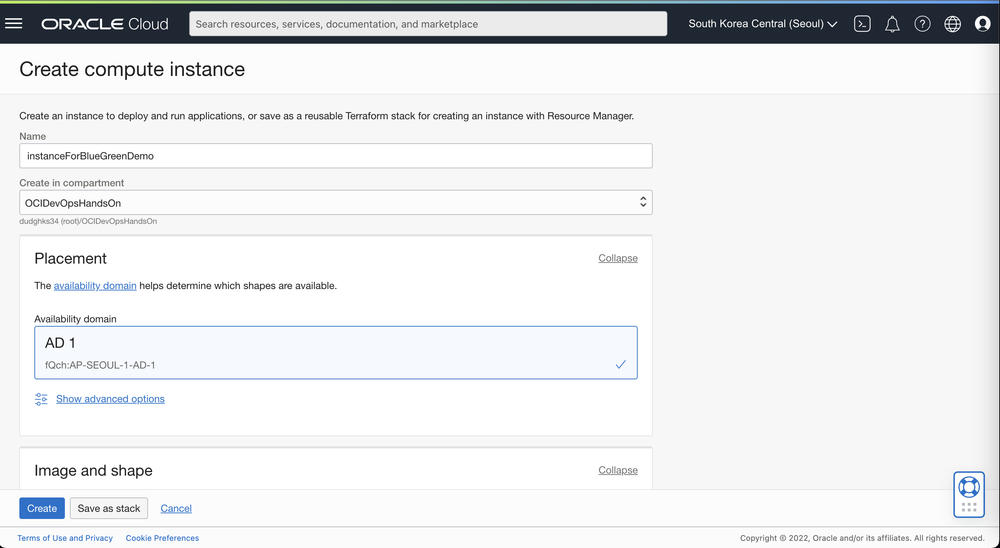
6. **Change Image** 버튼을 클릭하여 **Custom Image** 를 선택하여 생성한 Custom Image로 인스턴스를 생성합니다.
   
   
7. **SSH Key는 사전준비과정에서 생성한 Key를 활용 합니다.**
8. 기타 나머지 설정은 기본 설정으로 진행합니다.
9. 생성된 이미지에 접속하여 아래 명령어를 실행합니다.
   - sudo chmod 777 /var/run/docker.sock
   - 컨테이너 ID 확인 : docker ps -aa
   - docker start [CONTAINER ID]

### Load Balancer 생성 및 설정
1. 좌측 상단의 **햄버거 아이콘**을 클릭하고, **Networking**을 선택한 후 **Load Balancers**를 클릭합니다.
   
2. **Create Load Balancer** 버튼을 클릭 합니다.
   
3. 상단 **Load Balancer** 선택 후 하단 **Create Load Balancer** 버튼을 클릭합니다.
   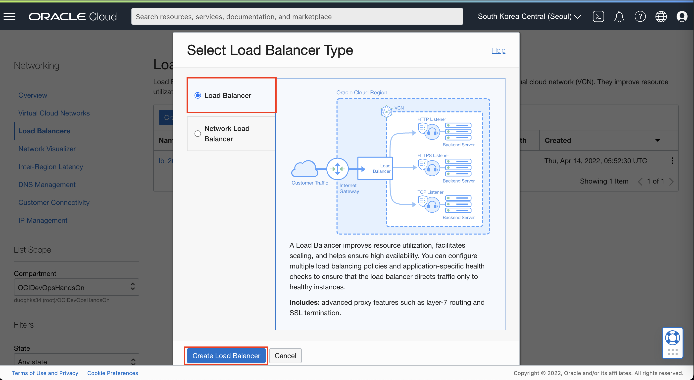
4. 다음과 같이 입력 합니다:
   - Load Balancer Name : **lbForDevOpsDemo**
   - Choose visibility type : **Public**
   - Assign a Public IP Address : **Ephermeral IP Address**

   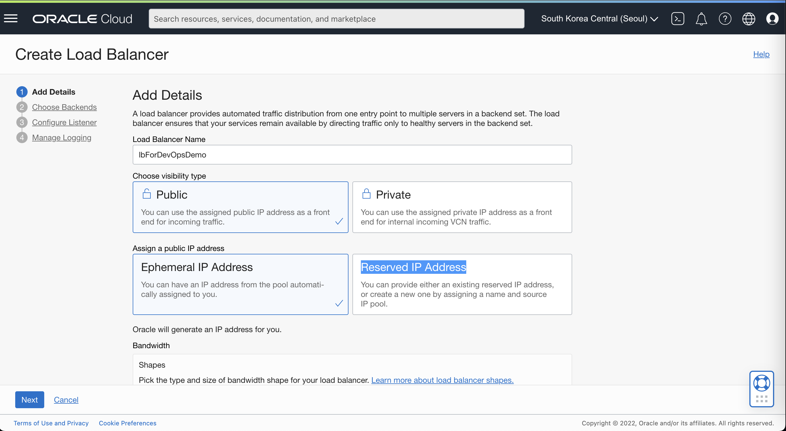
   - bandwidth : **min 10 Mbps / max 10 Mbps** [기본값] 
   - Virtual Cloud Network : **VCNForDebOpsHandsOn**
   - Subnet : **Public Subnet-VCNForDevOpsHandsOn**
   - **Next** 클릭

   
5. **Weighted Round Robin** 선택 후 **Add Backends**를 클릭하여 백엔드셋을 추가 합니다.
   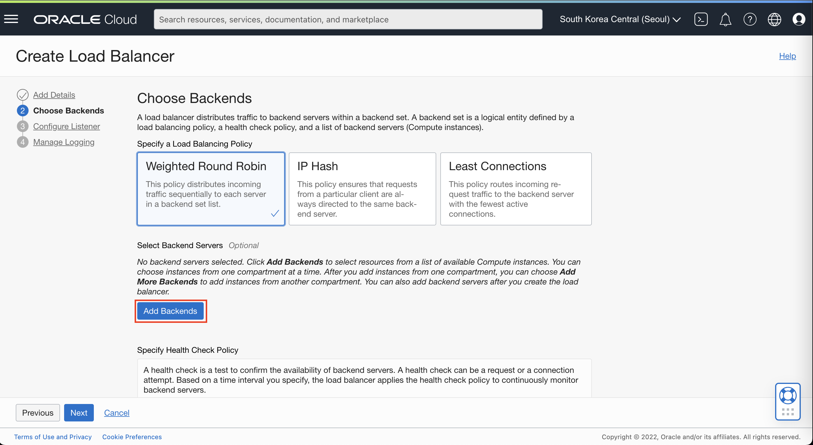
   - 생성한 인스턴스 2개 모두 선택   

   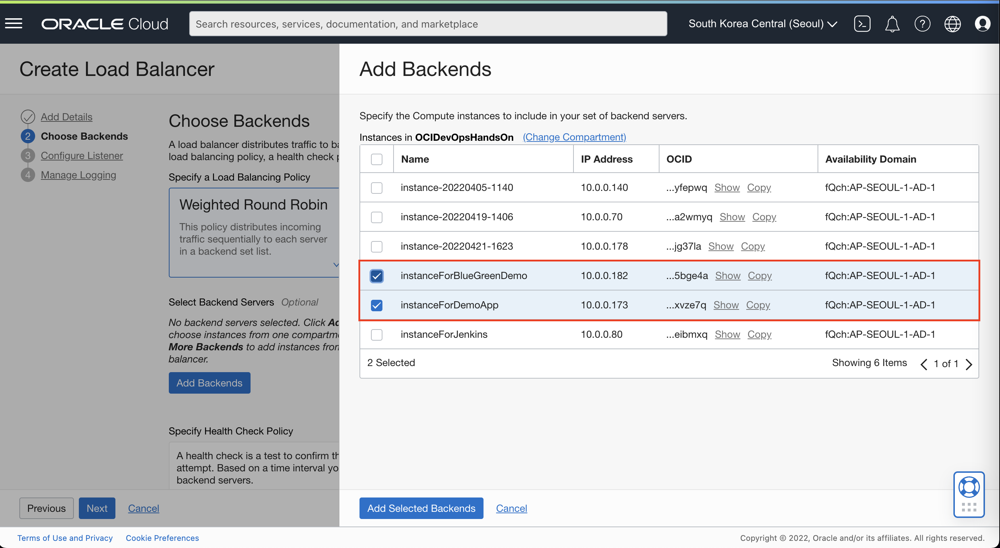
   - Backend Port 및 Health Check Port를 **8080** 으로 지정합니다.
   - Health Check Protocol을 **TCP**로 지정합니다
   - **Next** 클릭

   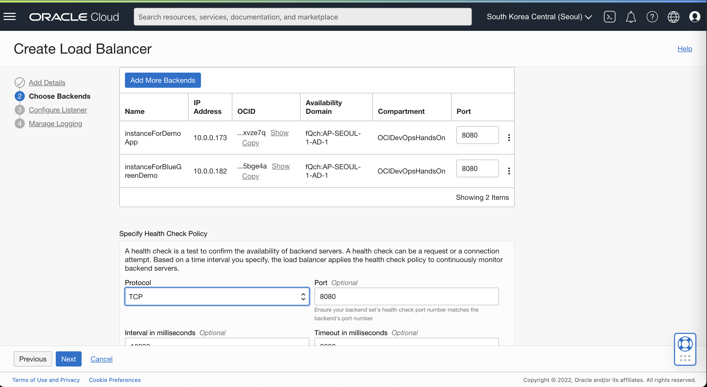

6. Listener를 다음과 같이 설정 합니다.
   - Listener Name : **listener\_lb\_for\_devops\_demo**
   - Listener Protocol : **HTTP**
   - Listener Port : **80**
   
   
7. Load Balancer 로그를 다음과 같이 설정 합니다.
   - Error Logs : **Enabled**
   - 기타 설정은 기본값으로 지정합니다.
   - **Submit** 버튼을 클릭하여 Load Balancer를 생성합니다.
   
   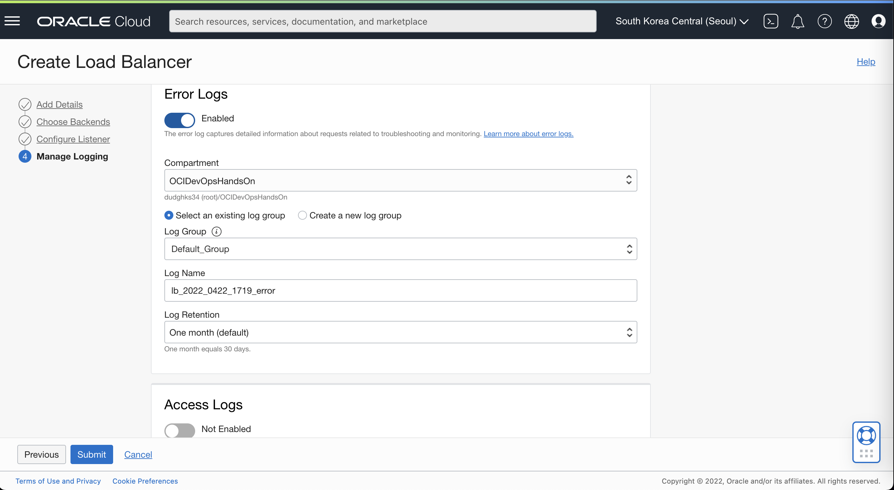

### Blue/Green Deployment 테스트 환경 생성
1. DevOps Project [**DevOpsHandsOn**] 의 Environment 메뉴로 이동하여 **Create environment** 버튼을 클릭합니다.
   
2. 다음과 같이 입력 합니다:
   - Environment Type : **Instance Group**
   - Name : **envForBlueGreenDemo**
   - **Next** 클릭
   
   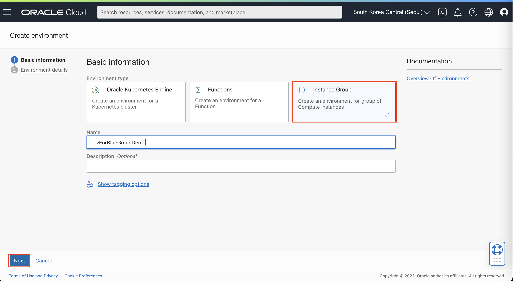
3. **instanceForBlueGreenDemo** 선택 후 **Add instance** > **Create environment**를 클릭하여 환경을 생성합니다.
   
   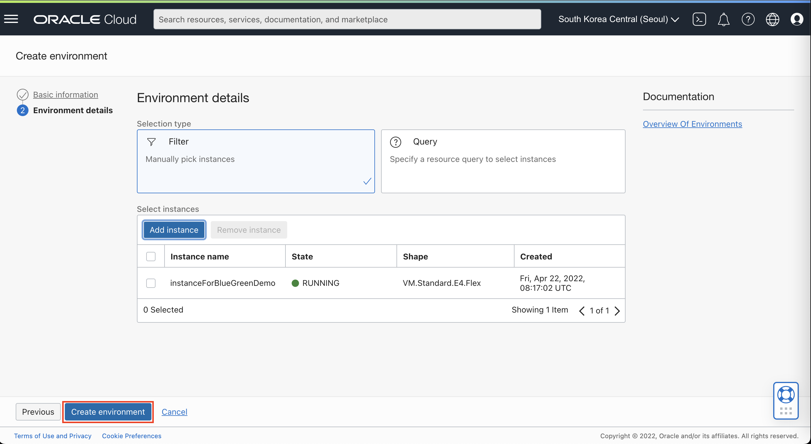

### Blue/Green Strategy 생성
1. DevOps 프로젝트의 **Deployment pipeline** 메뉴로 이동하여 **Create pipeline** 버튼 클릭 후 다음과 같이 입력하여 Pipeline을 생성합니다.
   - Pipeline name : **DeployBlueGreenDemoPipeline**   

   
2. 화면 중앙 **Add Stage** 버튼을 클릭합니다.
   
3. **Blue/Green Strategy** 선택 후 **Next**를 클릭합니다.
   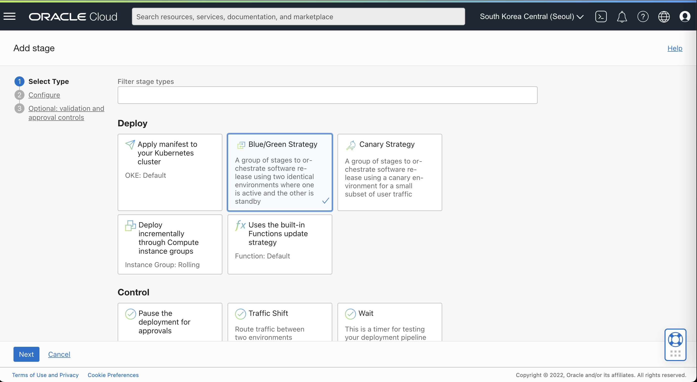
4. 다음과 같이 입력합니다:
   - Deployment type : **Instance Group**
   - Stage name : **BlueGreenDeploy**
   - Environment A : **instanceGroupForRolling** **_[기존 Application이 활성화 되어있는 환경]_**
   - Environment B : **envForBlueGreenDemo** **_[새로운 Application이 배포될 환경]_**
   
   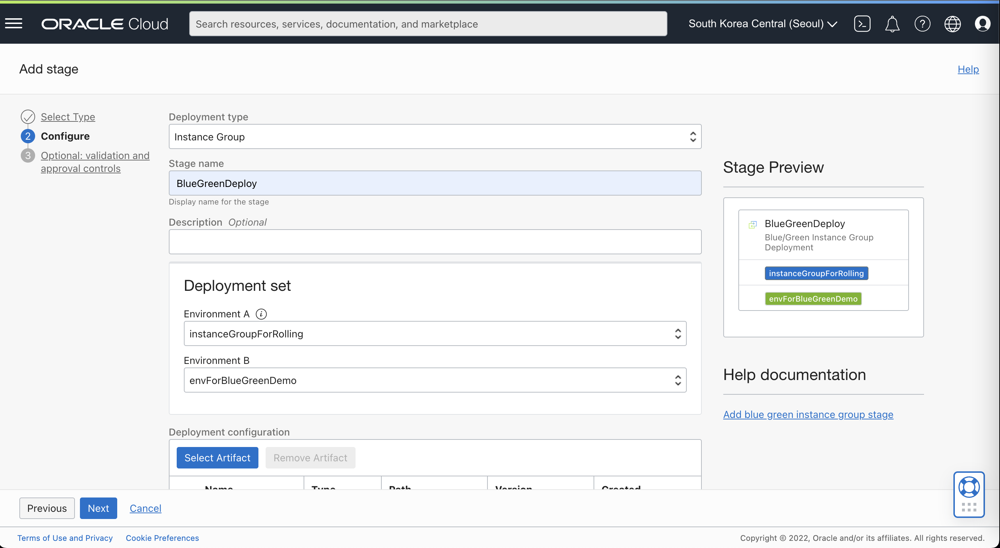
5. **Deployment configuration** 의 **Select Artifact**버튼을 클릭하여 다음과 같이 Artifact를 선택합니다.
   
6. 추가 Artifact에 기존 컨테이너 종료 및 삭제를 위한 스크립트 Artifact를 선택 및 추가합니다.
   
7. 앞 단계에서 생성한 Load balancer **_[lbForDevOpsDemo]_**를 선택합니다.
   
8. 앞 단계에서 생성한 Listener  **_[listener\_lb\_for\_devops\_demo]_**를 선택합니다.
   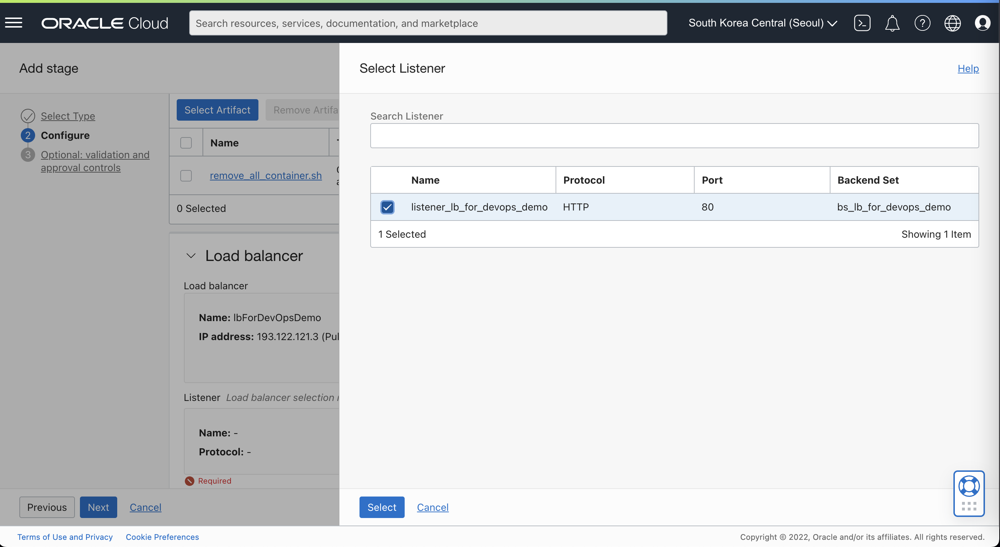
9. 다음과 같이 입력 합니다:
   - Backend port : **8080**
   - Rollout policy : **Instance rollout by percentage**
   - Instance rollout by percentage : **100**
   - **Next** 클릭

   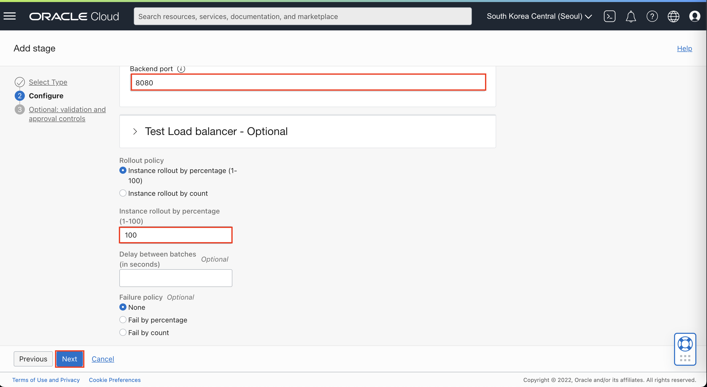
10. 입력 내용 확인 후 **Add** 버튼을 클릭하여 Stage를 추가합니다.
    
11. Pipeline 상세보기 화면에서 Parameter Tab을 클릭 하여 다음과 같이 파라미터를 추가 합니다. 
   - REGISTRY_USERNAME : **cnfdr2omjc2j/oracleidentitycloudservice/dudghks34@gmail.com** [tenancy명]/[사용자ID] 입력합니다.
   - REGISTRY_TOKEN : 앞서 생성한 Auth Token 값을 입력합니다.
   - DOCKER_REGISTRY : **ap-seoul-1.ocir.io** 

   

### Blue/Green Strategy 테스트
1. Spring Boot Application의 메시지를 변경하여 Commit & Push 합니다. **_(상세설명..? 예를들어 클라우드 쉘에서 해본다거나...?)_**
   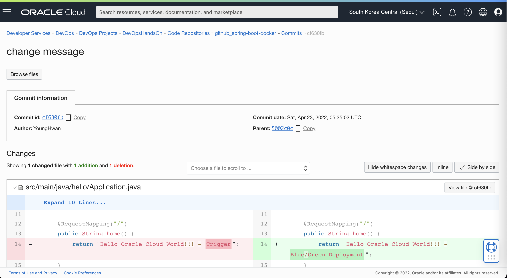
2. 기존 메시지 확인 (Load Balancer) - **Hello Oracle Cloud World!!! - Trigger**
   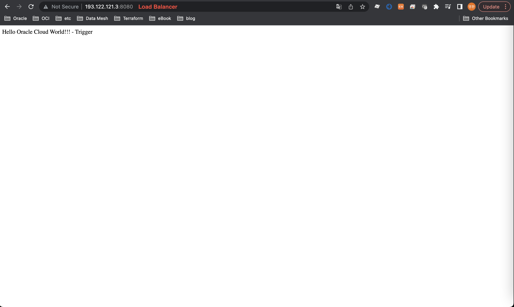
3. 배포 전 로드밸런서 Backends 확인 (Blue/Green)
   
4. 테스트를 위해 Build Pipeline에 Trigger Stage의 Deploy Pipeline을 변경합니다.
   - DeploySpringBootImagePipeline -> **DeployBlueGreenPipeline**

   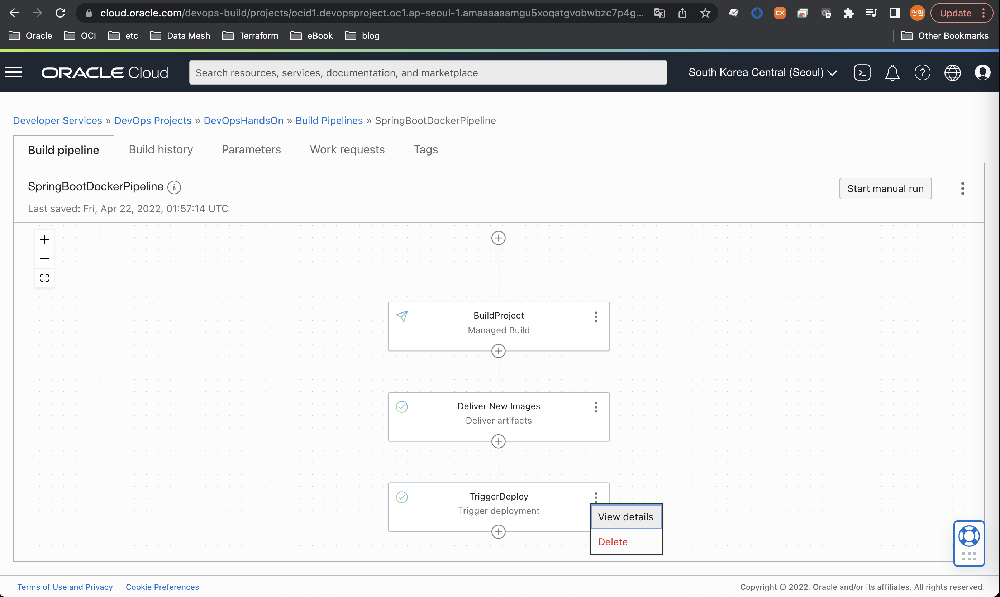
   
   
   
5. Build Pipeline을 실행합니다. (Build/Deploy 실행 완료 확인)
   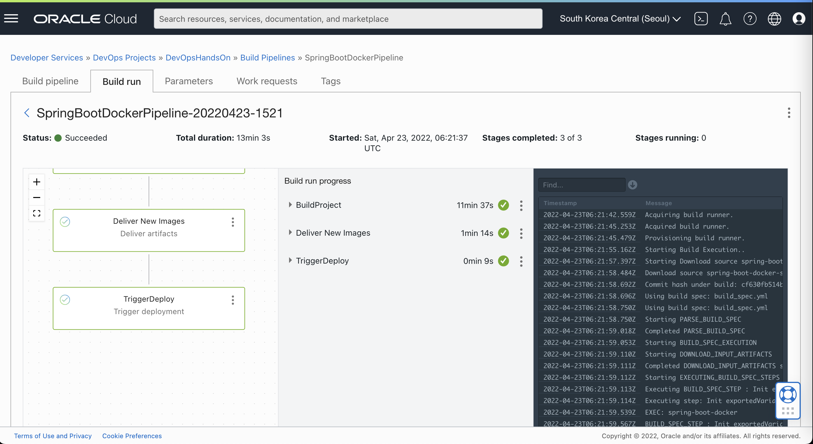
   
6. 배포 후 로드밸런서 Backends 확인 (Blue/Green) _blue 환경이 Drained 되었습니다._
   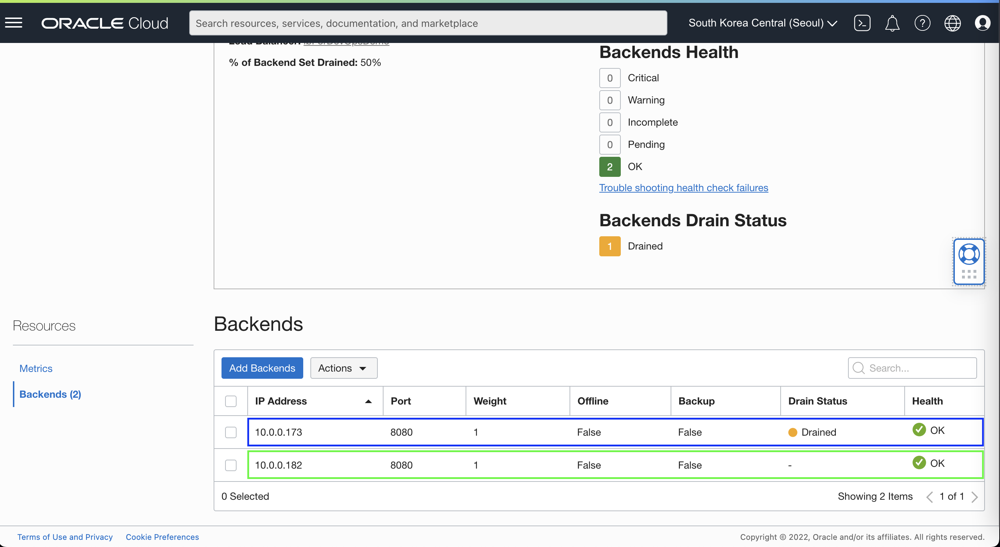
7. 배포 후 각 환경의 메시지를 확인합니다.
   
   
   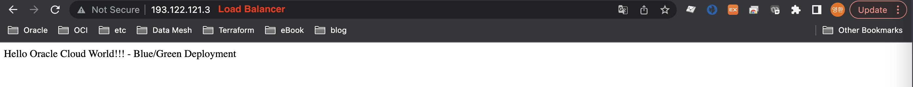

[다음 랩으로 이동](#next)
