# Jenkins CI + OCI DevOps CD 환경 준비

## 소개

Jenkins CI Pipeline과 OCI DevOps CD Pipeline 환경을 연동하는 실습을 진행하기 위한 환경을 준비합니다.

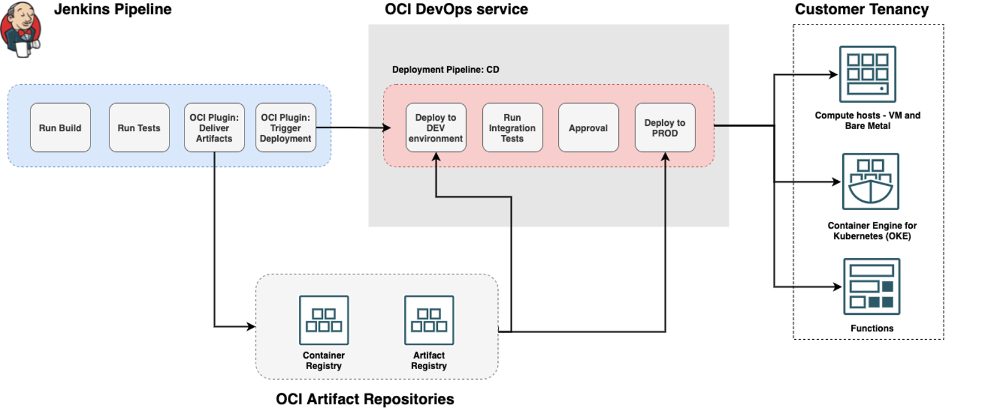

소요시간: 30 minutes

### 목표

-  Oracle Cloud Infrastructure (OCI) Cloud Native 환경 구성.  

### 사전 준비사항

1. 실습을 위한 노트북 (Windows, MacOS)
1. Oracle Free Tier 계정

## Task 1 : Compute Instance 생성 및 Instance 기본 설정

> **Note**: 화면 언어는 English로 설정하고 진행합니다. 언어 변경은 우측 상단의 **Language** 아이콘을 선택하고 변경할 수 있습니다.

### Instance 생성

1. 좌측 상단의 **햄버거 아이콘**을 클릭하고, **Compute**을 선택한 후 **Instances**를 클릭합니다.
   

2. **Create instance**를 클릭합니다.
   

3. 인스턴스 이름과 구획을 선택 합니다
   - Name: Enter **instanceForJenkins**
   - Create in compartment: **OCIDevOpsHandsOn**
   - Availability domain : **AP-SEOUL-1-AD-1 (Seoul 리전 기준)**
     

4. 설치할 이미지와 Instance의 Shape을 선택 합니다.
   - Image : **Oracle Linux8 - 2022.02.25-0**
   - Shape : **VM.Standard.E4.Flex (1 OCPU, 16 GB Memory)**
     

5. 네트워크 관련 옵션을 선택 합니다
   - Virtual cloud network : **VCNforDevOpsHandsOn**
   - Subnet : **Public Subnet-VCNforDevOpsHandsOn**
   - Public IP address : **Assign a public IPv4 address**
     

6. VM에 접속할때 사용할 SSH Keys 추가 합니다.
   - 이번 실습에서는 **Generate a key pair for me** 를 선택 후 Private Key, Public Key를 다운받아 잘 보관 합니다.
   - Boot volume 관련 옵션은 기본 설정을 유지 합니다.
     

7. **Create** 버튼을 클릭 후 생성
   - 생성 후 Running 상태를 확인 합니다
     

### Instance 접속 및 프로그램 설치

1. 인스턴스 접속
   - Windows 사용자 (PuttyGen , Putty 사용)
      - PuTTYgen을 실행합니다
      - **Load** 를 클릭 하고 인스턴스를 생성할 때 생성된 프라이빗 키를 선택합니다. 키 파일의 확장자는 **.key**
      - **Save Private Key** 를 클릭 합니다.
      - 키파일의 이름을 지정 합니다. (개인 키의 확장자는 **.ppk**로 저장합니다)
      - **Save** 를 클릭합니다.
      - 새로운 키 파일을 이용하여 인스턴스에 접속 합니다.
      - 상세내용은 링크를 통해 확인 가능 합니다. [접속 가이드 링크](https://docs.oracle.com/en-us/iaas/Content/Compute/Tasks/accessinginstance.htm#linux__putty)
   - MacOS 사용자
      - 다운로드 받은 키파일의 권한을 조정합니다.
        ````shell
          <copy>
           chmod 400 <private_key_file> #엑세스 하려는 키 파일의 전체 경로 와 이름을 입력합니다.
          </copy>
         ````
      - 다음 명령어를 입력하여 인스턴스에 접속합니다.
        ````shell
          <copy>
           ssh -i <private_key_file> opc@<public-ip-address>
          </copy>
         ````
2. 기본으로 OS에 적용되어 있는 방화벽을 중지 시키기 위해 VM 연결 후 아래 코드를 순차적으로 입력 합니다.
    ````shell
      <copy>
      sudo firewall-cmd --permanent --zone=public --add-port=8080/tcp
      sudo firewall-cmd --reload
      sudo systemctl disable firewalld
      sudo systemctl stop firewalld
      </copy>
    ````
3. JDK와 GIT, Maven을 설치합니다.
    ````shell
      <copy>
      sudo yum install jdk1.8.x86_64 -y
      sudo yum install git -y
      sudo yum install maven -y
   
      #정상설치 확인
      java -version
      </copy>
    ````
   - 결과 출력 예시:
    ````shell
      java version "1.8.0_321"
      Java(TM) SE Runtime Environment (build 1.8.0_321-b07)
      Java HotSpot(TM) 64-Bit Server VM (build 25.321-b07, mixed mode)
    ````
4. Docker 설치 및 서비스 활성화
    ````shell
      <copy>
      # Docker 설치
      sudo yum-config-manager --add-repo https://download.docker.com/linux/centos/docker-ce.repo
      sudo yum install docker-ce docker-ce-cli containerd.io -y
      
      # Docker 서비스 시작 및 연결
      sudo systemctl start docker
      sudo systemctl enable docker
      
      # Docker 서비스 실행권한 조정
      sudo chmod 777 /var/run/docker.sock
   
      # 정상 설치 확인
      docker version
      </copy>
    ````
   - 결과 출력 예시:
    ````shell
      Client: Docker Engine - Community
      Version:           20.10.14
      API version:       1.41
      Go version:        go1.16.15
      Git commit:        a224086
      Built:             Thu Mar 24 01:47:44 2022
      OS/Arch:           linux/amd64
      Context:           default
      Experimental:      true
      
      Server: Docker Engine - Community
      Engine:
      Version:          20.10.14
      API version:      1.41 (minimum version 1.12)
      Go version:       go1.16.15
      Git commit:       87a90dc
      Built:            Thu Mar 24 01:46:10 2022
      OS/Arch:          linux/amd64
      Experimental:     false
      containerd:
      Version:          1.5.11
      GitCommit:        3df54a852345ae127d1fa3092b95168e4a88e2f8
      runc:
      Version:          1.0.3
      GitCommit:        v1.0.3-0-gf46b6ba
      docker-init:
      Version:          0.19.0
      GitCommit:        de40ad0
    ````
5. Jenkins 설치
    ````shell
      <copy>
      sudo wget -O /etc/yum.repos.d/jenkins.repo http://pkg.jenkins-ci.org/redhat-stable/jenkins.repo
      sudo rpm --import https://pkg.jenkins.io/redhat-stable/jenkins.io.key
      sudo yum -y install jenkins
      </copy>
    ````
   - daemonize 관련 오류 발생시 설치 후 다시 진행합니다.
    ````shell
      <copy>
      sudo vi /etc/yum.repos.d/epelfordaemonize.repo
      
      [daemonize]
      baseurl=https://download-ib01.fedoraproject.org/pub/epel/7/x86_64/
      gpgcheck=no
      enabled=yes
      
      sudo yum install daemonize -y      
      </copy>
    ````
   
   - 설치 완료 후 Jenkins 서비스를 실행합니다.
    ````shell
       <copy>
       sudo systemctl start jenkins
       sudo systemctl enable jenkins   
       </copy>
    ````

6. Jenkins 서비스에 접속합니다.
   - http://[public-ip]:8080 으로 접속합니다.
   
   
   - 초기 관리자 비밀번호는 아래 명령어로 확인 가능 합니다.
    ````shell
       <copy>
       sudo cat /var/lib/jenkins/secrets/initialAdminPassword 
       </copy>
    ````
   
7. 초기 비밀번호를 입력 후 권장 플러그인을 설치합니다.
   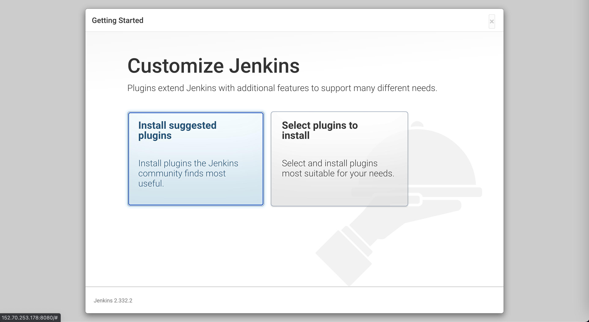
   
    
8. 관리자 계정을 생성 후 설정을 마무리 합니다.
   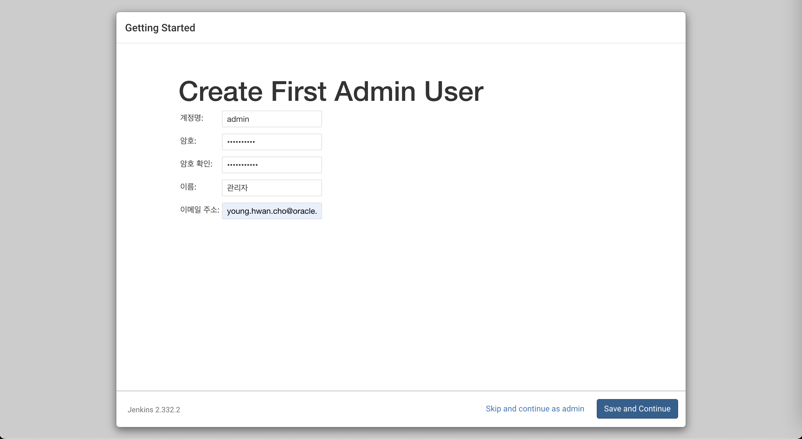
   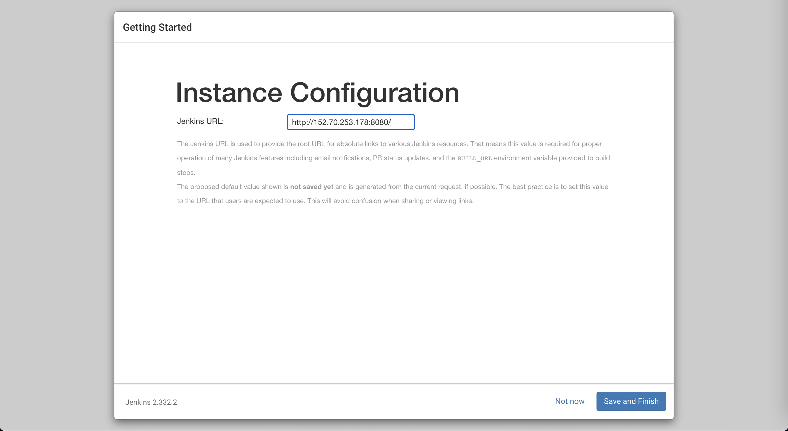
   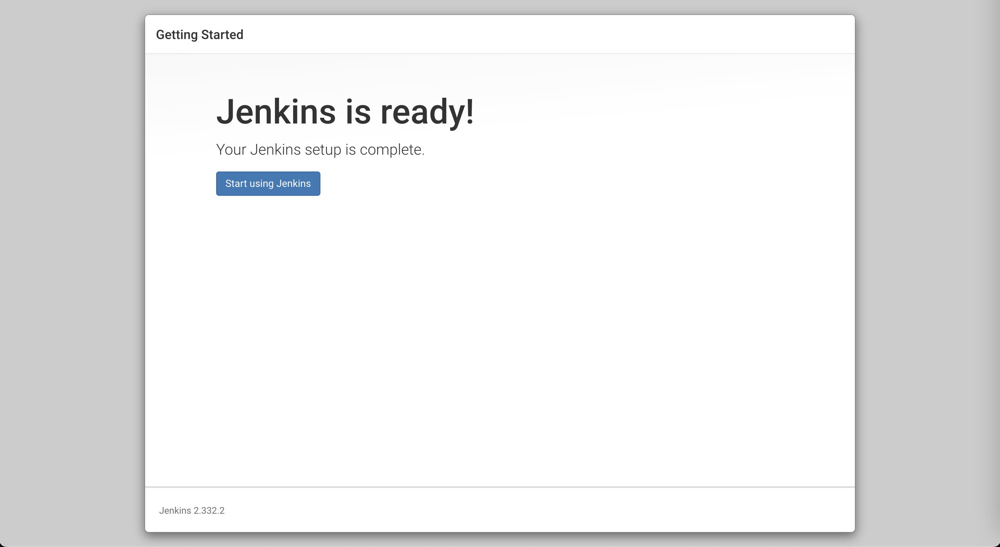

## Task 2: Jenkins 및 플러그인 설치
1. Jenkins 관리 > 플러그인 관리를 클릭합니다.
   
2. oracle cloud 검색 후 **Oracle Cloud Infrastructure DevOps**플러그인을 설치합니다.
   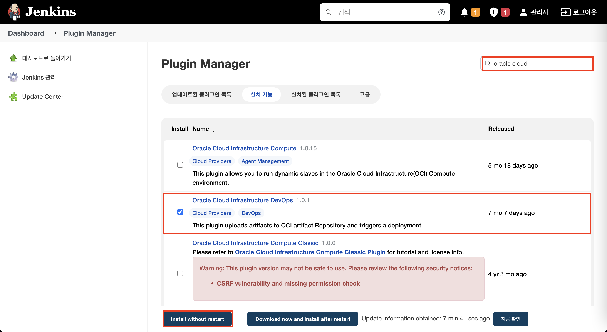

## Task 3: OCI DevOps 서비스 호출을 위한 자격증명 설정
1. 자격증명 생성을 위한 메뉴로 이동 합니다
   - **Jenkins 관리** 클릭
   
   
   - **Manage Credentials** 클릭
   
   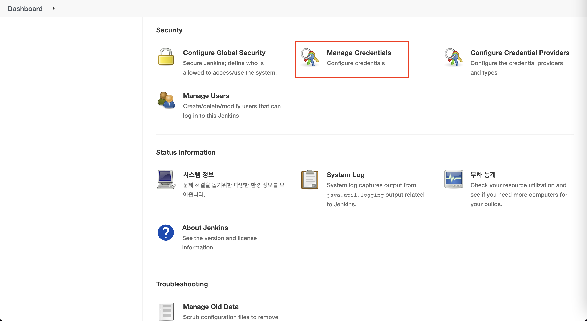
   - 다음 순서대로 이동합니다.
   
   
   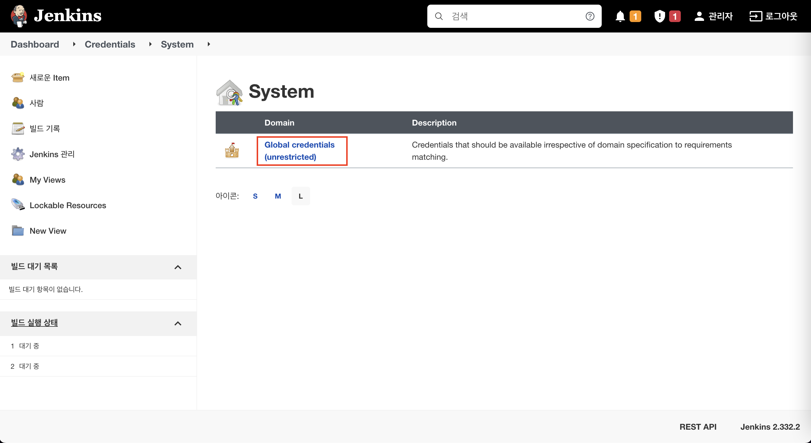
   - **Add Credentials**를 클릭하여 자격증명을 생성합니다.
   
   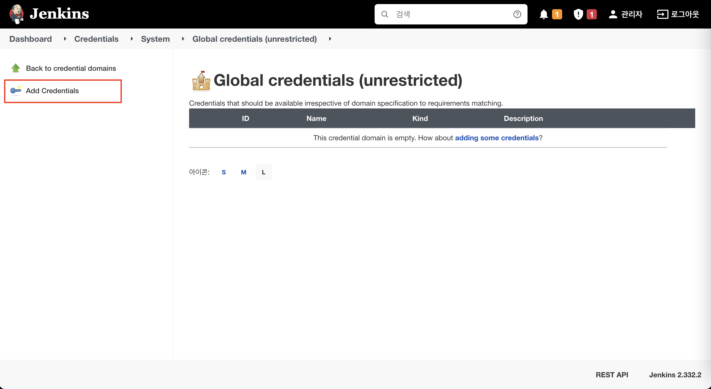
2. OCI CodeRepository를 위한 자격증명 생성
   - Kind : Username with password
   - Username : [테넌시]/[사용자ID]
   - Password : 비밀번호는 사전에 생성한 Auth Token을 입력합니다
   
   
3. OCI DevOps를 위한 자격증명 생성
   - 먼저 사용자 profile 화면에서 API Key를 등록합니다.
   
   
   - 등록화면에서 개인키/공개키 파일을 다운로드 받습니다.
   
   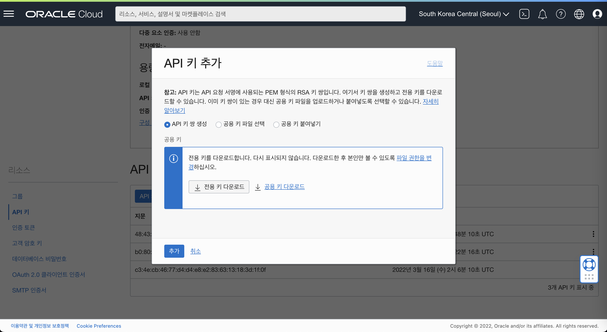
   - 등록 완료 후 구성파일의 내용을 복사해둡니다.
   
   
4. 자격증명 생성 화면에서 다음과 같이 입력합니다.
   - fingerpring : 구성파일의 fingerprint 정보를 입력합니다
   - apikey : 다운로드 받은 private-key.pem 파일의 내용을 입력합니다.
   
   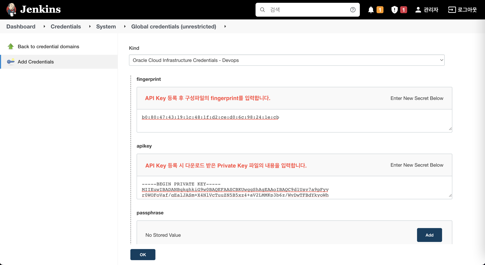
   - tenantId : 구성파일의 tenancy 정보를 입력합니다.
   - userId : 구성파일의 user 정보를 입력합니다.
   - regionId : 구성파일의 region 정보를 입력합니다.
   
   
   - **testConnection** 버튼을 클릭하여 연결을 확인 후 자격증명을 생성합니다.
   
   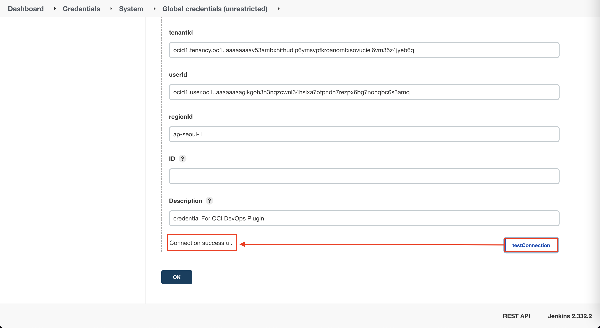

## Task 4: Pipeline 생성 및 테스트 진행
1. pipeline 아이템 생성
   
2. **이 빌드에 매개변수 있음** 체크 후 다음과 같이 매개변수를 입력합니다.
   - TENANCY : **dudghks34** [테넌시명을 입력 합니다]
   - DOCKER_REGISTRY : icn.ocir.io , ap-seoul-01.ocir.io
   - REGISTRY_USERNAME : 
   - REGISTRY_TOKEN :
   - APPLICATION :
   - TAG :
   - NAMESPACE :
3. pipeline 내용 입력

      ````yml
      def imageTag = "${params.DOCKER_REGISTRY}/${params.NAMESPACE}/${params.APPLICATION}:${params.TAG}"
      
      
      pipeline {
      agent any
      
          stages {
              stage('checkout project from OCI Code Repository') {
                  steps {
                      #syntax 생성기로 생성한 내용으로 대체      
                      checkout([$class: 'GitSCM', branches: [[name: '*/main']], extensions: [], userRemoteConfigs: [[credentialsId: 'f56a3041-4239-4756-9206-775d83962531', url: 'https://devops.scmservice.ap-seoul-1.oci.oraclecloud.com/namespaces/cnfdr2omjc2j/projects/DevOpsHandsOn/repositories/github_spring-boot-docker']]])
                  }
              }
              stage('build maven project'){
                  steps {
                      sh 'mvn clean install'
                  }
              }
              
              stage('Build Source - Post'){
                  steps {
                      sh 'mkdir -p target/dependency && (cd target/dependency; jar -xf ../*.jar)'
                  }
              }
              stage('Build Image and push') { 
                  steps {		
                     sh """
                         docker login ${params.DOCKER_REGISTRY} -u ${params.REGISTRY_USERNAME} -p '${params.REGISTRY_TOKEN}'
                         docker build -t ${imageTag} .
                         docker push ${imageTag} 
                     """
                  }
              }
              stage('Call OCI Deployment Pipeline'){
                  steps {
                      #syntax 생성기로 생성한 내용으로 대체  
                      OCIDeployment (argumentVal: '', credentialsId: 'credentialForOCI', displayName: 'spring-boot-docker-from-jenkins', endpoint: 'https://devops.ap-seoul-1.oci.oraclecloud.com', executionMode: 'ASYNC', pipelineId: 'ocid1.devopsdeploypipeline.oc1.ap-seoul-1.amaaaaaamgu5xoqamhtgewkibqksca3ucbrf4t66dd23ar7susy5h37wch2a', pollingConfig: [pollingIntervalSeconds: 10, timeoutSeconds: 120])
                  }
              }
          }
      }
      ````
4. OCI Code Repository 에서 checkout 하기
   - Steps : **checkout: Check out from version control** 선택
   - Repository URL : Code Repository URL을 입력합니다.
   - Credentials : Code Repository 를 위해 생성한 자격증명을 선택 합니다
   - Branch : */main
   - **Generate Pipeline Script** 를 클릭하여 스크립트를 생성합니다.
   
   
   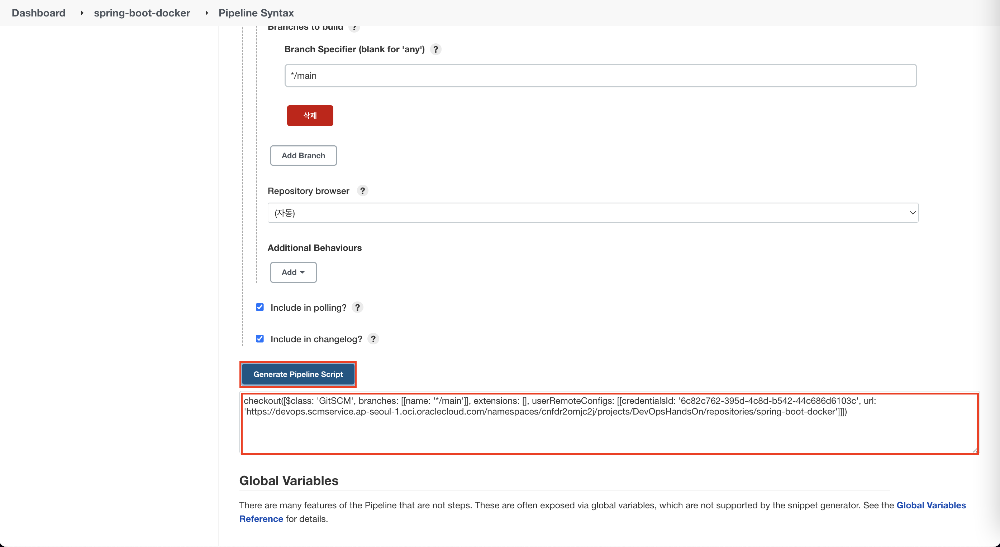
5. OCI DevOps : Deployment Pipeline 호출하기
   - Steps : **OCIDeployment: OCI Deployment**
   - Credential : OCI DevOps 용 자격증명을 선택합니다.
   - Pipeline OCID : OCI 콘솔에서 파이프라인의 OCID를 복사하여 입력합니다.
   - Display Name : **spring-boot-docker-from-jenkins**
   - Endpoint : **https://devops.ap-seoul-1.oci.oraclecloud.com** , [리전별 모든 EndPoint 확인 링크](https://docs.oracle.com/en-us/iaas/api/#/en/devops/20210630/)
   - **Generate Pipeline Script** 를 클릭하여 스크립트를 생성합니다.
   - **_생성된 스크립트에 ( ) 가 포함되어 있지 않아서 OCIDeployment([스크립트내용]) 형식으로 직접 입력해 줍니다_**
   
   
6. 테스트 수행
   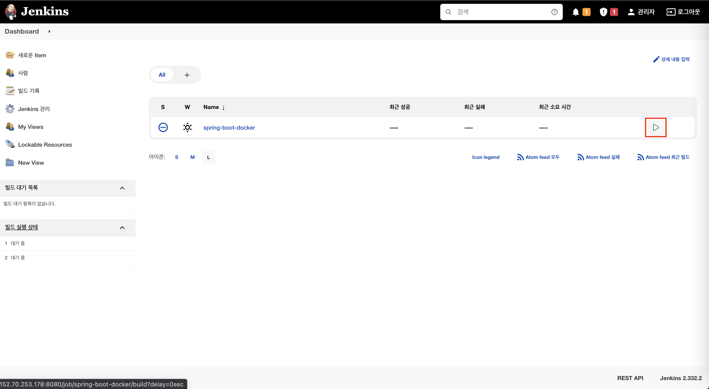
   
   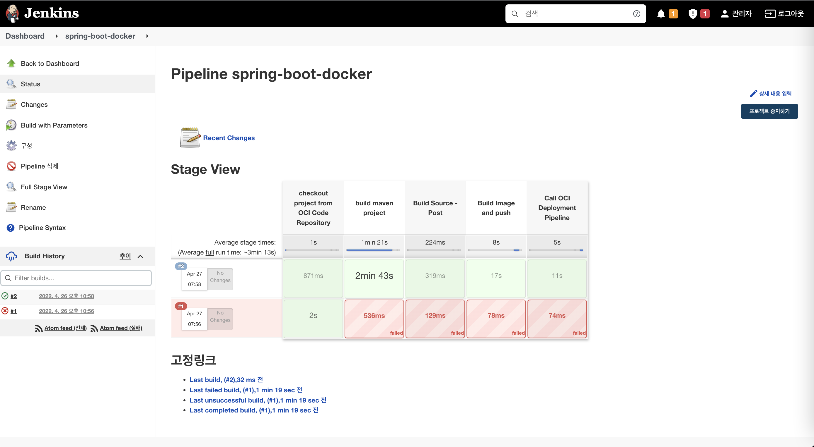
7. Image 업로드 확인
   
8. Deployment Pipeline 실행 확인
   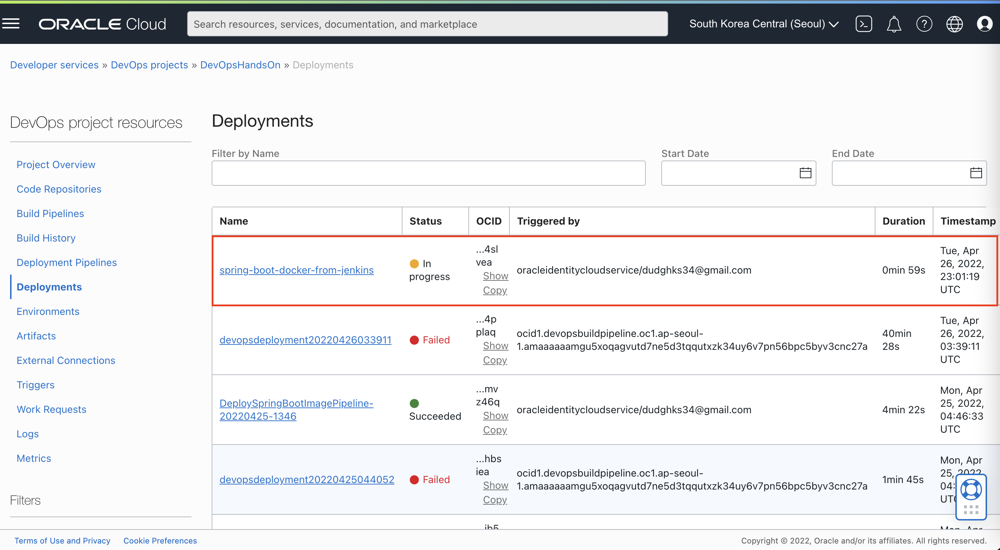

[다음 랩으로 이동](#next)
