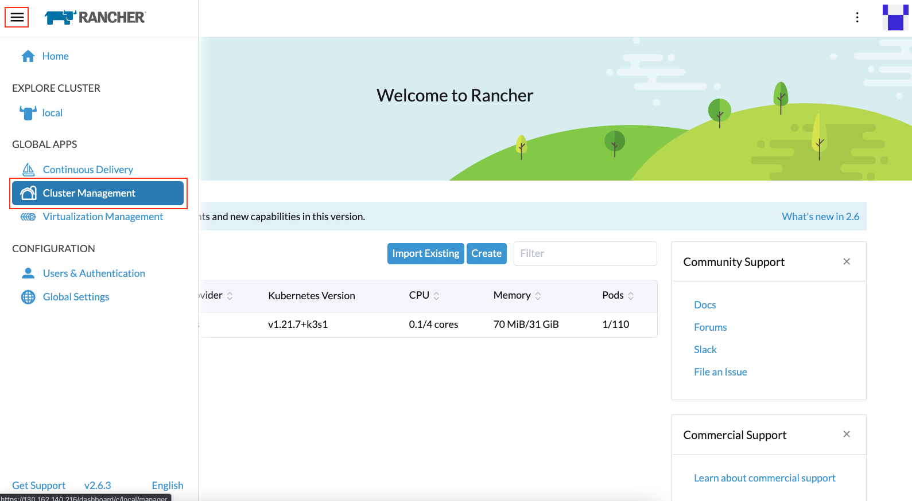
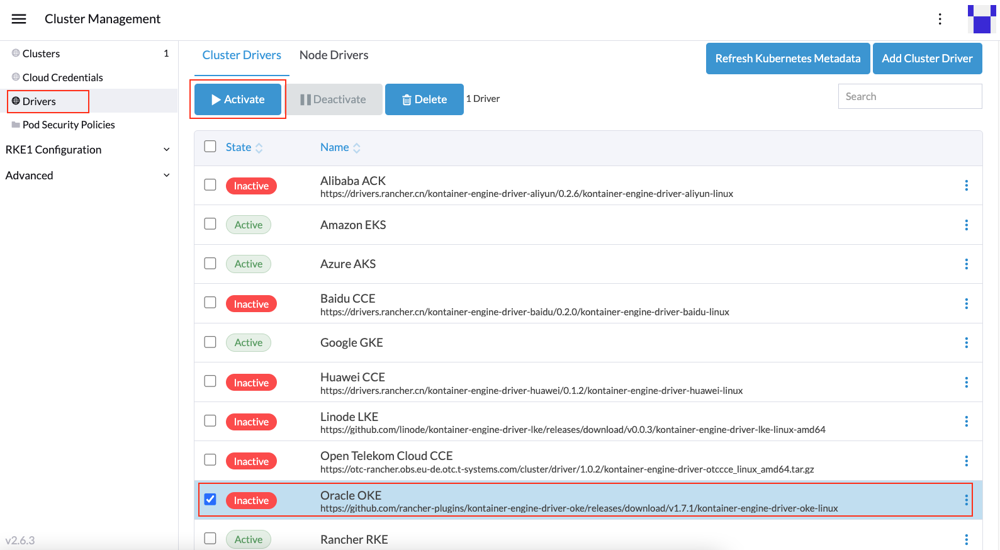
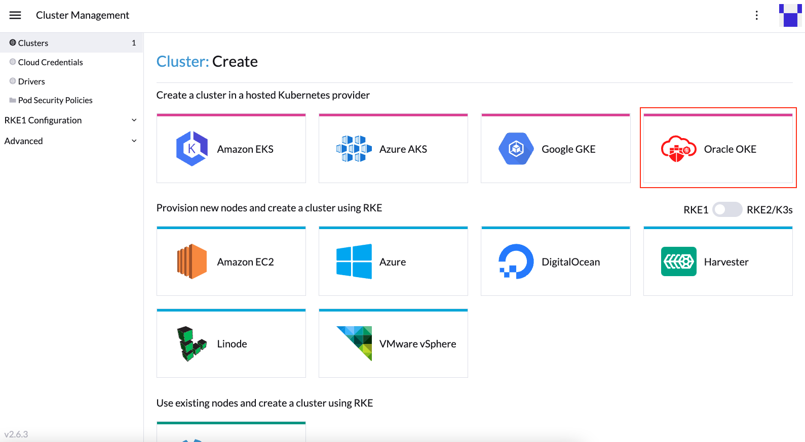
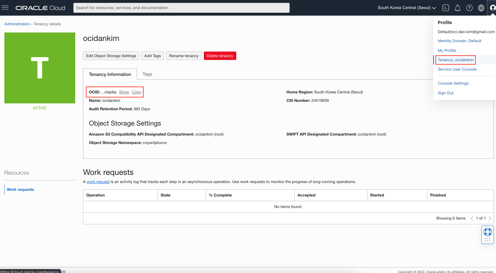
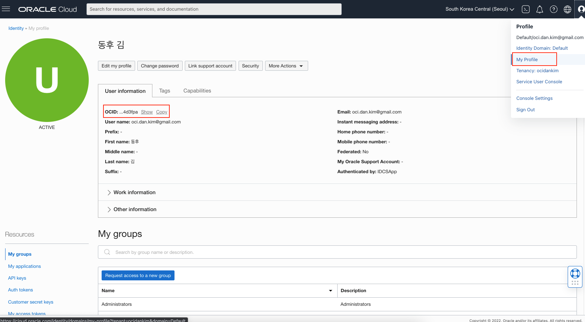
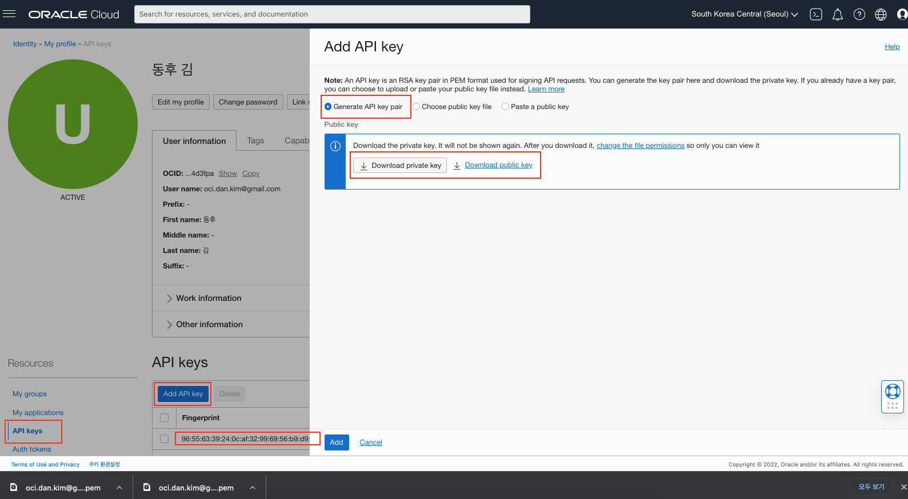
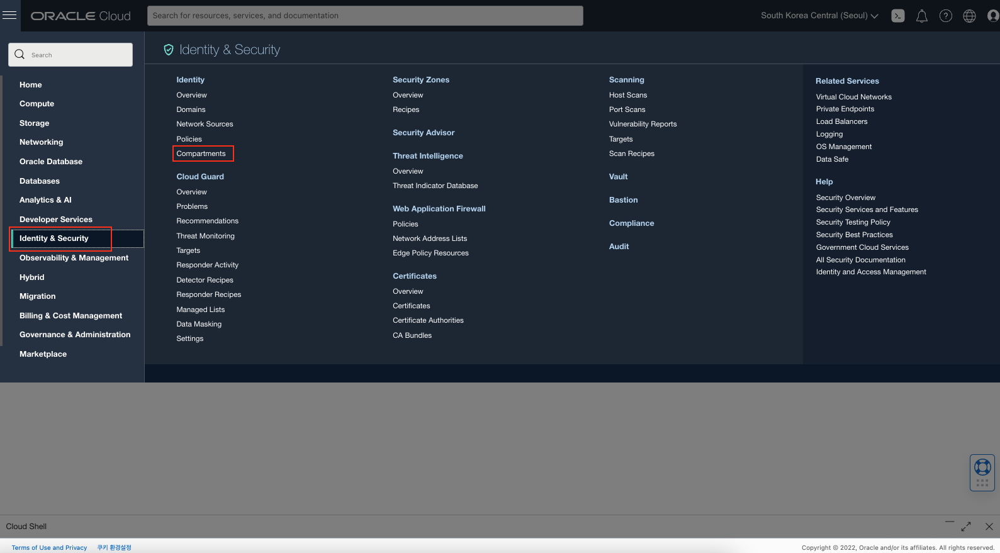
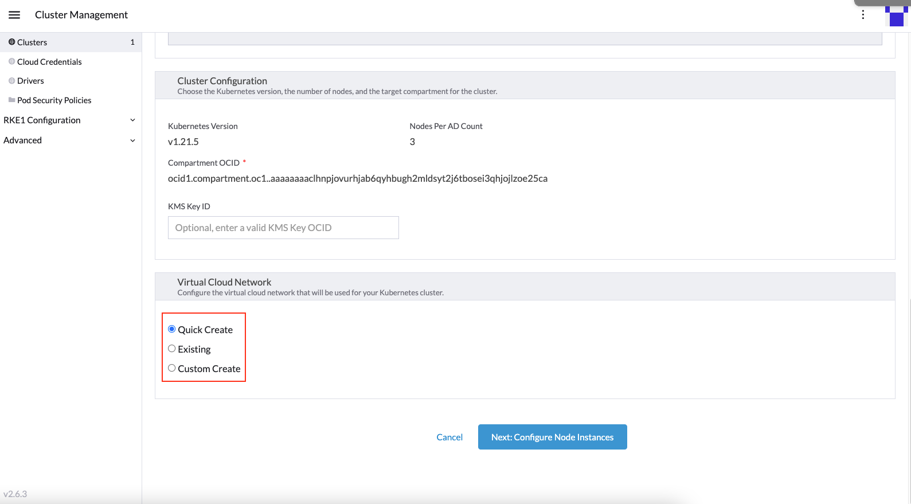

# Rancher OKE 인스턴스 구성

## 소개

Oracle Kubernetes Engine (OKE) 연동을 위한 Rancher 인스턴스 구성 실습입니다.

소요시간: 30 minutes

### 목표

- OKE 연동을 위한 Rancher 인스턴스 구성
- Rancher를 통해 OKE Cluster 생성

### 사전 준비사항

1. 실습을 위한 노트북 (Windows, MacOS)
1. Oracle Free Tier 계정
1. Lab 2 완료

## Task 1: OKE를 위한 Rancher Driver 활성

1. 좌측 상단의 **햄버거 아이콘**을 클릭하고, **Cluster Management**를 선택합니다.

 

1. 좌측 메뉴중에서 **Drivers**선택하고, Oracle OKE를 활성화합니다.

 

 

## Task 2: OKE Cluster 생성

1. 활성화가 완료되면 **Clusters** 메뉴를 선택하고 **Create** 버튼을 클릭합니다.

  

1. Oracle OKE를 선택합니다.
  
  

1. **Cluster Name**은 `oke-cluster-1`으로 입력합니다.

1. **Oracle Cloud Credentials**를 입력하는 단계입니다. 필요한 정보는 다음과 같습니다.
  - Tenancy OCID는 아래 순서로 선택하여 확인합니다.
    > OCI Console > 우측상단 Profile > Tenancy: {tenancyname}
  
    

  - User OCID는 아래 순서로 선택하여 확인합니다.
    > OCI Console > 우측상단 Profile > My Profile

    

  - Region
    > ap-seoul-1 (서울)

  - User Fingerprint
    > **Note** : 현재 OCI Console에서 생성한 PEM키, 혹은 **openssh**로 생성된 키는 등록시 다음과 같은 오류가 발생합니다.  
    >  
    > can not create client, bad configuration: x509: failed to parse private key (use ParsePKCS8PrivateKey instead for this key format)  
    >   
    > **Libressl**로 생성된 키는 문제가 발생하지 않는 것으로 확인되었으며, 이번 실습에서는 **Libressl**로 생성된 키로 실습을 진행합니다.
    >
    > 맥의 경우는 기본적으로 **Libressl**이 설치되어 있기 때문에 문제 없지만, 다른 OS의 경우는 별도로 **Libressl**을 설치하여야 한다. 아래 링크에서 최신버전을 다운로드 받아서 설치를 진행합니다.  
    > 다운로드: https://www.libressl.org/releases.html  
    > 설치방법: https://github.com/libressl-portable/portable

    ***OCI Console에서 생성한 PEM키를 활용 (현재 키 등록 시 오류 발생)***  
    OCI와 API 연동을 위해 Public Key를 등록한 후 얻은 Fingerprint값을 사용합니다. 다음 순서로 선택하여 키를 생성하고 등록한 후 Fingerprint값을 얻습니다.
    > OCI Console > 우측상단 Profile > My Profile > 좌측 API Keys > Add API Key > Generate > **Download private key** > **Download public key** > **Add**

    

    ***openssl을 통해서 키 생성 (Libressl 만 가능)***  
    openssl 툴을 사용하여 키를 생성합니다. Cloud Shell에 접속하여 다음과 같이 실행합니다.

    1. private key 생성
      ````shell
      <copy>
      openssl genrsa -out oci_api_key.pem 2048
      </copy>
      ````

    1. public key 생성
      ````shell
      <copy>
      openssl rsa -pubout -in oci_api_key.pem -out oci_api_key_public.pem
      </copy>
      ````

    1. public key 값 확인
      ````shell
      <copy>
      cat oci_api_key_public.pem
      </copy>
      ````

    1. public key 등록 및 Fingerprint 값 확인

    

  - User Private Key
    Private Key 값을 복사하여 붙여넣기 합니다.

1. 위와 같이 입력 후 **Next: Authenticate & Configure Cluster** 버튼을 클릭합니다.

  

1. Compartment OCID를 확인합니다. **좌측 상단 햄버거 메뉴**, **Identity & Security**, **Compartments**를 클릭합니다.

  

1. 앞서 생성한 Compartment (e.g. CloudNativeHandsOn)의 OCID를 복사합니다.

  

1. Rancher OKE 구성화면에서 다음과 같이 입력합니다.
   - Compartment OCID: 위에서 복사한 값
   - Kubernetes Version:1.21.5
   - Nodes Per AD Count: 3 

  

1. **Virtual Cloud Network**에서 **Quick Create**를 선택합니다.

  

1. **Node Instance Configuration**에서 다음과 같이 선택한 후 **Create**버튼을 클릭합니다.
   - Instance Shape: VM.Standard.E4.Flex
   - Specify the number of OCPUs for the flex shape: 1
   - Operating System: Oracle-Linux-7.9-2022.01.24-0
   
   > **Note**: 목록에 이미지가 보인다 하더라도 지원되지 않는 이미지가 있습니다. 지원되는 이미지 확인은 OCI Console에서 확인하거나, 다음의 ocicli 명령어로 확인할 수 있습니다.  
   > ```oci ce node-pool-options get --node-pool-option-id all```
   
   - SSH public key for nodes: **Lab 2**에서 생성한 Public Key 활용
   
  

1. Provisioning 상태의 Cluster가 하나 생성된 것을 확인할 수 있습니다. 실제 클러스터 생성까지 약 10~20분 소요되며, Rancher에서 확인은 좀 더 시간이 소요됩니다.

  

1. 프로비저닝이 완료되면 다음과 같이 **Active**상태의 OKE 클러스터를 확인할 수 있습니다.

  

[다음 랩으로 이동](#next)
