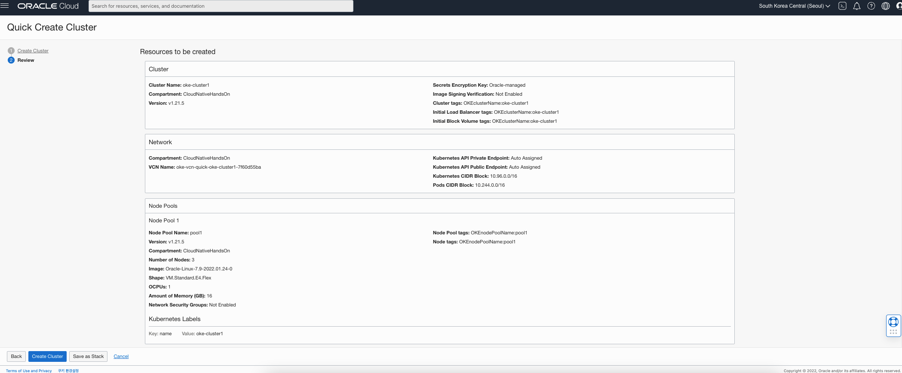
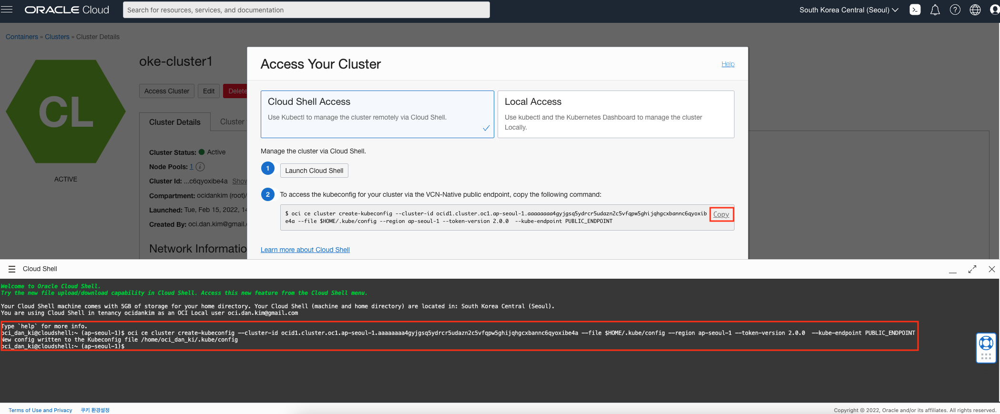

# OKE 클러스터 환경 준비

## 소개

실습을 위한 Oracle 클라우드 환경을 구성합니다. 우선 OCI내의 특정 구획 (Comartment)이 생성될 것이며, 해당 구획내에 가상 클라우드 네트워크 (VCN)가 구성됩니다. 여기서 구획과 VCN은 저체 환경을 격리하고 보호하는 역할을 합니다. 마지막으로 Kubernetes 클러스터 구성을 위해 Oracle Cloud Infrastructure Container Engine(OKE)를 구성합니다.

소요시간: 20 minutes

### 목표

-  Oracle Cloud Infrastructure (OCI) Cloud Native 환경 구성.  

### 사전 준비사항

1. 실습을 위한 노트북 (Windows, MacOS)
1. Oracle Free Tier 계정

## Task 1: OCI Console 로그인

   OCI에 로그인합니다. 

1. 로그인하면 다음과 같은 홈 화면을 볼 수 있습니다. 좌측 상단의 햄버거 모양의 아이콘을 클릭하면 OCI의 모든 메뉴를 확인할 수 있습니다. 

  

1. Dashboard를 클릭하면 기본적인 사용현황을 살펴볼 수 있습니다.

  

## Task 2: OCI 인프라스트럭처 기본 설정

> **Note**: 화면 언어는 English로 설정하고 진행합니다. 언어 변경은 우측 상단의 **Language** 아이콘을 선택하고 변경할 수 있습니다.

1. 좌측 상단의 **햄버거 아이콘**을 클릭하고, **Identity & Security**을 선택한 후 **Compartments**를 클릭합니다.

 

1. **Create Compartment**를 클릭합니다.

   

1. 다음과 같이 입력:
      - Name: Enter **CloudNativeHandsOn**
      - Description: **클라우드 네이티브 실습 구획**
      - Parent Compartment: 부모 구획으로 기본 선택되는 root 구획 선택
      - **Create Compartment** 클릭

  

## Task 2: OKE Kubernetes 클러스터 생성

1. **햄버거 메뉴**를 클릭한 후, **Developer Services**, **Kubernetes Clusters (OKE)**를 선택합니다.

 

1. **CloudNativeHandsOn** 컴파트먼트를 선택한 후에 **Create Cluster**를 클릭합니다. 

  

1. **Quick Create**를 선택하면 VCN(가상 클라우드 네트워크), IG(인터넷 게이트웨이), NAT 게이트웨이(NAT), Worker 노드를 위한 서브넷, 로드 밸런서용 서브넷등과 같은 새로운 네트워크 리소스들이 자동으로 생성이 됩니다. **Launch Workflow**을 선택합니다.

   

1. 다음과 같이 입력:
      - Name: Enter **oke-cluster1**
      - Compartment: **CloudNativeHandsOn**
      - Kubernetes Version: **최신 버전으로 선택**
      - Kubernetes API Endpoint: **Public Endpoint**
      - Kubernetes Worker Nodes: **Private Worker Nodes**
      - OCPU: **1**
      - Memory: **16**
      - Number of nodes: **3**

   

   모든 항목을 입력/선택하였으면, **Next**를 클릭합니다.

1. 생성되는 리소스를 최종 확인한 후 **Create Cluster** 버튼을 클릭합니다.

   

1. OKE 클러스터와 관련된 모든 리소스가 생성되는데, 일반적으로 대략 5-10정도 소요됩니다.

## Task 4: OKE Kubernetes Cluster Cloud Shell 접속 구성

1. 생성한 클러스터의 상세 페이지에서 **Access Cluster** 버튼을 선택합니다.

   

1. **Launch Cloud Shell** 버튼을 클릭하여 Cloud Shell을 오픈합니다.

> **Note**: 우측 상단에도 **Cloud Shell** 아이콘을 클릭하여 오픈할 수도 있습니다.

   

 그리고 바로 아래에 있는 kubeconfig 생성을 위한 ocicli 명령어를 복사한 후 Cloud Shell에서 붙여넣기하여 실행합니다.

   

1. `kubectl` 명령어로 클러스터에 접속하는지 확인합니다.

    ````shell
    <copy>
    kubectl get cs
    </copy>
    ````

    ````shell
    NAME                 STATUS    MESSAGE             ERROR
   scheduler            Healthy   ok                  
   controller-manager   Healthy   ok                  
   etcd-0               Healthy   {"health":"true"}
    ````

1. 다음 명령어로 kubectl client와 kubernetes server의 버전을 확인합니다.

    ````shell
    <copy>
    kubectl version
    </copy>
    ````

1. Worker Node 정보를 확인합니다.

    ````shell
    <copy>
    kubectl get nodes
    </copy>
    ````

    ````shell
   NAME          STATUS   ROLES   AGE   VERSION
   10.0.10.207   Ready    node    18m   v1.21.5
   10.0.10.53    Ready    node    18m   v1.21.5
   10.0.10.9     Ready    node    17m   v1.21.5
    ````

[다음 랩으로 이동](#next)
