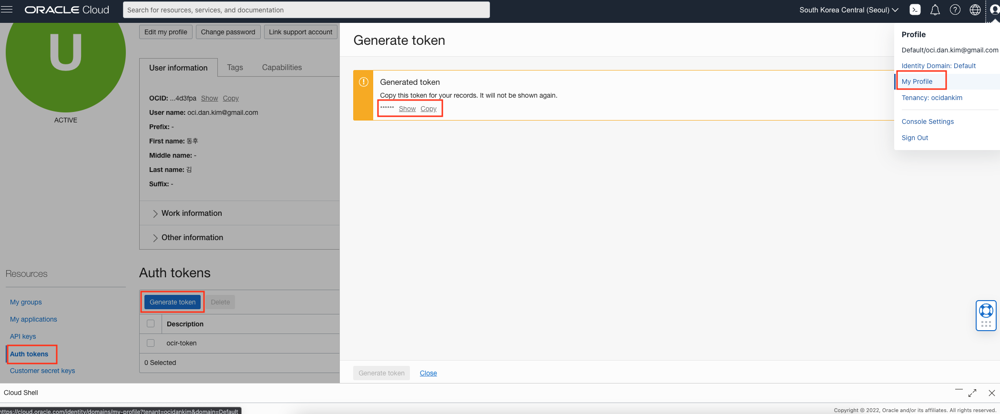
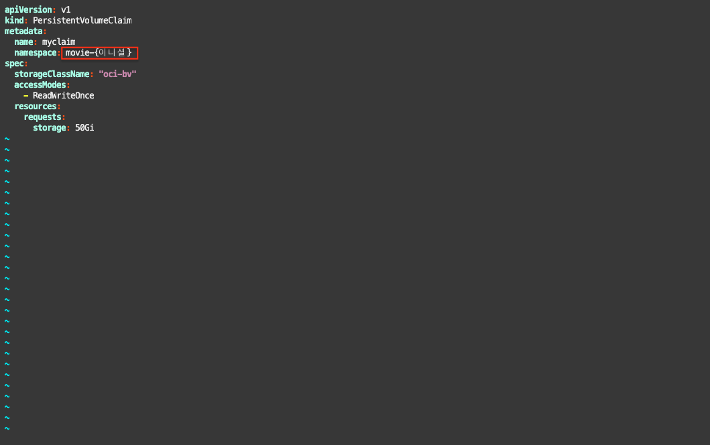
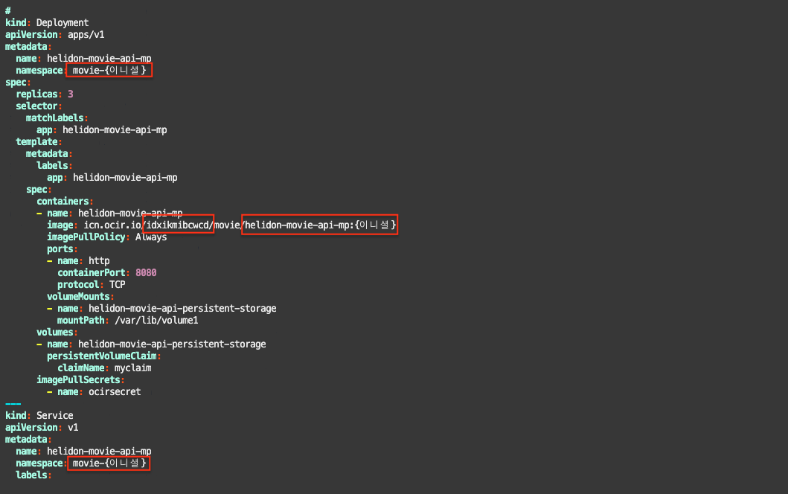

# Microprofile 마이크로 서비스 배포

## 소개

Microprofile 기반 (Oracle Helidon Framework)의 REST 서비스를 OKE 환경에 배포하는 과정입니다.

소요시간: 30 minutes

### 목표

* 이미지 빌드, 생성 
* Oracle Cloud Infrastructure Container Registry (OCIR) 활용
* OKE 배포 및 서비스 동작 확인

### 사전 준비사항

1. 실습을 위한 노트북 (Windows, MacOS)
1. Oracle Free Tier 계정

## Task 1: Microprofile 기반 REST 서비스 (Movie) 소스코드 내려받기

> **Note**: Cloud Shell이 오픈되어 있지 않다면, 우측 상단의 **Cloud Shell** 아이콘을 클릭하여 Cloud Shell을 오픈합니다.

1. Cloud Shell에서 다음 명령어로 실습을 위한 소스코드를 다운로드 받습니다.

    ````shell
    <copy>
    git clone https://github.com/MangDan/helidon-movie-api-mp.git movie
    </copy>
    ````

    Sample response:

    ````shell
    Cloning into 'movie'...
    remote: Enumerating objects: 416, done.
    remote: Counting objects: 100% (416/416), done.
    remote: Compressing objects: 100% (263/263), done.
    remote: Total 416 (delta 206), reused 202 (delta 81), pack-reused 0
    Receiving objects: 100% (416/416), 253.08 KiB | 0 bytes/s, done.
    Resolving deltas: 100% (206/206), done.
    ````

## Task 2: 이미지 빌드 및 OCIR에 푸시

1. 이미지 빌드

    OCIR에 이미지를 푸시하기 위해서는 다음과 같은 이미지 태그 네이밍 규칙을 따라야 합니다.
    > {Region Key}.ocir.io/{Object Storage Namespace}/{레파지토리명}/{이미지명}:{태그}

    Region Key는 [Regions and Availability Domains](https://docs.oracle.com/en-us/iaas/Content/General/Concepts/regions.htm) 에서 확인 가능합니다. 서울의 Region Key는 **icn**입니다.

    Object Storage Namespace는 Tenancy Detail 화면에서 확인할 수 있습니다.

    
    
    Sample Tag Namespace:  
    **[중요]** 여러 사람이 같이 실습을 하므로, 레파지토리 이름이 겹치지 않게 하기 위해 애플리케이션 태그에 실습자의 이니셜을 붙여서 진행합니다.  
    > icn.ocir.io/cn5ibtrkf0tc/movie/helidon-movie-api-mp:{이니셜}

    이미지 빌드 예시:
    ````shell
    cd movie
    ````

    ````shell
    docker build -t icn.ocir.io/cn5ibtrkf0tc/movie/helidon-movie-api-mp:kdh .
    ````

1. OCIR 로그인
    OCIR 로그인을 위해서는 Username과 Password가 필요합니다. Username은 {Object Storage Namespace}/{OCI 로그인 아이디}이며, Password는 Auth Token값입니다.

    OCIR Username 예시: 
    > cn5ibtrkf0tc/oci.dan.kim@gmail.com

    OCIR Password (Auth Token) 생성 (My Profile > Auth tokens > Generate token):
    > **Note**: Auth Token은 한번 생성 후 다시 확인이 불가능하기 때문에 복사해서 기록해놔야 합니다.
    
    
    OCIR 로그인 예시:
    ````shell
    docker login icn.ocir.io -u cn5ibtrkf0tc/oci.dan.kim@gmail.com
    ````

1. OCIR에 이미지 푸시
    OCIR에 이미지 푸시 예시:
    ````shell
    docker push icn.ocir.io/cn5ibtrkf0tc/movie/helidon-movie-api-mp:kdh
    ````

    이미지 확인
    
    
## Task 3: 서비스 배포

**[중요]** 하나의 OKE Cluster에서 실습을 진행하는 경우 Namespace 이름이 겹치지 않도록 Namespace에 다음과 같이 이니셜을 붙여서 생성합니다.
> kubectl create ns movie-{이니셜}

1. 서비스 배포를 위한 Namespace와 secret 생성 예시
    
    Namespace 생성:
    ````shell
    <copy>
    kubectl create ns movie-kdh
    </copy>
    ````

    Secret 생성 :
    ````shell
    <copy>
    kubectl create secret docker-registry ocirsecret --docker-server=icn.ocir.io --docker-username={Object Storage Namespace}/{OCI Username} --docker-password='{Auth Token}' --docker-email={이메일} -n movie-{이니셜}
    </copy>
    ````

    Secret 생성 예시:
    ````shell
    kubectl create secret docker-registry ocirsecret --docker-server=icn.ocir.io --docker-username=cn5ibtrkf0tc/oci.dan.kim@gmail.com --docker-password=';u}T!ExB&rq(R-(y3>f8' --docker-email=oci.dan.kim@gmail.com -n movie-kdh
    ````

1. Persistent Volume 생성
    Pod내의 컨테이너에서 사용할 Persistent Volume Claim (PVC)을 생성합니다. Pod 생성 시 PVC를 활용하면 OCI의 Block Storage를 Persistent Volume으로 사용하여 마운트할 수 있습니다. PVC 생성을 위한 Manifest 파일을 열어서 Namespace를 다음과 같이 앞서 생성한 Namespace로 수정한 후에 PVC를 생성합니다.

    PVC Manifest 파일 수정
    ````shell
    <copy>
    vi csi-bvs-pvc.yaml
    </copy>
    ````
    
    

    PVC 생성:
    ```shell
    <copy>
    kubectl create -f csi-bvs-pvc.yaml
    </copy>
    ```

1. Kubernetes Manifest 파일 수정
    Kubernetes 배포를 위한 Manifest 파일의 내용중에서 **Namespace**, **애플리케이션 태그**, **Object Storage Namespace**의 값을 변경하고 저장합니다.

    ```shell
    <copy>
    vi kube-helidon-movie-api-mp-config-direct.yml
    </copy>
    ```

    
    
1. 서비스 배포
    ```shell
    <copy>
    kubectl apply -f kube-helidon-movie-api-mp-config-direct.yml
    </copy>
    ```

    배포된 리소스 확인:
    ```shell
    <copy>
    kubectl get all -n movie-{이니셜}
    </copy>
    ```

    Sample Response:
    ```shell
    NAME                                       READY   STATUS    RESTARTS   AGE
    pod/helidon-movie-api-mp-64cbd8448-7smqz   1/1     Running   0          4m34s
    pod/helidon-movie-api-mp-64cbd8448-hj99k   1/1     Running   0          4m33s
    pod/helidon-movie-api-mp-64cbd8448-vwmb9   1/1     Running   0          4m33s

    NAME                           TYPE           CLUSTER-IP      EXTERNAL-IP   PORT(S)           AGE
    service/helidon-movie-api-mp   LoadBalancer   10.96.157.210   10.xxx.xxx.xxx     30000:30287/TCP   4m34s

    NAME                                   READY   UP-TO-DATE   AVAILABLE   AGE
    deployment.apps/helidon-movie-api-mp   3/3     3            3           4m34s

    NAME                                             DESIRED   CURRENT   READY   AGE
    replicaset.apps/helidon-movie-api-mp-64cbd8448   3         3         3       4m34s
    ```

> **Note** : 배포된 백엔드 서비스는 Private Load Balancer만 적용이 된 상태로 외부로 노출이 되지 않은 상태입니다. 다음 랩에서는 API Gateway를 활용하여 백엔드 서비스를 외부에서 접근 가능한 엔드포인트로 노출하는 것을 실습합니다.

[다음 랩으로 이동](#next)
