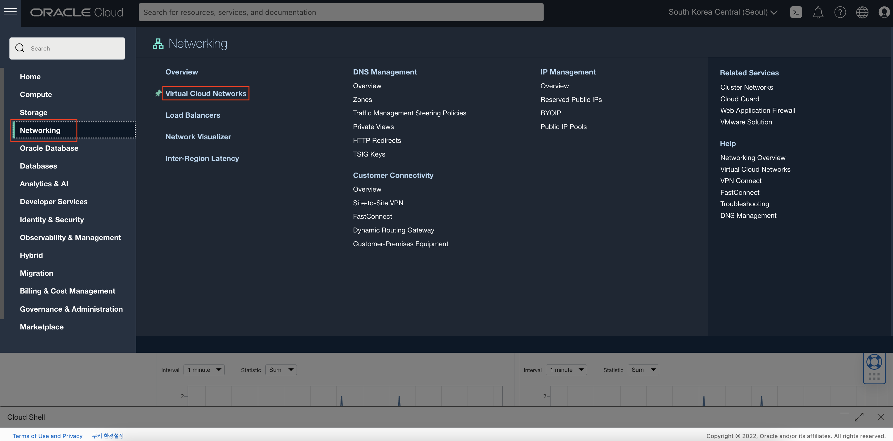
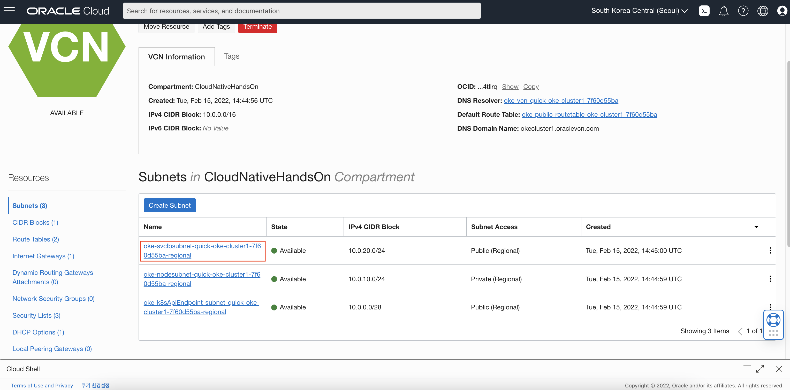
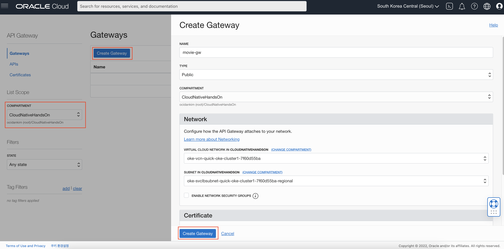
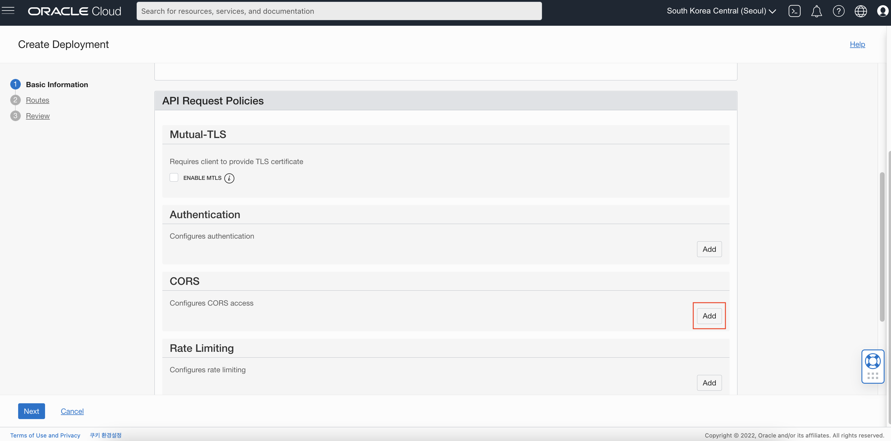
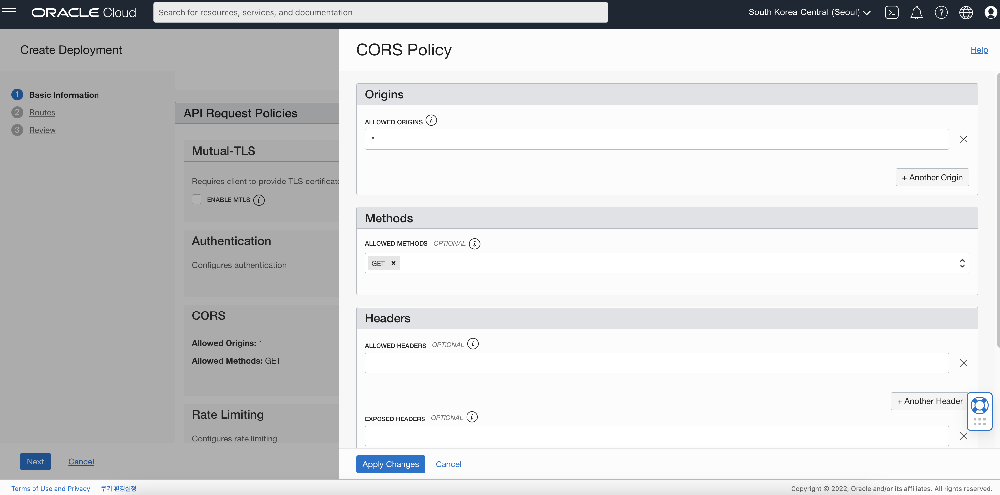
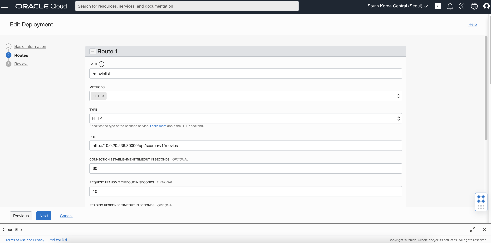

# OCI API Gateway

## 소개

OKE 환경에 배포된 서비스에 API Gateway를 적용하는 실습입니다.

소요시간: 20 minutes

### 목표

* API Gateway 생성
* API Gateway에 OKE 서비스 적용

### 사전 준비사항

1. 실습을 위한 노트북 (Windows, MacOS)
1. Oracle Free Tier 계정
1. Lab-2 완료

## Task 1: Security List 수정

본 실습에서는 앞서 자동으로 생성한 VCN의 Public Subnet을 사용합니다. 해당 서브넷은 자동으로 생성된 서브넷으로 API Gateway에서 사용하기 위해서는 기본적으로  Security List의 Egress Rule에 추가적인 작업이 필요합니다.

1. 좌측 상단의 **햄버거 메뉴** 버튼을 클릭하고, **Networking**, **Virtual Cloud Networks**을 순서대로 클릭합니다.

    

1. 목록에서 **oke-vcn-quick**으로 시작하는 이름의 VCN을 클릭합니다. (목록에서 안보이는 경우 좌측 Compartment를 전 단계에서 생성한 Compartment로 선택)

1. Subnet 목록에서 **oke-svclbsubnet-**라는 이름으로 시작하는 Subnet을 선택합니다. 

    

1. 목록에 있는 Security List를 선택하고 좌측의 **Ingress Rule**, **Add Ingress Rules**을 차례로 선택합니다.

1. Destination CIDR 값을 `0.0.0.0/0,` Destination Port Range르ㄹ `80,443` 으로 입력하고 **Add Ingress Rules**를 클릭합니다.

1. 목록에 있는 Security List를 선택하고 좌측의 **Egress Rule**, **Add Egress Rules**을 차례로 선택합니다.

    

1. Destination CIDR 값을 `0.0.0.0/0` 으로 입력하고 **Add Egress Rules**를 클릭합니다.

## Task 2: API Gateway 생성

API 게이트웨이는 정책, 메트릭 및 로깅을 통해 Kubernetes, Compute 또는 기타 엔드포인트용 Container Engine에서 실행되는 모든 RESTful 서비스를 보호하는 역할을 합니다. 앞서 구성한 Microprofile 기반 RESTful 서비스를 직접 외부에 노출하는 대신 API 게이트웨이를 사용하여 인증이나, CORS(Cross-Origin Resource Sharing), 트래픽등을 제어할 수 있습니다. 

1. 좌측 상단의 **햄버거 메뉴** 버튼을 클릭하고, **Developer Services**, **Gateways**을 순서대로 클릭합니다.

    

1. 앞서 생성한 Compartment (CloudNativeHandsOn)를 선택합니다.

1. **Create Gateway**를 클릭합니다.
1. 이니셜을 포함하여 Gateway 이름을 입력합니다. (e.g. `movie-gw-kdh`)
1. Type을 선택합니다. (e.g. `public`)
1. Newwork에서 VCN은 OKE에서 사용중인 VCN을 선택합니다. (e.g. `oke-vcn-quick-oke-cluster1-7f60d55ba`)
1. Newwork에서 Subnet은 Public으로 노출한 Subnet을 선택합니다. (e.g. `oke-svclbsubnet-quick-oke-cluster1-7f60d55ba-regional`)

    

## Task 3: API Gateway 구성

1. 생성이 완료되면 좌측 **Deployment**, **Create Deployment**를 순서대로 클릭합니다.

    

1. Deployment 이름을 입력합니다. (e.g. `movie`)
1. PATH PREFIX를 입력합니다. (e.g. `/`)

    

1. CORS를 구성합니다. CROS 우측의 **Add**를 클릭합니다.

    

1. Origins의 **ALLOWED ORIGINS**을 입력합니다. (e.g. `*`)
1. Methods의 **ALLOWED METHODS**을 선택합니다. (e.g. `GET`)
1. **Apply Changes**를 클릭합니다.

    

1. **Next**를 클릭한 후 **Route 1**을 등록합니다.

1. PATH를 입력합니다. (e.g. `/movielist`)
2. METHODS를 선택합니다. (e.g. `GET`)
3. TYPE을 선택합니다. (e.g. `HTTP`)
4. URL을 입력합니다. Lab 2에서 배포한 서비스의 **http://{EXTERNAL-IP}:30000/api/search/v1/movies** 입니다.
5. **Next**를 클릭한 후 **Save Changes**를 클릭합니다.

    

## Task 4: API Gateway를 통해 백엔드 서비스 테스트

1. API Gateway Deployment의 Endpoint를 확인합니다.

    

1. 브라우저로 접속합니다.

> **Note**: 접속 주소는 API Gateway Deployment의 Endpoint주소 + Deployment의 PATH (e.g. `/movielist`) 입니다.

JSON 형태의 결과값을 확인합니다.
    
    

[다음 랩으로 이동](#next)
