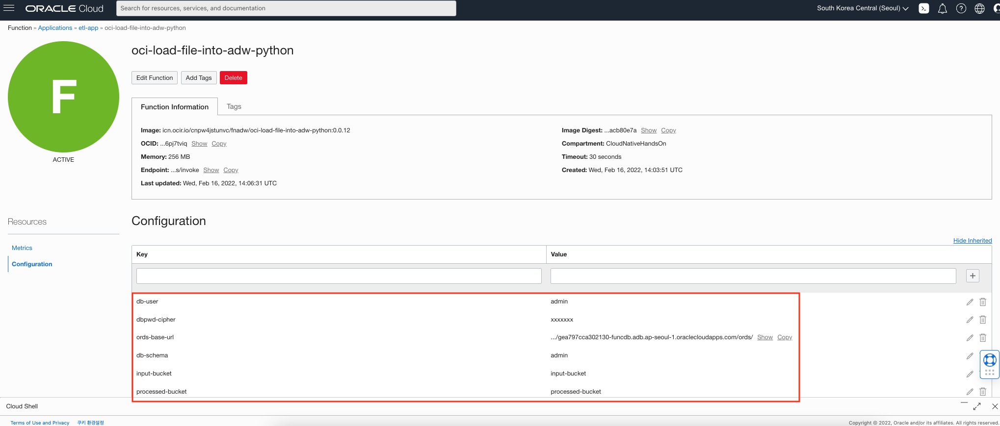
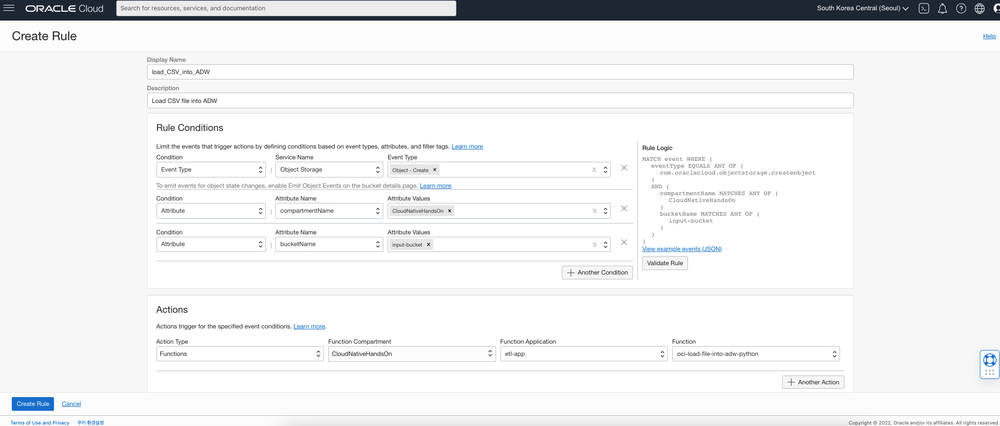

# Functions for ETL (Object Storage to ADW) #2 - 생성, 배포, 테스트

## 소개

이 실습에서는 Oracle Function을 생성하고 파일이 Object Storage에 업로드 될 때마다 Function을 트리거하도록 구성합니다. Function에서는 파일의 내용을 읽어서 Oracle Autonomous Database로 전달하는 역할을 합니다.

소요시간: 20 minutes

### 목표

- Function 애플리케이션 생성
- Function 배포
- Event Rule 생성
- Function 테스트

### 사전 준비사항

1. 실습을 위한 노트북 (Windows, MacOS)
1. Oracle Free Tier 계정
1. **Functions 사전준비** 실습 완료
1. **Lab 5** 실습 완료

## Task 1: Function 애플리케이션 생성

이번 단계에서는 OCI Console에서 Function 애플리케이션을 생성하고 Cloud Shell에서 Fn CLI를 셋업합니다.

1. 좌측 상단의 **햄버거 아이콘 메뉴**를 클릭하고 **Developer Services**, **Applications**을 선택합니다.

    

1. 앞서 생성한 Compartment (CloudNativeHandsOn)를 선택합니다.
1. **Create Application**을 클릭합니다.
1. 이름을 입력합니다. (e.g. `etl-app`)
1. 앞서 생성한 VCN을 선택합니다. (e.g. `myvcn-1`).
1. Public Subnet을 선택합니다.
1. **Create** 버튼을 클릭합니다.

    

1. Application 상세화면에서 **Cloud Shell Setup**을 선택하고 **Begin your Cloud Shell session** 의 내용을 순서대로 실행하기 위해 Cloud Shell을 오픈합니다.

    

1. **Setup fn CLI on Cloud Shell** 하위 단계를 진행합니다. 본 과정을 진행하기 위해서는 Compartment OCID(단계3), repo-name-prefix(단계4), Auth Token(단계6)값이 필요합니다. Compartment OCID(Functions 사전준비 실습)와 Auth Token(Lab 2)은 앞 실습에서 사용한 값을 사용합니다. **repo-name-prefix** 값은 `fnadw`를 사용합니다.
    
> **Note**: Functions을 사용하기 위해서는 클라이언트에 fn cli툴을 설치해야 합니다. (Cloud Shell에는 기본 설치) fn cli에는 OCI와 연동하기 위한 정보를 담고 있는 Context를 사전에 구성하여야 합니다. 이번 단계에서 하는 작업이 바로 Context를 구성하는 작업입니다.

    2. fn cli에 설정된 Context 목록 조회 및 Context의 Region을 서울로 설정
    ````shell
    fn list context

    CURRENT NAME            PROVIDER        API URL                                                 REGISTRY
    *       ap-seoul-1      oracle-cs       https://functions.ap-seoul-1.oci.oraclecloud.com
            default         oracle-cs

    fn use context ap-seoul-1

    Fn: Context ap-seoul-1 currently in use
    ````

    3. Function Context의 Compartment OCID 값을 설정
    ````shell
    fn update context ocid1.compartment.oc1..example......
    ````

    4. Function 이미지가 업로드 될 Container Registry 정보
    ````shell
    fn update context registry icn.ocir.io/cnpw4jstunvc/fnadw

    Current context updated registry with icn.ocir.io/cnpw4jstunvc/fnadw
    ````

    6. OCIR 로그인
    ````shell
    docker login -u 'cnpw4jstunvc/oci.dan.kim@gmail.com' icn.ocir.io
    Password: 

    Login Succeeded
    ````

    7. Functions 애플리케이션 조회
    ````shell
    fn list apps

    NAME    ID
    etl-app ocid1.fnapp.oc1.ap-seoul-1.aaaaaaaaqpkqrubvabncqjlclzvidv7whhj4daxjr6ai5uf3bleobpojvzxa
    ````

    Oracle Functions
## Task 2: function 배포

fn cli를 위한 Context 구성이 완료되면, 이제 `fn deploy` 명령어를 사용하여 배포를 진행합니다. 배포 단계에서는 기본적을 OCIR로 이미지를 업로드하기 때문에 Docker Login이 되어 있어야 합니다.

1. Cloud Shell에서 예제로 제공하고 있는 샘플 Function을 다운로드 받습니다. 참고로 fn 명령어로 기본 뼈대를 갖춘 Function Quick Start Template을 제공하는데, 관련 가이드는 [Creating and Deploying Functions](https://docs.oracle.com/en-us/iaas/Content/Functions/Tasks/functionsuploading.htm)를 참고합니다.

    ```shell
    <copy>
    git clone https://github.com/oracle/oracle-functions-samples.git
    </copy>
    ```

1. `samples/oci-load-file-into-adw-python` 폴더로 이동합니다.

    ```shell
    <copy>
    cd oracle-functions-samples/samples/oci-load-file-into-adw-python
    </copy>
    ```

1. 다음 명령어로 Function을 배포합니다. `etl-app`:

    ```shell
    <copy>
    fn -v deploy --app etl-app
    </copy>
    ```

1. Using the Fn CLI, set the following configuration values.

    Note: 앞서 설정한 ORDS_BASE_URL와 DB_PASSWORD 환경변수는 현재 사용하고 있는 Cloud Shell에서 유효해야 합니다. 아래 명령어는 배포된 Function에서 사용할 전역 변수 값을 fn cli툴을 이용하여 설정하는 과정으로 다음 명령어를 순서대로 실행합니다.

    ```shell
    <copy>
    fn config function etl-app oci-load-file-into-adw-python ords-base-url $ORDS_BASE_URL && \
    fn config function etl-app oci-load-file-into-adw-python db-schema admin && \
    fn config function etl-app oci-load-file-into-adw-python db-user admin
    </copy>
    ```

    ```shell
    <copy>
    fn config function etl-app oci-load-file-into-adw-python dbpwd-cipher $DB_PASSWORD
    </copy>
    ```

    ```shell
    <copy>
    fn config function etl-app oci-load-file-into-adw-python input-bucket input-bucket && \
    fn config function etl-app oci-load-file-into-adw-python processed-bucket processed-bucket
    </copy>
    ```
    
    이 과정은 fn cli를 활용할 수도 있지만, OCI UI 상에서도 추가/수정/삭제할 수 있습니다.
    다음과 같이 배포된 Function에 대한 전역 변수가 설정된 것을 OCI Console에서 확인할 수 있습니다.
    

## Task 3: Event Rule 생성

이번 단계에서는 앞서 생성한 `input-bucket` Bucket에 파일이 업로드 될 때 자동으로 배포한 Function을 호출하도록 Cloud Event를 생성하고 구성하는 과정입니다.

1. 메뉴에서 **Observability & Management**, **Rules**를 선택합니다.

    

1. 우선 앞서 생성한 Compartment(CloudNativeHandsOn)를 선택합니다.
1. **Create Rule**을 클릭합니다.
1. Display name을 입력합니다. (e.g. `load_CSV_into_ADW`)
1. Description을 입력합니다. (e.g. `Load CSV file into ADW`)
1. 다음 3개의 규칙을 생성합니다.

    Note: 새로운 Event Type 혹은 Attribute 값을 입력하고 Enter를 눌러야 합니다.

    - 첫 번째 조건을 아래와 같이 추가하고 **Another Condition**을 클릭합니다.

        | Condition | Service/Attribute Name | Event Type |
        | --- | --- | --- |
        | Event Type | Object Storage | Object - Create |

    - 두 번째 조건을 아래와 같이 추가하고 **Another Condition**을 클릭합니다.

        | Condition | Service/Attribute Name | Attribute Value |
        | --- | --- | --- |
        | Attribute | compartmentName | CloudNativeHandsOn |

    - 세 번째 조건을 입력합니다.:

        | Condition | Service/Attribute Name | Attribute Value |
        | --- | --- | --- |
        | Attribute | bucketName | input-bucket |

1. Actions 부분에서 **Functions**를 선택합니다.
    - Function이 배포된 Compartment를 선택합니다. (CloudNativeHandsOn).
    - Function Application으로 `etl-app` 선택합니다.
    - Function으로 `oci-load-file-into-adw-python`를 선택합니다.

    

1. **Create Rule**을 클릭합니다.

## Task 4: Function 테스트

Function 테스트를 위해서 `.csv` 파일을 `input-bucket`에 업로드 하여야 합니다.

1. 먼저 Cloud Shell을 오픈합니다.
1. 아래 폴더로 이동합니다.

    ```shell
    <copy>
    cd ~/oracle-functions-samples/samples/oci-load-file-into-adw-python
    </copy>
    ```

1. OCI CLI를 활용하여 `file1.csv` 파일을 `input-bucket`으로 업로드 합니다.

    ```shell
    <copy>
    oci os object put --bucket-name input-bucket --file file1.csv
    </copy>
    ```

    아래와 같은 메시지가 확인되어야 합니다.

    ```bash
    Uploading object  [####################################]  100%
    {
        "etag": "f0687d5e-9c14-4f29-88c2-bcfd0b9c5590",
        "last-modified": "Wed, 16 Feb 2022 17:05:08 GMT",
        "opc-content-md5": "O8mZv0X2gLagQGT5CutWsQ=="
    }   
    ```

다음 절차를 통해서 데이터베이스에 데이터가 입력이 되었는지 확인합니다.

1. 메뉴에서 **Oracle Database**, **Autonomous Data Warehouse**를 선택합니다.

 

1. Compartment (CloudNativeHandsOn)를 선택합니다. 
1. 앞서 생성한 Database (`funcdb`)를 클릭합니다.
1. **Service Console**을 클릭합니다.
1. 좌측 메뉴에서 **Development**를 선택합니다.
1. **Database Actions**을 선택합니다.
1. **ADMIN**을 입력하고 처음 Database 생성 시 입력한 패스워드를 입력합니다.
1. **SQL**을 클릭합니다.

    

1. 워크시트에 다음과 같이 쿼리를 입력합니다.

    ```shell
    <copy>
    select json_serialize (JSON_DOCUMENT) from regionsnumbers;
    </copy>
    ```

1. 녹색의 Play 버튼 (`Run Script`)을 클릭하여 쿼리를 실행합니다.

    

1. **Script Output** 탭에서 CSV 파일로 부터 읽은 데이터를 확인합니다.

Congratulations!
Oracle Cloud Native 교육을 모두 수료하였습니다.
