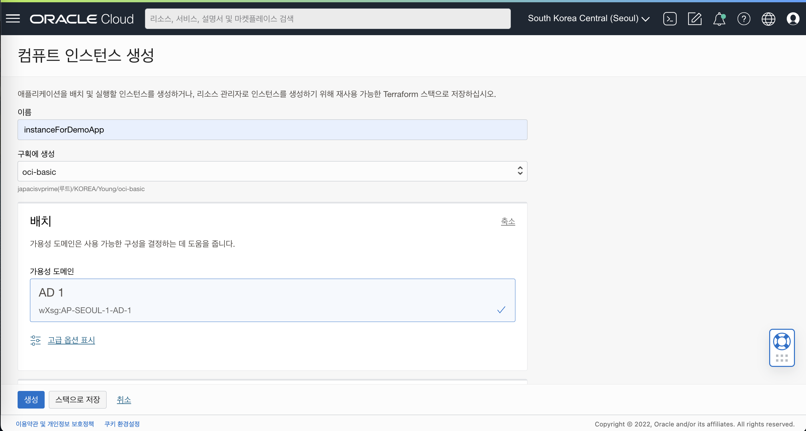
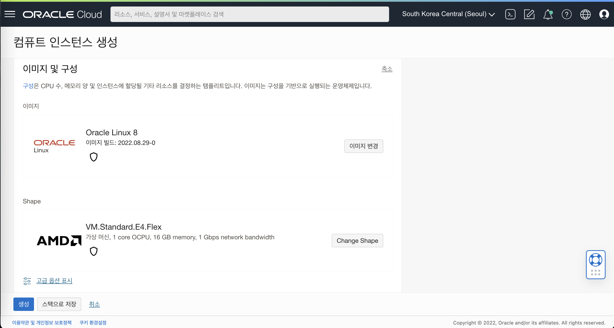
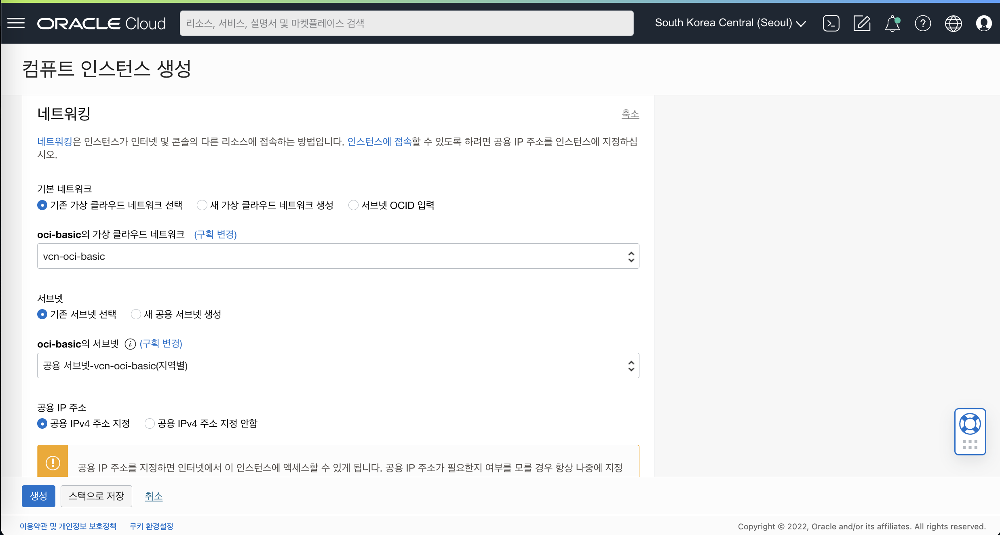
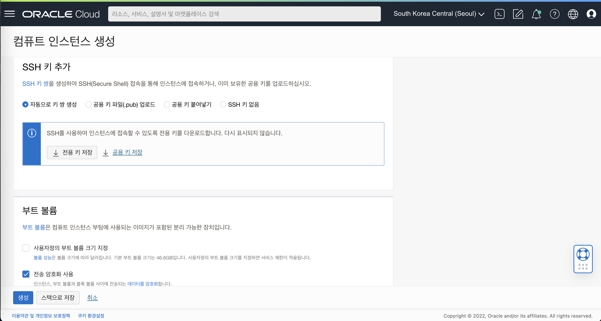
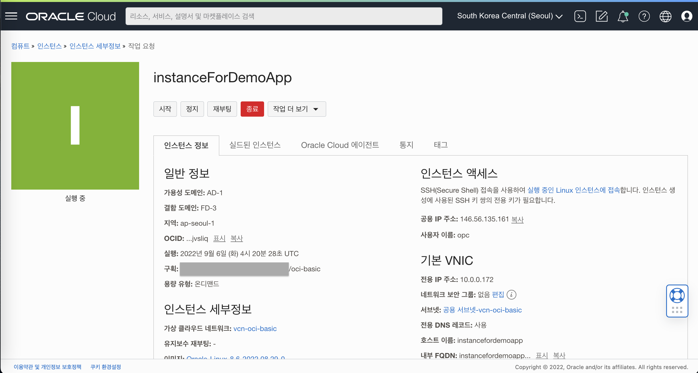
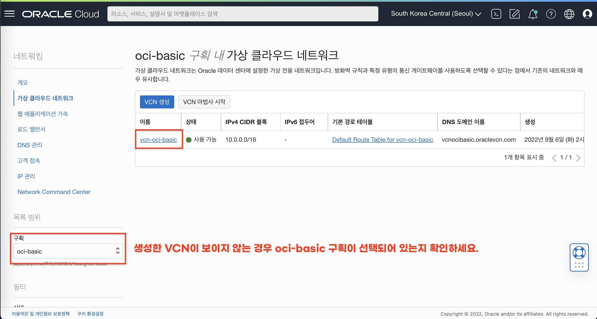
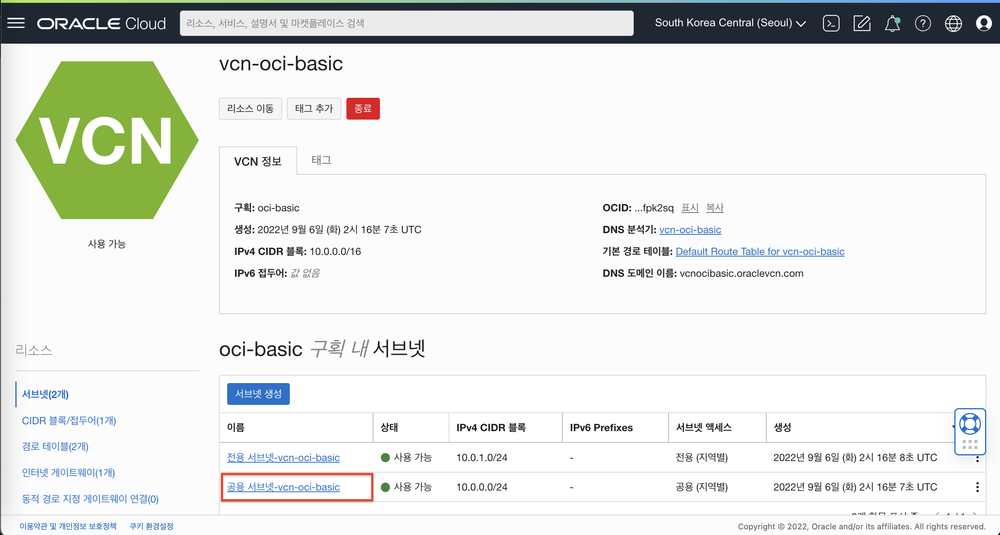
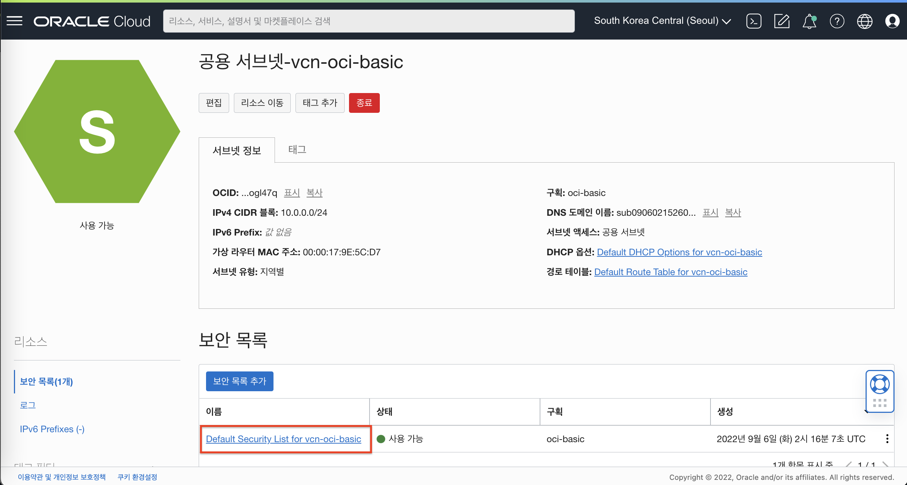
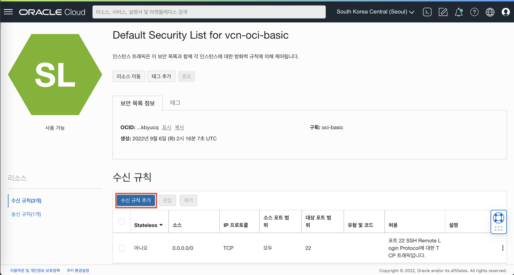
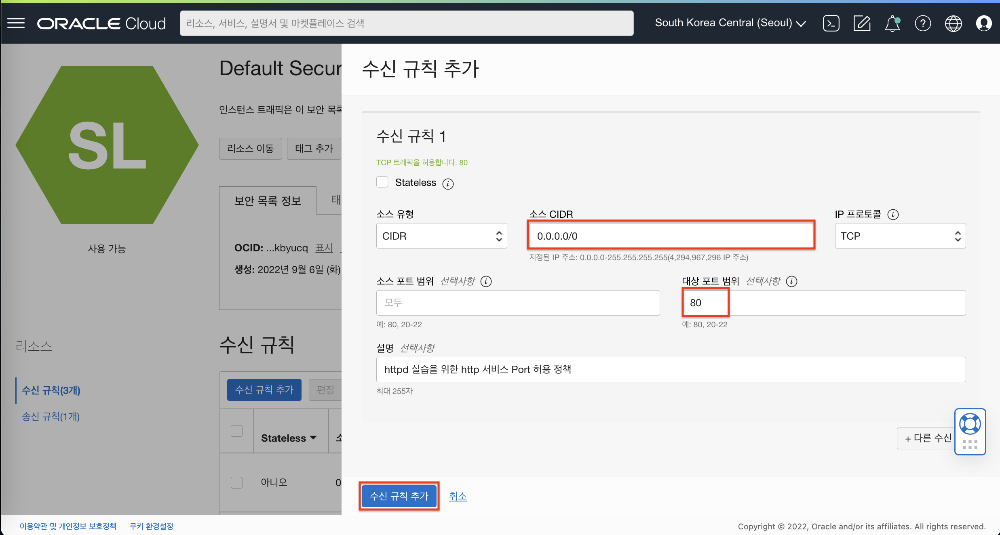

# OCI Compute Instance 및 Apache httpd 서버 설치 실습

## 소개

OCI 기본서비스 중 하나인 Compute - Instance 서비스에 Apache httpd 서버를 설치 및 접속하는 실습을 진행합니다.

소요시간: 20 minutes

### 목표

- OCI Compute Instance 서비스에 대한 이해
- OCI VCN Security 서비스에 대한 이해

### 사전 준비사항

1. 실습을 위한 노트북 (Windows, MacOS)
1. Oracle Free Tier 계정

## Task 1: Compute Instance 생성

1. 좌측 상단의 **햄버거 아이콘**을 클릭하고, **컴퓨트(Compute)**을 선택한 후 **인스턴스(Instances)**를 클릭합니다.
   

2. 왼쪽 하단에 구획을 확인하고 **인스턴스 생성(Create instance)**버튼을 클릭합니다.
   

3. 인스턴스 이름과 구획을 선택 합니다
    - 이름: Enter **instanceForDemoApp**
    - 구획에 생성: **oci-basic**
    - 가용성 도메인 : **AP-SEOUL-1-AD-1 (Seoul 리전 기준)**
      

4. 설치할 이미지와 Instance의 Shape을 선택 합니다.
    - Image : **Oracle Linux8 - 2022.08.29-0**
    - Shape : **VM.Standard.E4.Flex (1 OCPU, 16 GB Memory)**
      

5. 네트워크 관련 옵션을 선택 합니다
    - Virtual cloud network : **vcn-oci-basic**
    - Subnet : **공용 서브넷-vcn-oci-basic**
    - Public IP address : **공용 IPv4 주소 지정**
      

6. VM에 접속할때 사용할 SSH Keys 추가 합니다.
    - 이번 실습에서는 **자동으로 키 쌍 생성** 를 선택 후 전용 키, 공용 키를 다운받아 잘 보관 합니다.
    - Boot volume 관련 옵션은 기본 설정을 유지 합니다.
      
7. **Create** 버튼을 클릭 후 생성
    - 생성 후 Running 상태를 확인 합니다
      

## Task 2: Compute Instance 접속

### 인스턴스 접속
- Windows 사용자 (PuttyGen , Putty 사용)
    - PuTTYgen을 실행합니다
    - **Load** 를 클릭 하고 인스턴스를 생성할 때 생성된 프라이빗 키를 선택합니다. 키 파일의 확장자는 **.key**
    - **Save Private Key** 를 클릭 합니다.
    - 키파일의 이름을 지정 합니다. (개인 키의 확장자는 **.ppk**로 저장합니다)
    - **Save** 를 클릭합니다.
    - 새로운 키 파일을 이용하여 인스턴스에 접속 합니다.
    - 상세내용은 링크를 통해 확인 가능 합니다. [접속 가이드 링크](https://docs.oracle.com/en-us/iaas/Content/Compute/Tasks/accessinginstance.htm#linux__putty)
- MacOS 사용자
    - 다운로드 받은 키파일의 권한을 조정합니다.
      ````shell
        <copy>
         chmod 400 <private_key_file> #엑세스 하려는 키 파일의 전체 경로 와 이름을 입력합니다.
        </copy>
       ````
    - 다음 명령어를 입력하여 인스턴스에 접속합니다.
      ````shell
        <copy>
         ssh -i <private_key_file> opc@<public-ip-address>
        </copy>
       ````

## Task 3: OCI 보안목록 (Security List) 설정

1. VCN 목록에서 생성한 **vcn-oci-basic**을 클릭 상세보기 창으로 이동합니다.
   

2. VCN 상세보기 화면에서 하단 Subnet 목록중 **공용 서브넷-vcn-oci-basic**을 클릭 합니다.
   

3. Subnet 상세보기 화면에서 하단 Security Lists 목록중 **Default Security List for vcn-oci-basic**을 클릭 합니다.
   

4. **수신 규칙 추가** 버튼을 클릭 합니다.
   

5. 다음과 같이 입력:
    - Source Type : **CIDR** (기본값)
    - Source CIDR : Enter **0.0.0.0/0**
    - IP Protocol : **TCP** (기본값)
    - Destination Port Range : **80**
    - Description : **httpd 실습을 위한 http 서비스 Port 허용 정책**
    - **수신 규칙 추가** 클릭
      

## Task 4: Apache httpd 서버 설치 및 접속 확인

1. Install Apache httpd 서버
      ````shell
      <copy>
      sudo yum install httpd -y
      </copy>
      ````
2. Apache 서버 시작 및 재부팅시 자동으로 서비스가 활성화 되도록 설정 합니다.
      ````shell
      <copy>
      sudo apachectl start
      sudo systemctl enable httpd
      </copy>
      ````
3. Apache 설정 테스트 명령을 실행합니다.
      ````shell
      <copy>
      sudo apachectl configtest
      </copy>
      ````
4. 아래 명령어를 입력하여 웹 브라우저에서 확인할 index.html 파일을 생성합니다.
      ````shell
      <copy>
      sudo bash -c 'echo This is my Web-Server running on Oracle Cloud Infrastructure >> /var/www/html/index.html'
      </copy>
      ````

      

5. OS 방화벽 사용 해제
기본으로 OS에 적용되어 있는 방화벽을 중지 시키기 위해 아래 명령어를 순차적으로 입력 합니다.
      ````shell
      <copy>
      sudo systemctl disable firewalld
      sudo systemctl stop firewalld
      </copy>
      ````
6. 웹서버 접속 및 응답 확인
인스턴스의 공용 IP로 접속하여 생성한 index.html파일의 내용을 브라우저에서 확인합니다.

      


[다음 랩으로 이동](#next)