# 실습 환경 준비

## 소개

OCI에서는 애플리케이션 로드 밸런서와 네트워크 로드 밸런서를 제공합니다.
로드 밸런서는 한 시작점에서 VCN(가상 클라우드 네트워크)에서 연결 가능한 여러 서버로의 자동 트래픽 분배를 제공합니다. 
리소스 활용률을 높이고 스케일링을 촉진하며 고가용성을 보장해 줍니다.
이번 실습을 통해 애플리케이션 로드 밸런서를 생성하고 구성하는 방법에 대해 알아봅니다.

소요시간: 20 minutes

### 목표

- OCI 로드밸런서에 대한 이해

### 사전 준비사항

1. 실습을 위한 노트북 (Windows, MacOS)
1. Oracle Free Tier 계정

## Task 1: OCI Load Balancer 생성

1. 좌측 상단의 **햄버거 아이콘**을 클릭하고, **네트워킹(Networking)**을 선택한 후 **로드 밸런서(Load Balancer)**를 클릭합니다.
   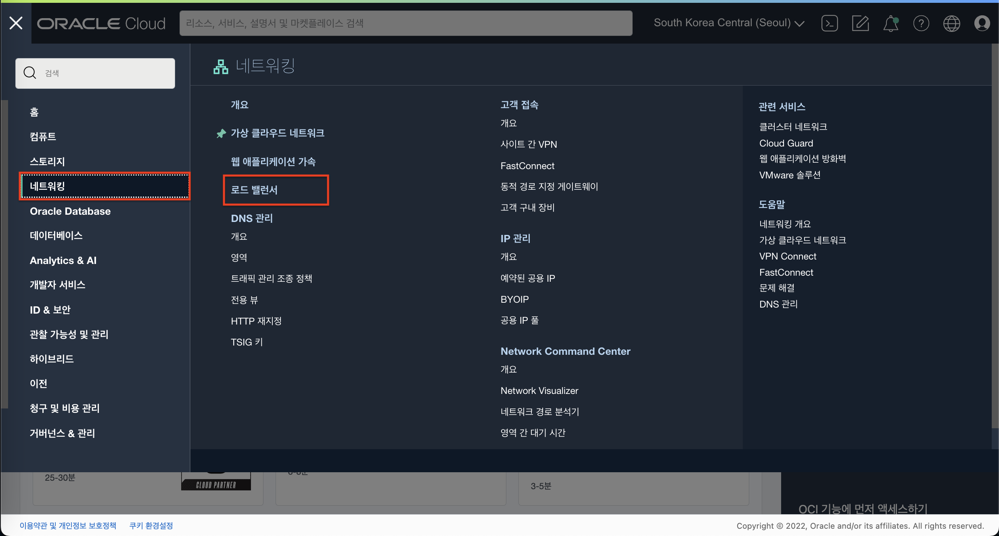
2. 이동한 화면에서 현재 구획을 확인 후 **로드 밸런서 생성** 버튼을 클릭합니다.
   
3. 로드 밸런서 유형 선택 화면에서 상단의 Layer-7 **로드 밸런서**를 선택 후 **로드 밸런서 생성** 버튼을 클릭합니다.
   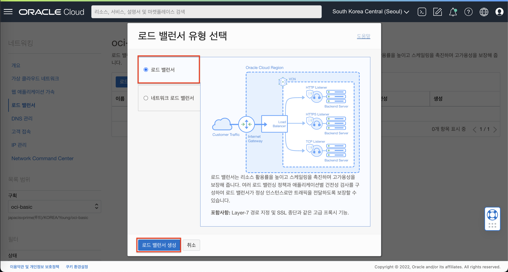
4. 로드 밸런서 생성 화면에서 아래와 같이 입력 및 선택 합니다.
    - 로드 밸런서 이름: **lb\_for\_demo**
    - 가시성 유형 선택: **공용**
    - 공용 IP 주소 지정 : **임시 IP 주소** / 예약된 IP 주소를 사용하려면 사전에 예약된 IP 생성 필요
   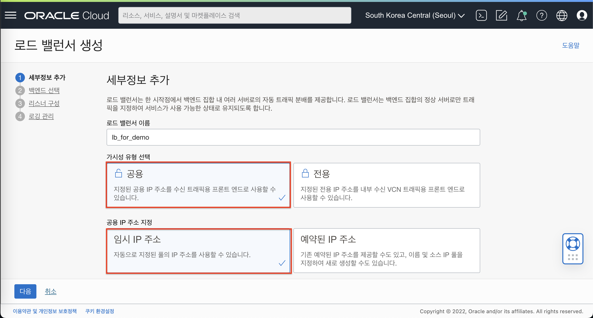
5. 대역폭 구성은 기본값으로 구성합니다. (**최소/최대 10Mbps**)
   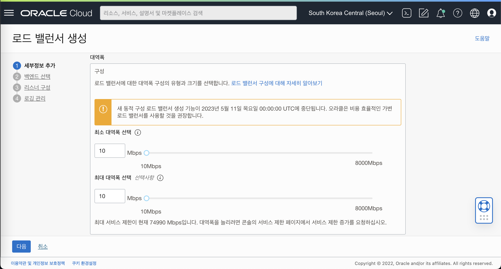
6. 네트워킹 선택에서 아래와 같이 선택 합니다.
   - 가상 클라우드 네트워크: **vcn-oci-basic**
   - 가시성 유형 선택: **공용 서브넷-vcn-oci-basic**
   - **다음** 버튼을 클릭합니다.
   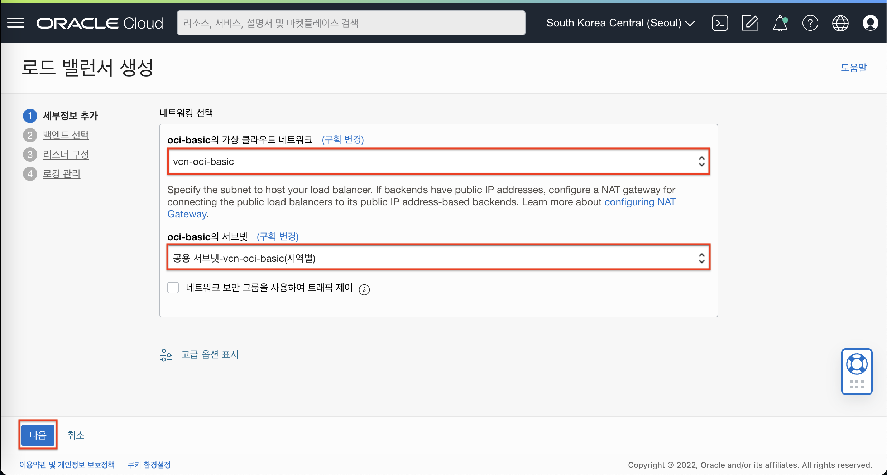
7. 백엔드 선택 단계에서 아래와 같이 선택합니다.
   - 로드 밸런싱 정책 지정: **라운드 로빈(가중치 사용)**
   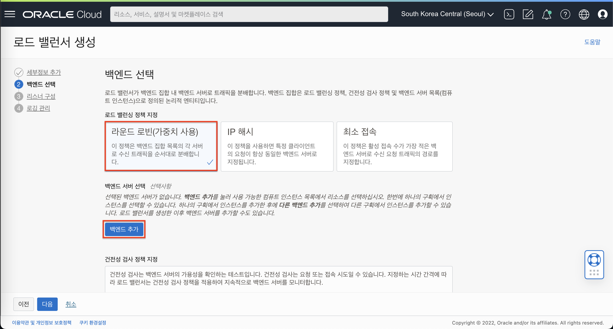
8. **백엔드 추가** 버튼을 클릭하여 전단계에서 생성한 인스턴스를 선택합니다.
   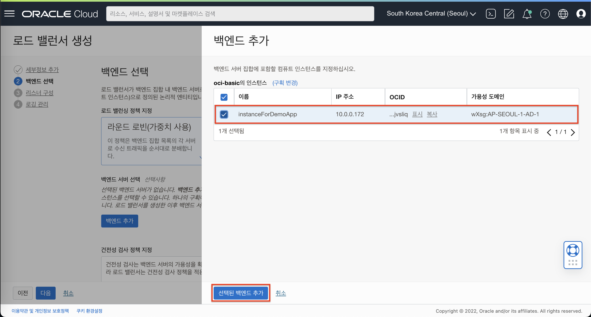
9. 건정성 검사 정책 지정 단계에서는 기본값을 그대로 사용 합니다.
   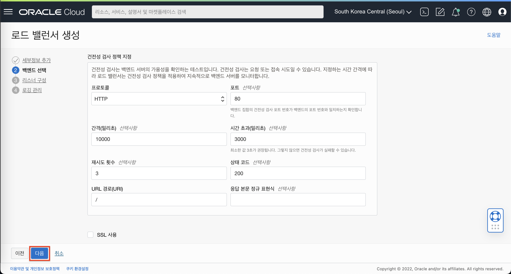
10. 리스너 구성 화면에서 아래와 같이 입력 및 선택 합니다.
    - 리스너 이름: **listener\_lb\_demo**
    - 리스너가 처리하는 트래픽의 유형 지정: **HTTP**
    - 수신 트래픽에 대해 리스너가 모니터하는 포트 지정: **80**
    - **다음** 버튼을 클릭합니다.
   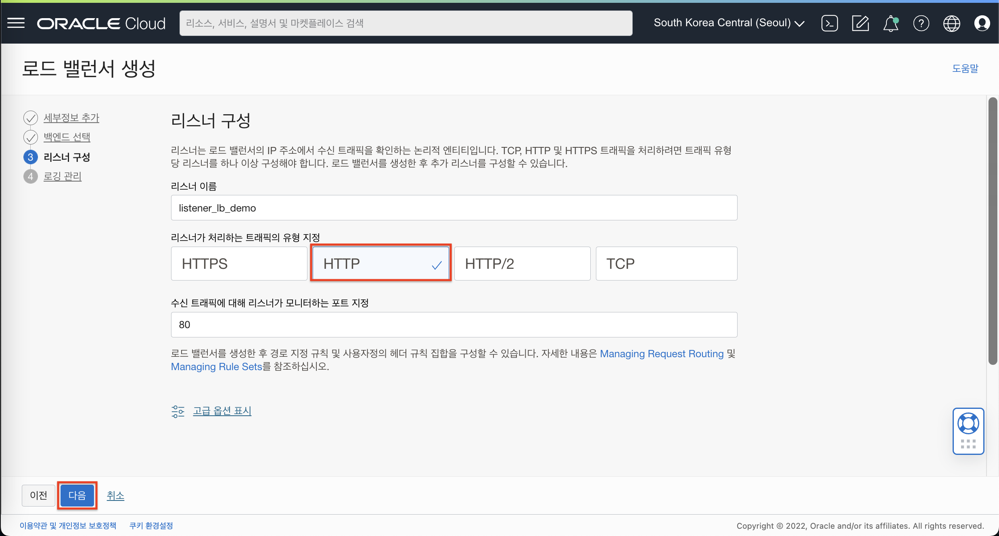
11. 로깅 관리 설정 단계에서 아래와 같이 오류 & 엑세스 로그를 모두 사용함으로 설정하고 **제출** 버튼을 클릭하여 Load Balancer를 생성합니다.
    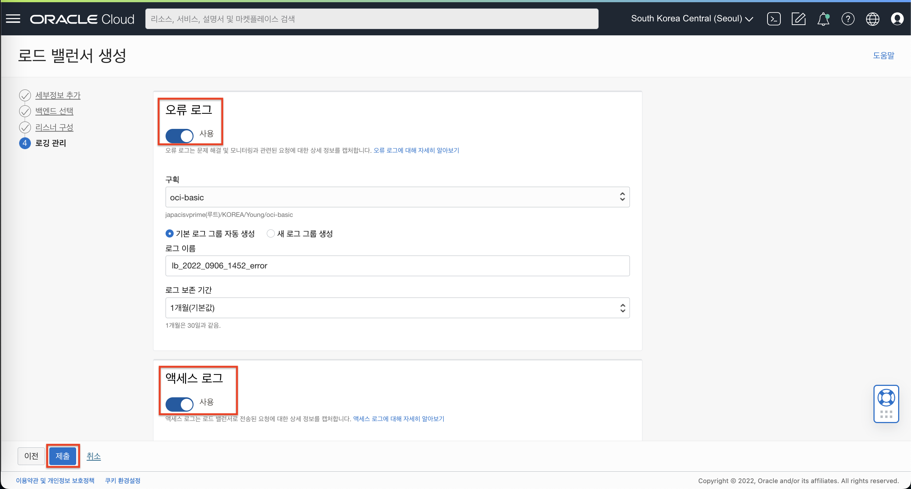
12. 생성 완료 후 로드밸런서 정보를 확인합니다.
    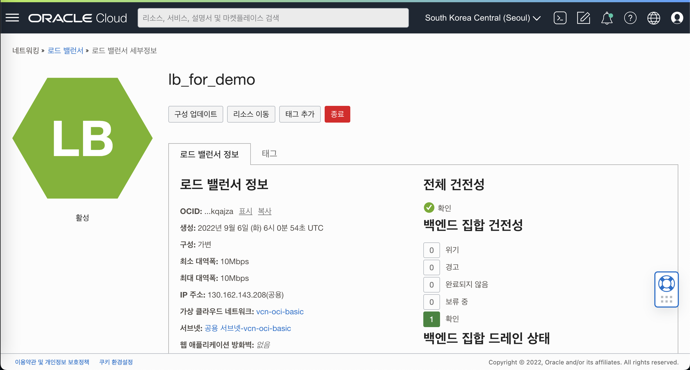
13. 확인한 공용 IP로 웹브라우저를 통해 접속을 확인합니다.
    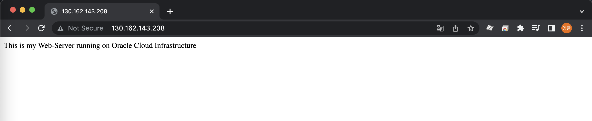

[다음 랩으로 이동](#next)