# 실습 환경 준비

## 소개

OCI의 컴퓨트 리소스를 관리할 수 있는 서비스인 인스턴스 구성과 인스턴스 풀에 대해 실습을 통해 알아봅니다.
이 과정을 완료하면 인스턴스 구성, 인스턴스 풀을 이용하여 자동 스케일 조정 설정하는 방법을 학습할 수 있습니다.

소요시간: 40 minutes

### 목표

- OCI 인스턴스 구성, 인스턴스 풀 생성하기
- OCI 인스턴스 풀을 이용하여 자동 스케일 조정 설정 및 테스트하기

### 사전 준비사항

1. 실습을 위한 노트북 (Windows, MacOS)
1. Oracle Free Tier 계정

## Task 1: Custom Image 생성

1. OCI 콘솔에서 **"사용자 정의 이미지 생성"** 버튼을 클릭하여 아래와 같이 입력하여 사용자 정의 이미지를 생성합니다.
   * **구획에 생성** : **oci-basic**
   * **이름** : **custom-image-demo**
   * **"사용자정의 이미 생성"** 버튼을 클릭하여 이미지를 생성합니다.
   
   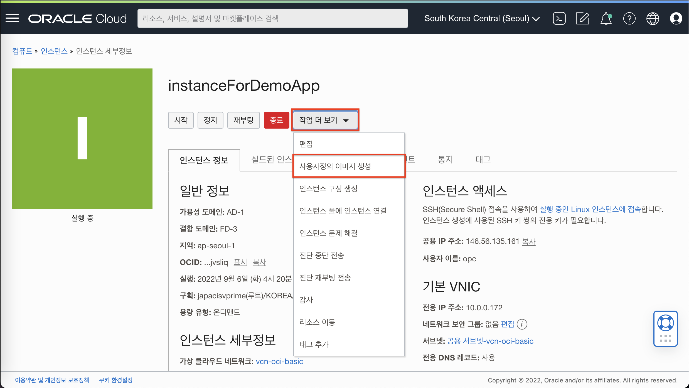
   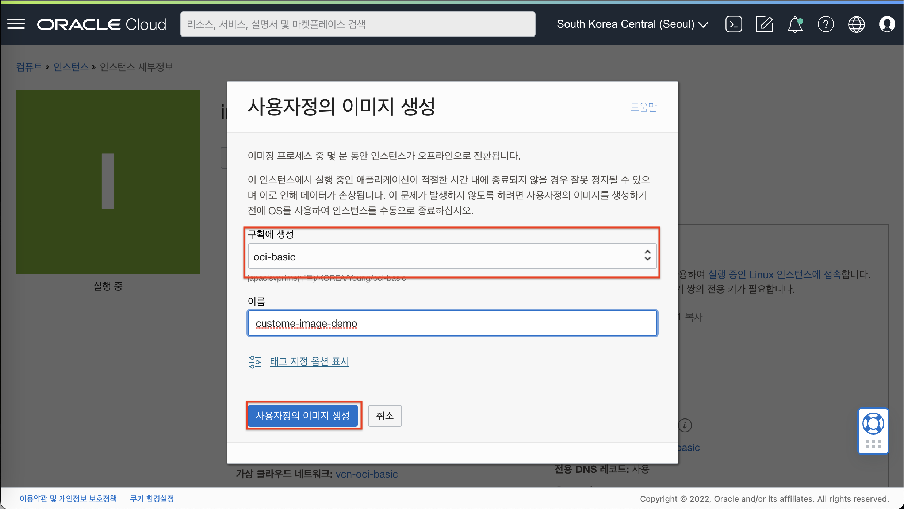

## Task 2: Custom Image로 Compute Instance 생성

1. 인스턴스 생성 버튼을 클릭합니다.
2. 생성화면에서 **"이미지 > 이미지 변경"** 버튼을 클릭합니다.
   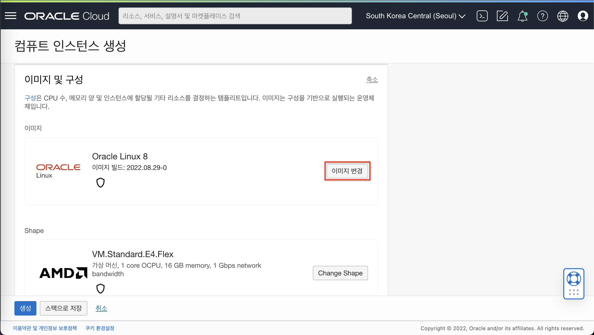
3. 팝업에서 이미지 소스를 **"사용자정의 이미지"**로 변경합니다.
4. **Task 1** 단계에서 생성한 Custom Image를 선택 후 하단 **"이미지 선택"** 버튼을 클릭합니다.
   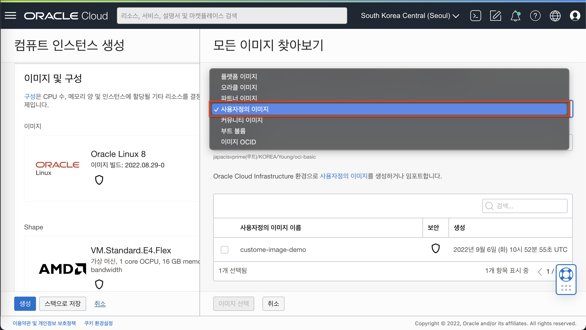
   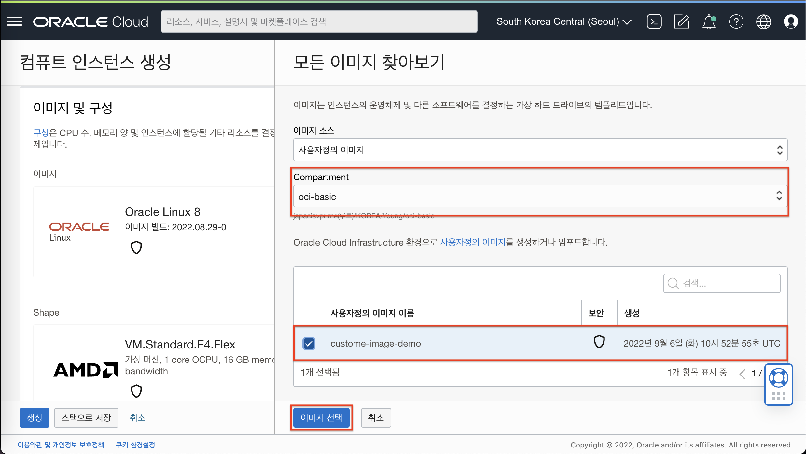
5. Shape 및 네트워크 등 기타 설정 부분은 [Lab 1: Compute Instance 생성 및 httpd 서버 설치](http://localhost:4000/learning-library/oci-library/oci-basic-compute/livelabs/index.html?lab=create-compute-instance) 섹션의 내용을 참고하여 설정합니다.
6. 화면 최하단 **"고급 옵션 표시"** 를 클릭합니다.
7. 초기화 스크립트 섹션에서 **"Cloud-init 스크립트 붙여넣기"** 를 선택 후 아래 내용을 복사하여 붙여넣기 합니다. (Block Volume 포멧 및 마운트 명령 추가)
      ```
      #!/bin/bash
      sudo rm /var/www/html/index.html
      sudo bash -c 'echo This is my Web-Server running on Oracle Cloud Infrastructure [$HOSTNAME] >> /var/www/html/index.html'
      ```

   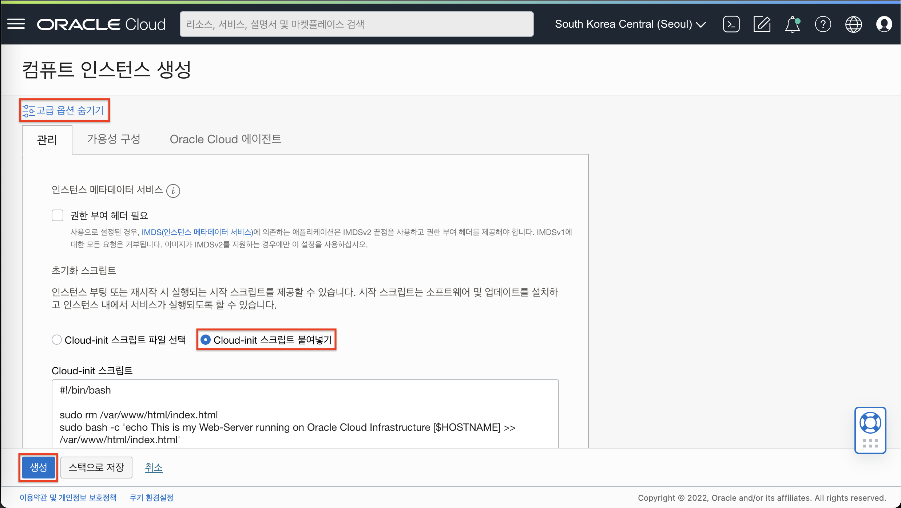
8. **"생성"** 버튼을 클릭하여 인스턴스를 생성합니다.
9. 인스턴스가 생성되면 http://[공용 IP 주소] 로 접속하여 정상 여부를 확인합니다.
   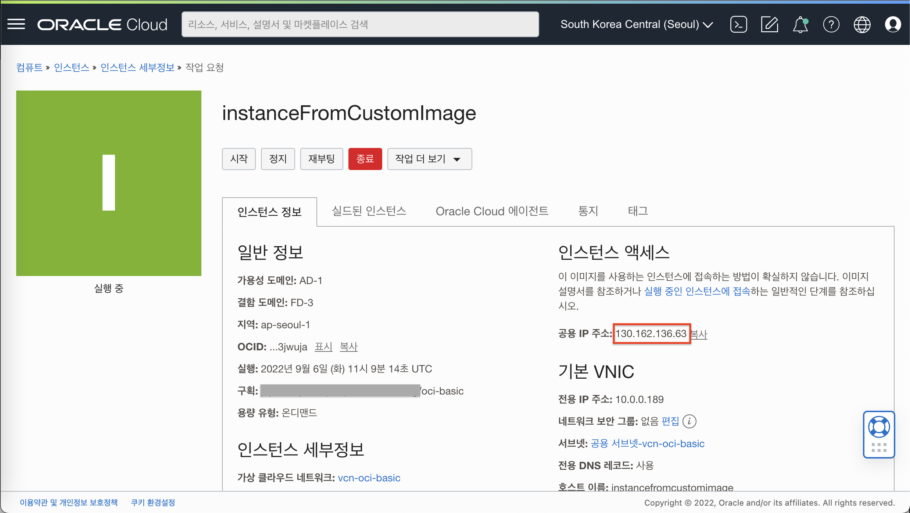
   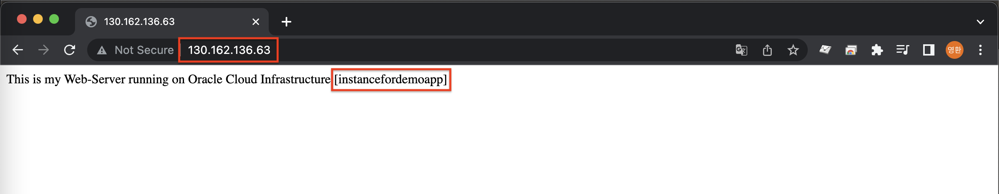


## Task 3: Instance Configuration 및 Instance Pool 생성

1. 인스턴스 세부정보 화면에서 **"작업 더 보기"** 버튼을 클릭하여 **인스턴스 구성 생성** 메뉴를 클릭합니다.
   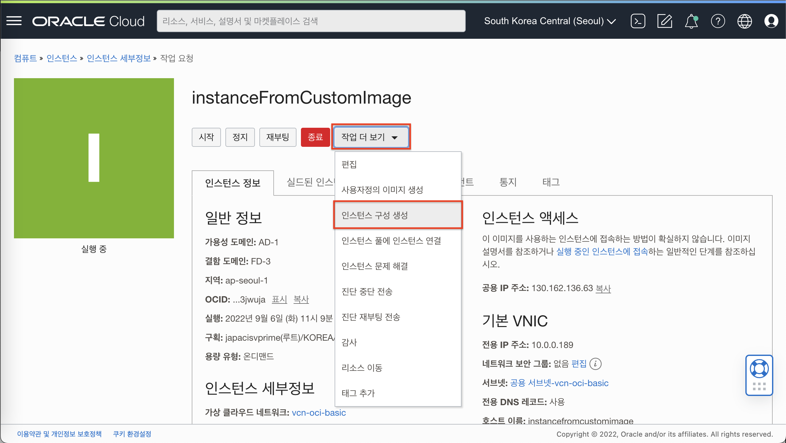
2. 아래와 같이 정보 입력 후 **"인스턴스 구성 생성"** 버튼을 클릭하여 구성을 생성합니다.
   * 구획에 생성 : **oci-basic**
   * 이름 : instance-config-demo
   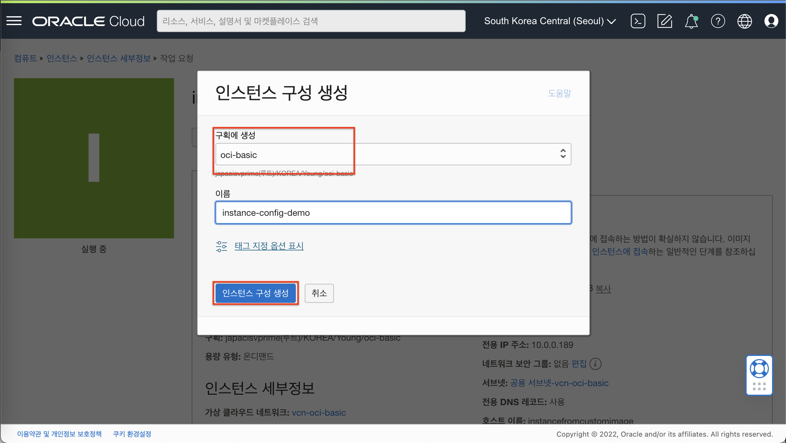
3. 생성된 인스턴스 구성 화면에서 **"인스턴스 풀 생성"** 버튼을 클릭하여 인스턴스 풀을 생성합니다.
   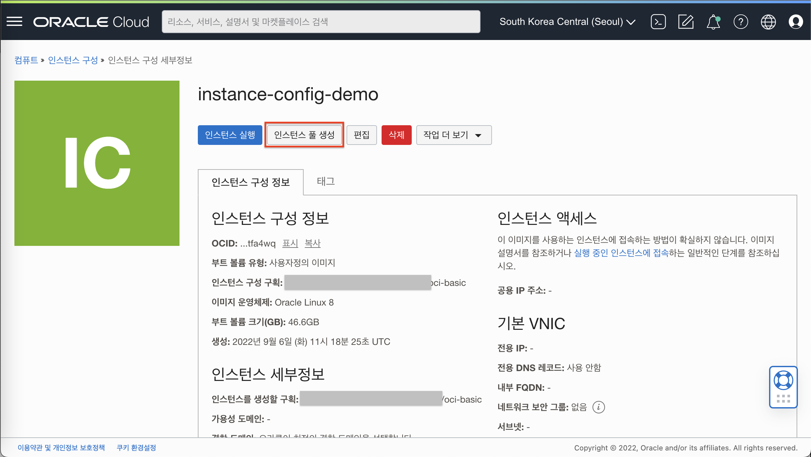
4. 다음과 같이 입력 및 선택 합니다.
   * 이름 : instance-pool-demo
   * 구획에 생성 : **oci-basic**
   * [oci-basic 구획]의 인스턴스 구성 : **instance-config-demo**
   * 인스턴스 수 : **1**
   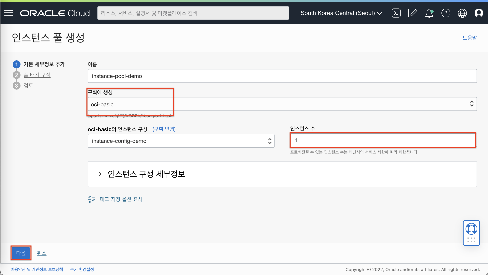
5. 풀 배치 구성 단계에서 아래와 같이 입력 및 선택 후 "다음" 버튼을 클릭합니다.
   * 가용성 도메인 : **기본값**
   * 결함 도메인 : **FD1, FD2, FD3**
   * 기본 VNIC (VCN 선택) : **vcn-oci-basic**
   * 기본 VNIC (Subnet 선택) : **공용 서브넷-vcn-oci-basic**
   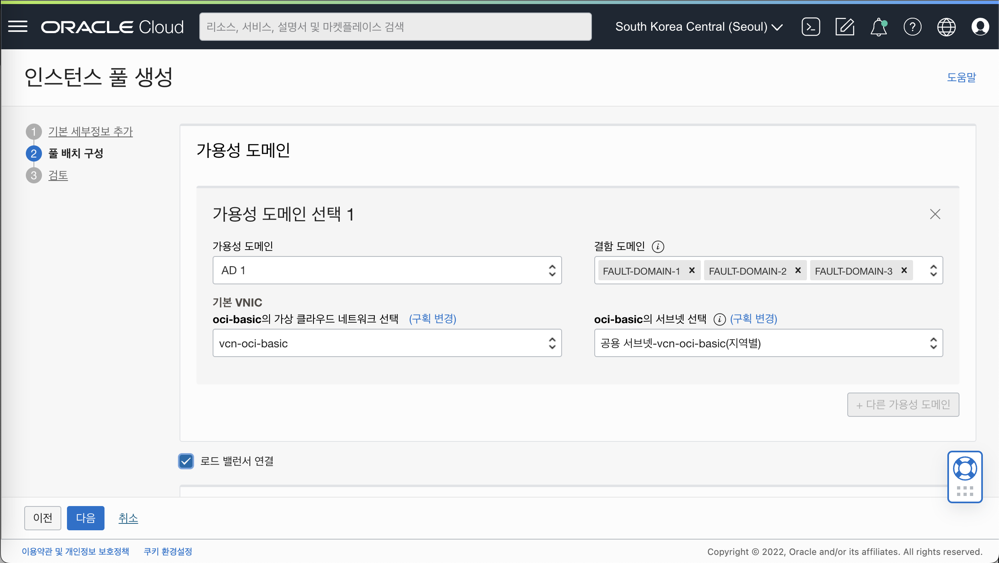
6. 로드 밸런서 연결을 선택하여 <mark>Lab 3</mark>에서 생성한 로드 밸런서를 연결합니다.
   * 로드 밸런서 유형 : **로드 밸런서**
   * [oci-basic 구획]의 로드 밸런서 : **lb\_for\_demo**
   * 백엔드 집합 : **bs\_lb\_2022-0906-1452** / 각자 생성되어 있는 백엔드 집합을 선택합니다.
   * 포트 : **80**
   * VNIC : **기본 VNIC**
   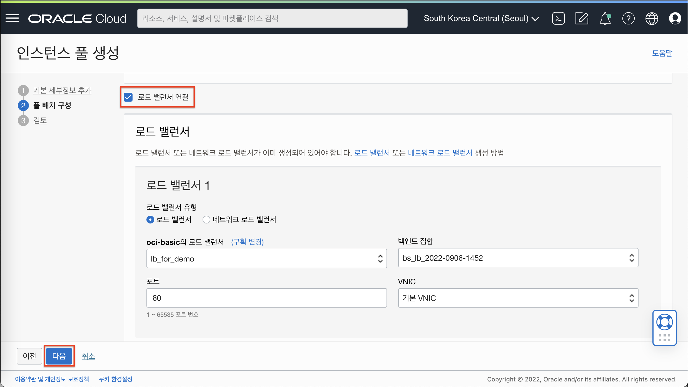
7. 입력 및 선택한 정보 확인 후 "생성" 버튼을 클릭하여 인스턴스 풀을 생성합니다.
   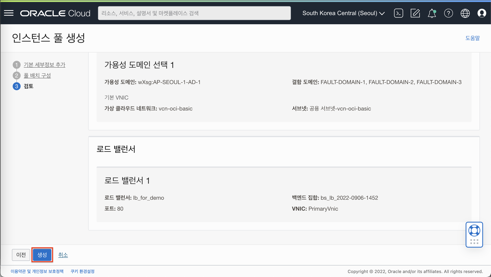
8. 인스턴스 풀이 프로비전 완료되면 자동으로 동일한 구성의 인스턴스가 함께 프로비전 됩니다.
   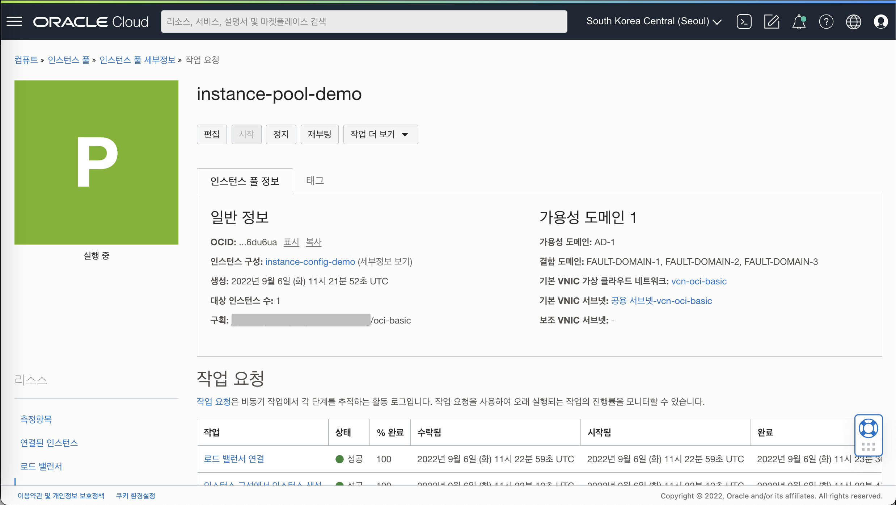
   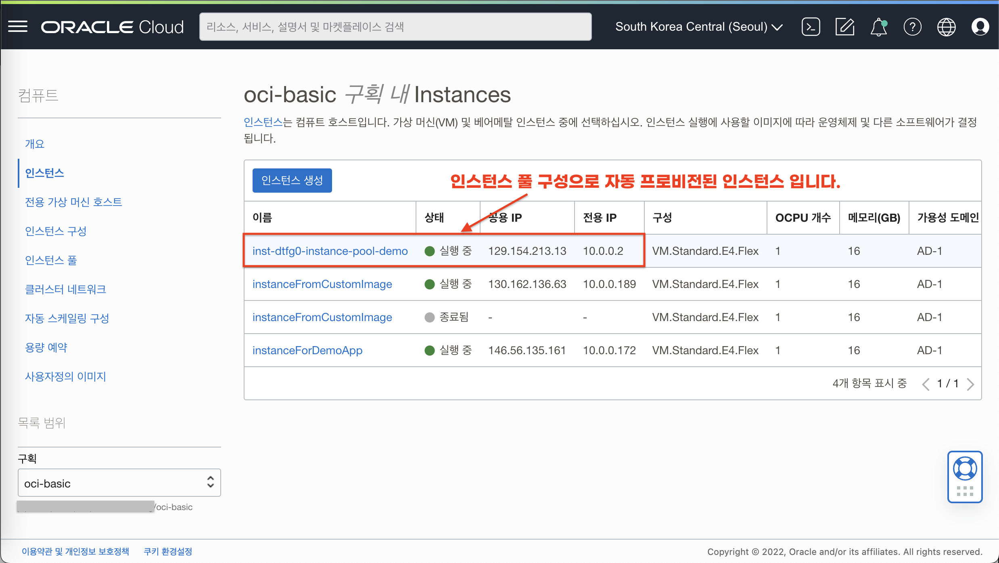
9. 프로비전 된 인스턴스가 로드 밸런서의 백엔드 집합에 자동으로 추가됩니다.
   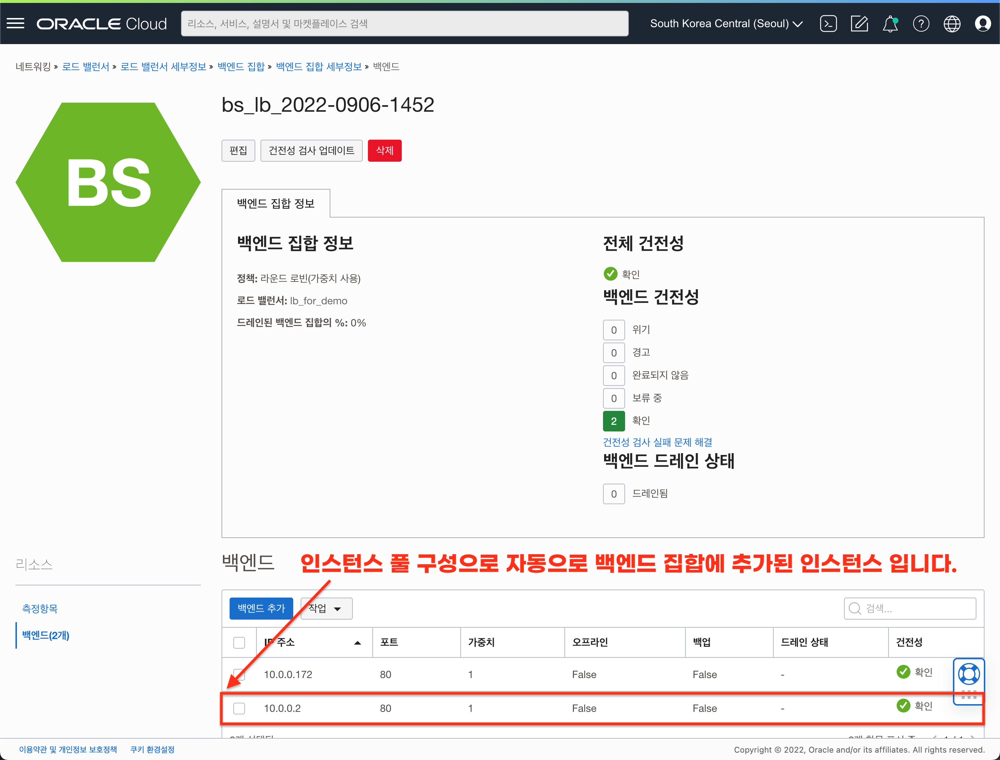
10. 로드 밸런서의 공용 IP로 접속하여 프로비전된 인스턴스의 HostName이 번갈아 출력되는 부분을 확인합니다.
   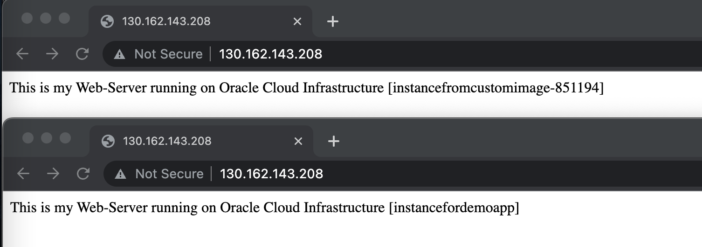


## Task 4: Auto Scaling 구성 생성
1. 인스턴스 풀 세부정보 화면에서 **"작업 더 보기"** 버튼을 클릭하여 **자동 스케일링 구성 생성** 메뉴를 클릭합니다.
   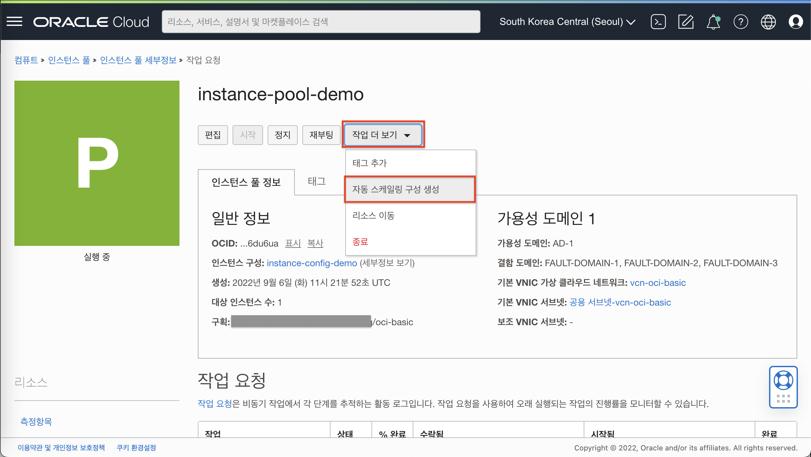
2. 아래와 같이 입력 및 선택 합니다.
   * 이름 : instance-pool-demo
   * 구획에 생성 : **oci-basic**
   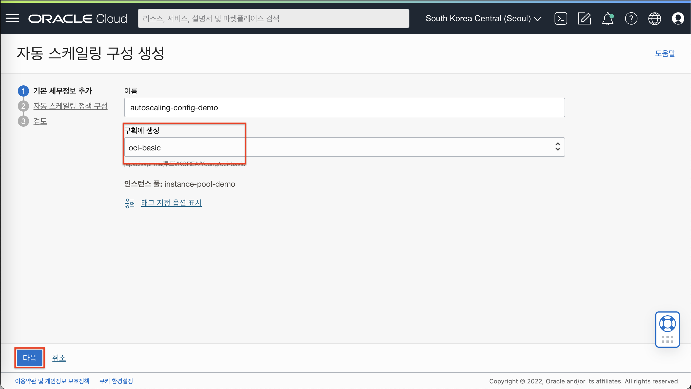
3. 아래와 같이 선택 합니다.
   * **측정항목 기준 자동 스케일링** 선택
   * 자동 스케일링 정책 구성
      * 자동 스케일링 정책 이름 : **autoscaling-policy-202200906-2025** / 자동 생성된 이름 그대로 사용
      * 쿨타임(초) : **300 (최소 값 300초)**
   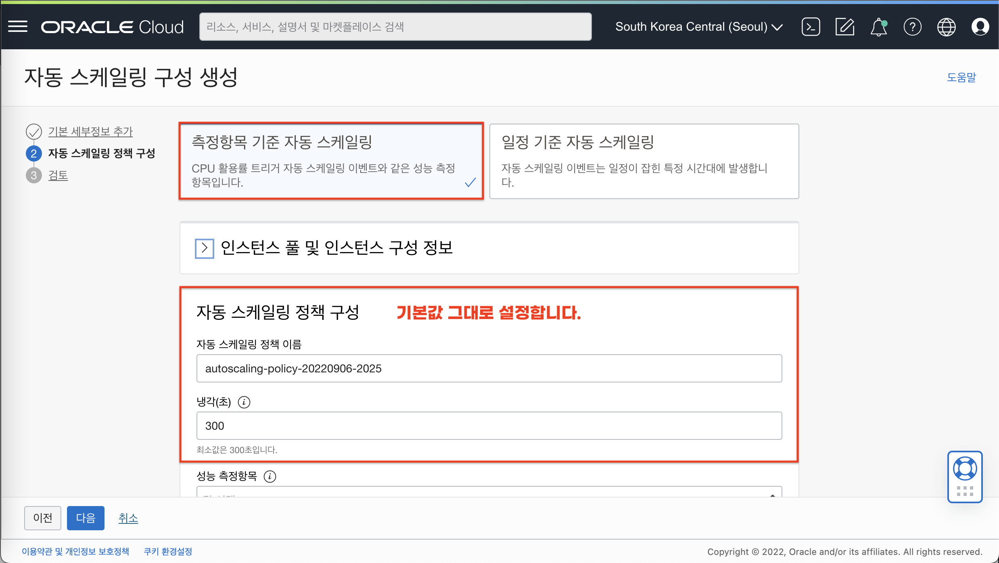
4. 아래와 같이 입력 및 선택 합니다.
   * 성능 측정항목 : **CPU 활용률**
      * 스케일 아웃 규칙
         * 연산자 : 보다 큼(>)
         * 임계값 백분율 : 80
         * 추가할 인스턴스 수 : 1
      * 스케일 인 규칙
         * 연산자 : 보다 작음(<)
         * 임계값 백분율 : 20
         * 제거할 인스턴스 수 : 1
      * 스케일링 제한
         * 최소 인스턴스 수 : 1
         * 최대 인스턴스 수 : 3
         * 초기 인스턴스 수 : 1

   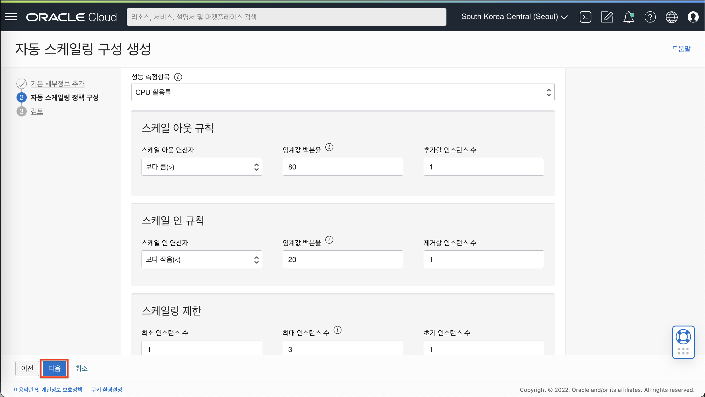
5. 입력한 내용을 검토 후 이상이 없을 시 **"생성"** 버튼을 클릭하여 자동 스케일링 구성을 생성합니다.
   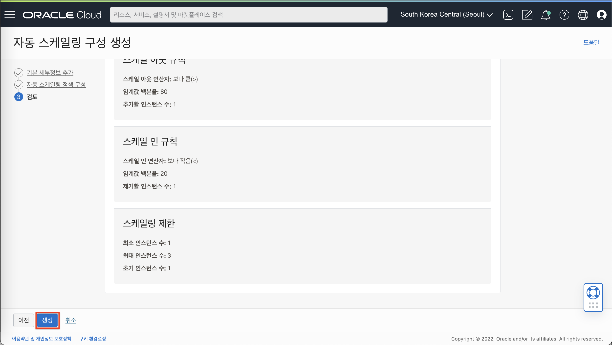
   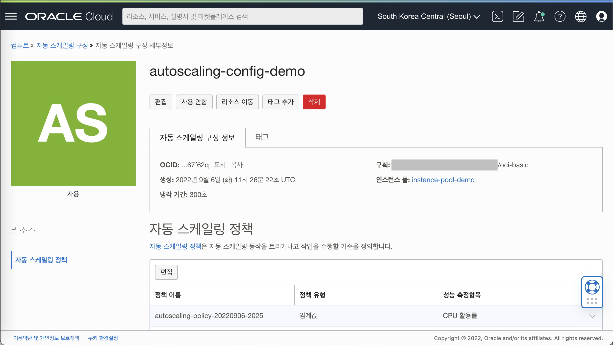

## Task 5: Auto Scaling 테스트하기
1. 부하를 주기 위해 테스트에 필요한 프로그램을 다운로드 및 설치합니다.
      ````shell
      <copy>
      wget https://download-ib01.fedoraproject.org/pub/epel/7/x86_64/Packages/s/stress-1.0.4-16.el7.x86_64.rpm
      sudo yum install -y stress-1.0.4-16.el7.x86_64.rpm
      </copy>
      ````
2. 인스턴스 풀에서 자동으로 프로비전된 인스턴스에 접속하여 아래와 같이 입력하여 해당 VM의 CPU에 부하를 줍니다.
      ````shell
      <copy>
      stress -c 8
      </copy>
      ````
   * 명령어 실행 전 CPU 활용률
     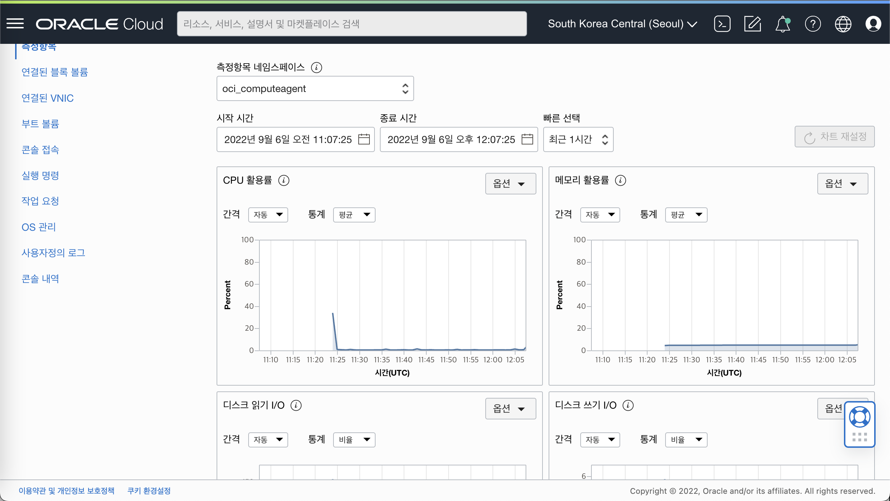
   * 명령어 실행 후 CPU 활용률
     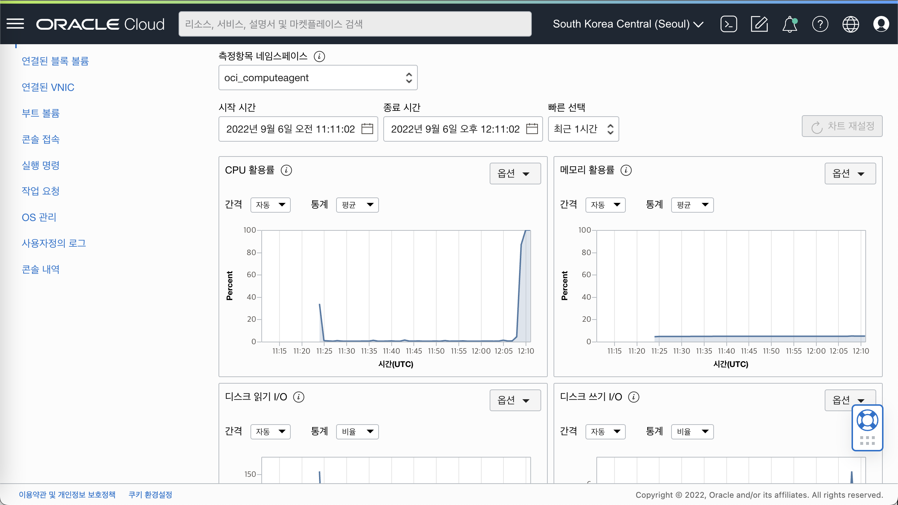
3. Auto Scaling은 최소 300초의 간격으로 작업이 수행되기 때문에 최대 5분간 부하를 주며 Auto Scaling 작업이 수행되기 기다립니다.
4. Auto Scaling 작업이 수행되면 자동으로 설정한 수 만큼 인스턴스가 추가 됩니다.
   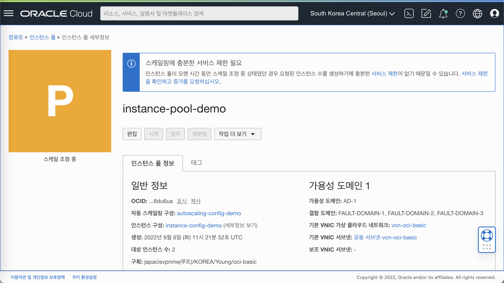
   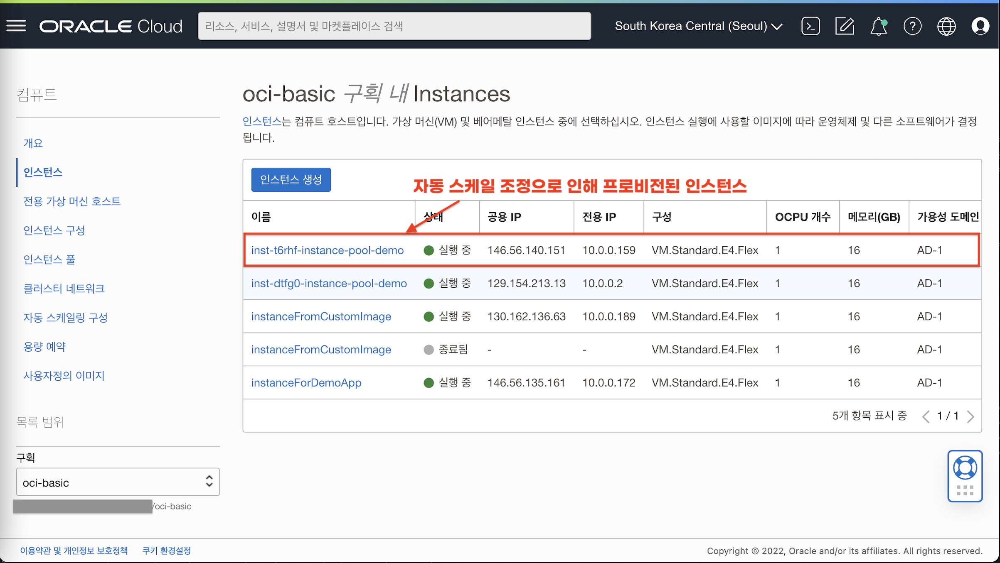
5. 로드 밸런서에도 자동으로 설정되어 각각 번갈아서 호출되는것을 확인할 수 있습니다.
   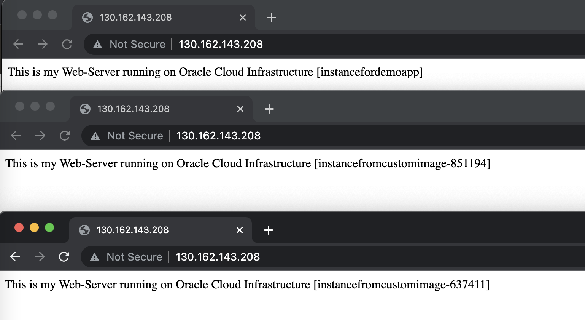

[다음 랩으로 이동](#next)