# 실습 환경 준비

## 소개

OCI 에서는 Cloud Native의 Database Tool 서비스를 제공합니다. 
그 중 하나인 SQL 워크시트를 활용하여 사전 준비 단계에서 생성한 DBCS 인스턴스에 접속 및 쿼리를 실행하는 실습을 진행합니다.

소요시간: 20 minutes

### 목표

- OCI SQL 워크시트를 활용하여 Database 쿼리 실행

### 사전 준비사항

1. 실습을 위한 노트북 (Windows, MacOS)
1. Oracle Free Tier 계정

## Task 1: DBCS 생성 확인하기

1. 좌측 상단의 **햄버거 아이콘**을 클릭하고, **Oracle Database**을 선택한 후 **Oracle 기본 위치 데이터베이스(VM,BM)**를 클릭합니다.

   
2. 사전 준비 단계에서 생성 요청한 DBCS가 프로비전 완료 되었는지 확인합니다.
   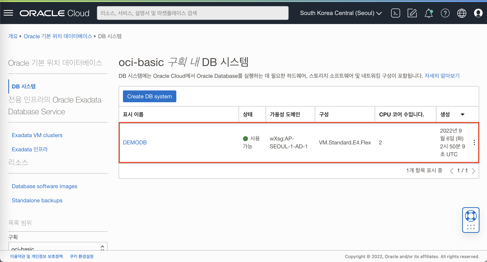

## Task 2: OCI Vault 에 관리자 비밀번호 저장하기
Database Tool 에서 사용하기 위해 관리자 비밀번호를 OCI Vault 서비스에 저장해야 합니다.

1. 좌측 상단의 **햄버거 아이콘**을 클릭하고, **ID & 보안**을 선택한 후 스크롤을 내려서 **저장소**를 클릭합니다.
   
2. 이동된 화면에서 **"저장소 생성"** 버튼을 클릭하여 아래와 같이 입력 및 선택 하여 저장소를 생성합니다.
   * **구획에 생성** : **oci-basic**
   * **이름** : demo-vault
   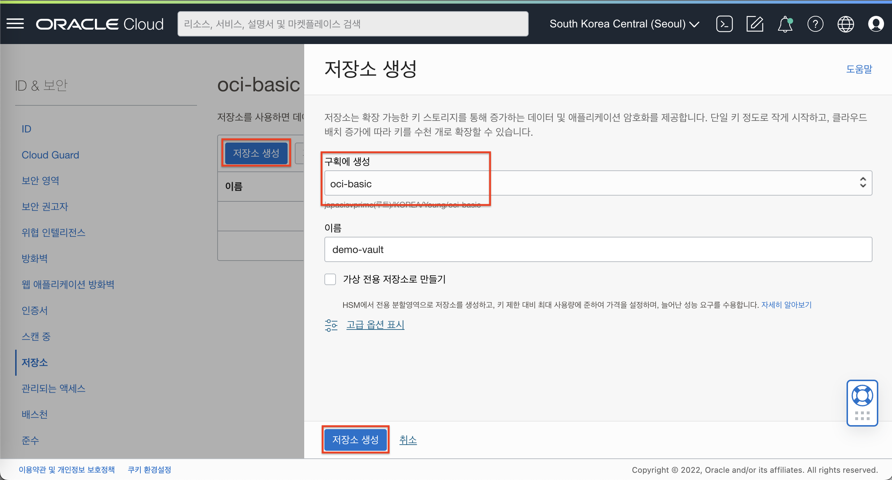
3. 생성된 저장소에서 아래와 같이 입력 및 선택하여 암호를 저장할때 사용할 키를 생성합니다.
   * **구획에 생성** : **oci-basic**
   * **보호모드** : HSM
   * **이름** : demo-key
   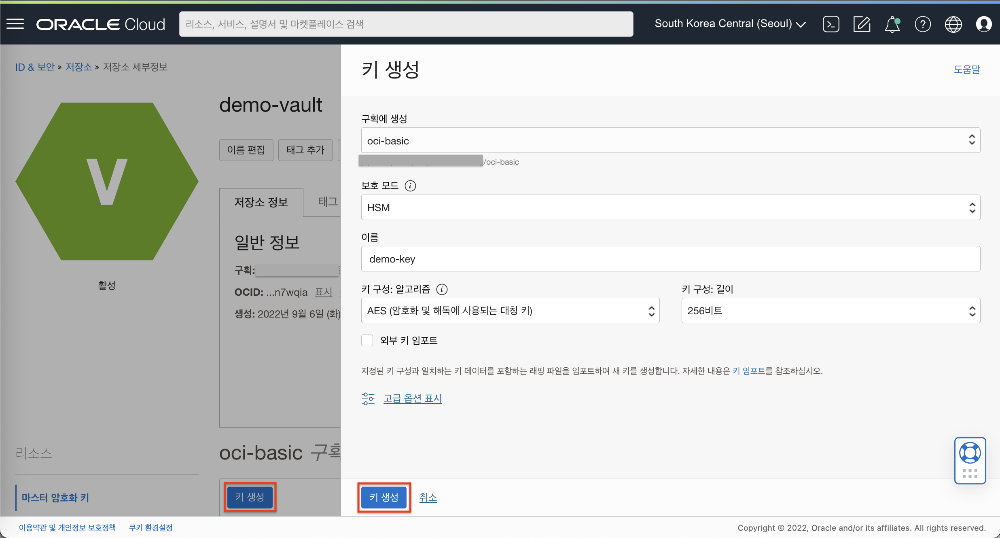
4. 키 생성이 완료되면, DBCS를 생성할때 입력한 관리자 비밀번호로 새로운 "암호" 를 생성합니다.
   * **구획에 생성** : **oci-basic**
   * **이름** : demodb-admin
   * **설명** : demodb 관리자 비밀번호
   * **암호화 키** : demo-key
   * **암호 유형 템플리트** : 일반 텍스트
   * **암호 콘텐츠** : WelCome12##
   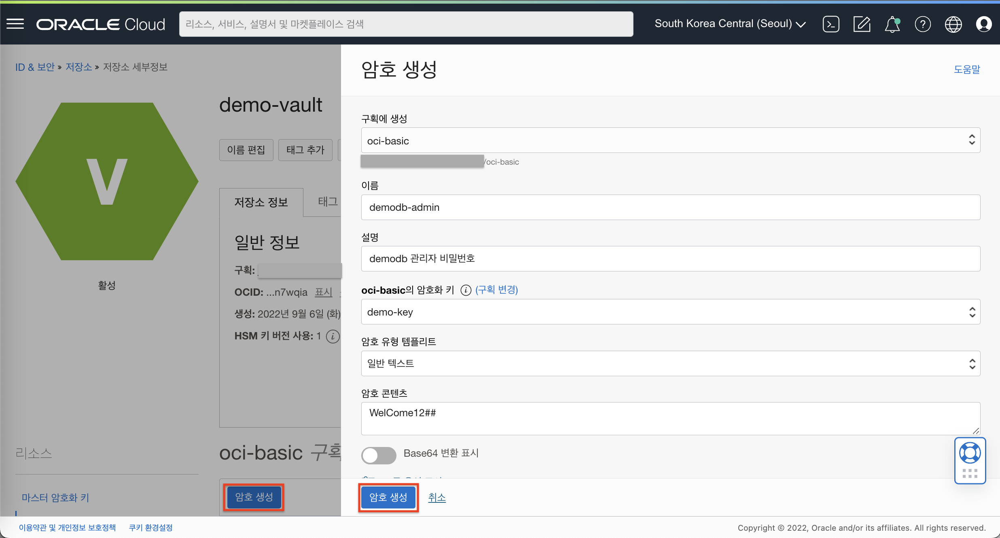

## Task 3: OCI Database Tool에서 접속을 위한 준비하기
좌측 상단의 **햄버거 아이콘**을 클릭하고, **개발자 서비스**를 선택한 후 **데이터베이스 툴**를 클릭합니다.
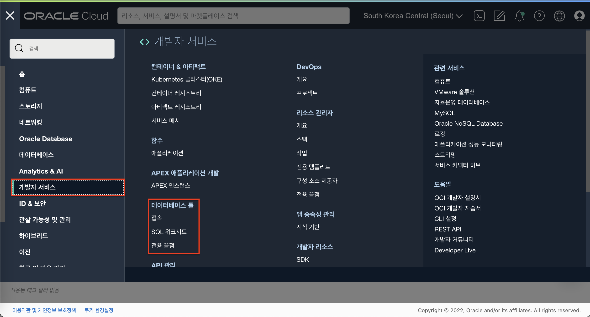

### Database Tool 에서 전용 끝점 생성하기
좌측 메뉴에서 전용 끝점을 클릭 후 "전용 끝점 생성" 버튼을 클릭한 다음 아래와 같이 입력 및 선택하여 전용 끝점을 생성합니다.
   * **이름** : pe-demodb
   * **구획** : **oci-basic**
   * **데이터베이스 선택** 클릭
   * **데이터베이스 클라우드 서비스** : **Oracle 기본 위치 데이터베이스**
   * **데이터베이스 시스템** : **DEMODB**
   * **서브넷** : **전용 서브넷-vcn-oci-basic (vcn-oci-basic VCN)**
   * **"생성"** 버튼을 클릭합니다.
  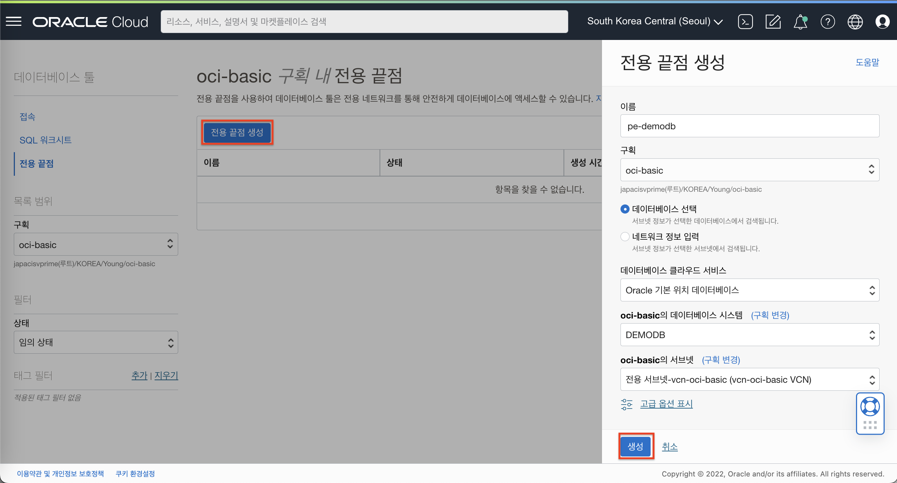

### Database Tool 에서 접속 생성하기
좌측 메뉴에서 접속을 클릭 후 "접속 생성" 버튼을 클릭한 다음 아래와 같이 입력 및 선택하여 접속을 생성합니다.
  * **이름** : demodb-conn
  * **구획** : **oci-basic**
  * **데이터베이스 선택** 클릭
  * **데이터베이스 클라우드 서비스** : **Oracle 기본 위치 데이터베이스**
  * **데이터베이스 시스템** : **DEMODB**
    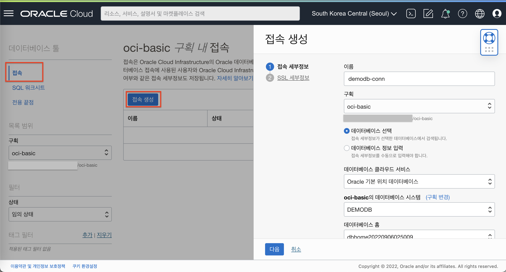
  * **데이터베이스 홈** : 기본값
  * **데이터베이스** : **DEMODB**
  * **플러거블 데이터베이스** : **PDB1**
  * **사용자 이름** : **sys**
  * **롤** : <mark>SYSDBA</mark> / sys 계정으로 로그인하려면 롤이 SYSDBA로 선택되어야 합니다.
  * **사용자 비밀번호 암호** : Vault에 생성한 **demodb-admin** 암호를 선택합니다.
    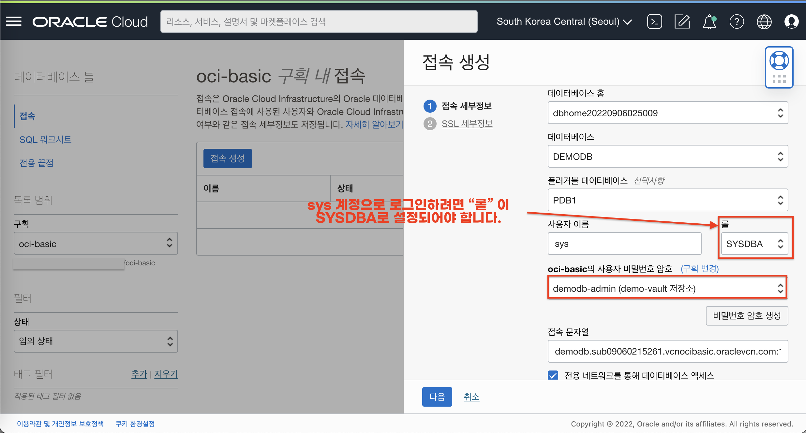
  * SSL 세부정보 단계 내용은 수정없이 **"생성"** 버튼을 클릭합니다.
    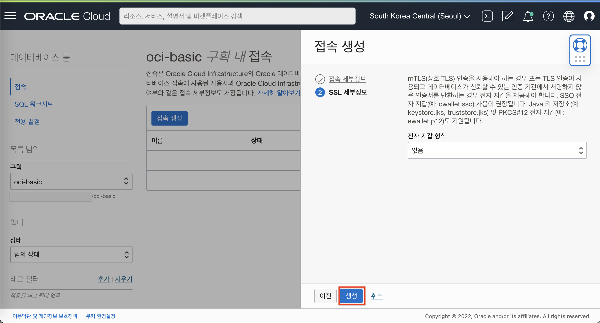

### VCN의 보안목록에 DBCS 접속을 위한 규칙 추가하기
1. 좌측 상단의 **햄버거 아이콘**을 클릭하고, **네트워킹(Networking)**을 선택한 후 **가상 클라우드 네트워크(Virtual Cloud Networks)**를 클릭합니다.
   
2. VCN (vcn-oci-basic) 세부 정보 화면에서 **"전용 서브넷-vcn-oci-basic"** 을 클릭합니다.
   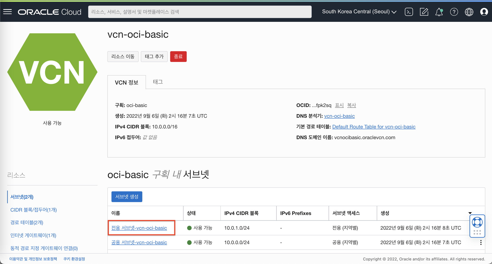
3. 전용 서브넷 세부 정보 화면에서 **"전용 서브넷-vcn-oci-basic의 보안 목록"** 을 클릭합니다.
   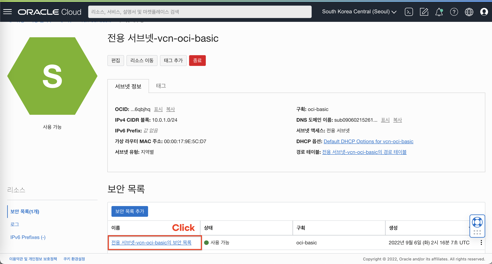
4. 이동한 화면에서 **"수신 규칙 추가"** 버튼을 클릭합니다.
   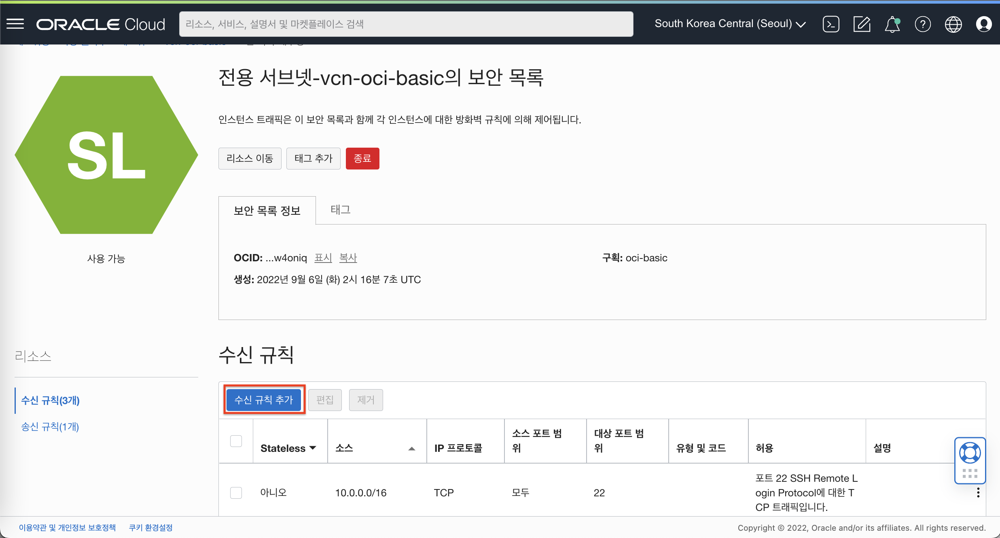
5. 아래와 같이 입력하여 수신 규칙을 추가 합니다.
   * 소스 유형 : **CIDR**
   * 소스 CIDR : **10.0.0.0/16**
   * IP 프로토콜 : **TCP**
   * 대상 포트 범위 : **1521**
   * 설명 : **DBCS 접속을 위한 보안규칙 입니다.**
   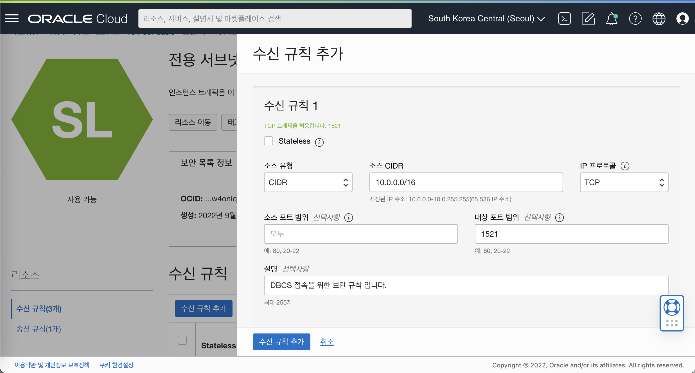
## Task 4: OCI SQL 워크시트로 DBCS 접속 및 테스트하기
1. 생성된 접속의 상세화면 페이지로 이동합니다.
2. 이동된 화면에서 **SQL 워크시트** 버튼을 클릭합니다.
   
3. SQL 워크시트에서 아래 쿼리를 입력하여 쿼리를 실행하여 정상적으로 접속되는지 확인합니다.
      ````shell
      <copy>
      select * from ALL_ALL_TABLES;
      </copy>
      ````
4. 정상 동작시 아래와 같이 출력 됩니다.
   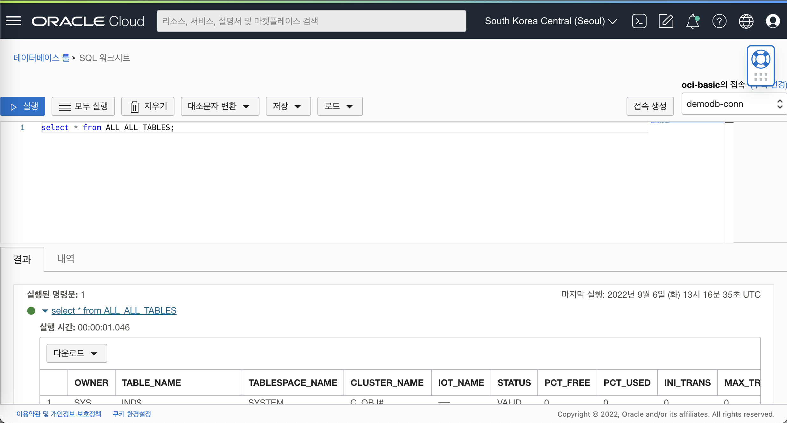
   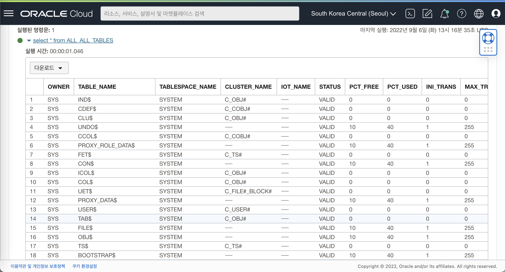

[다음 랩으로 이동](#next)