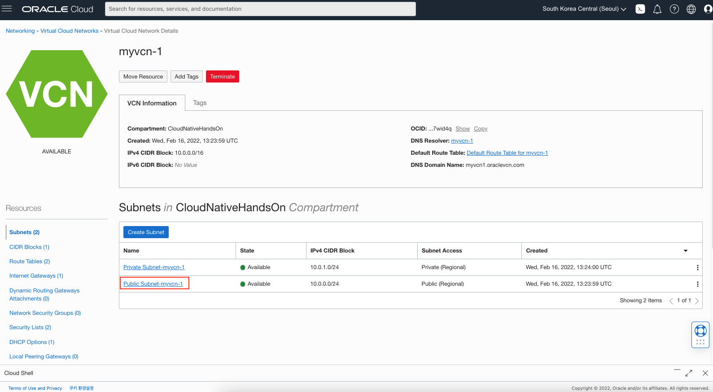
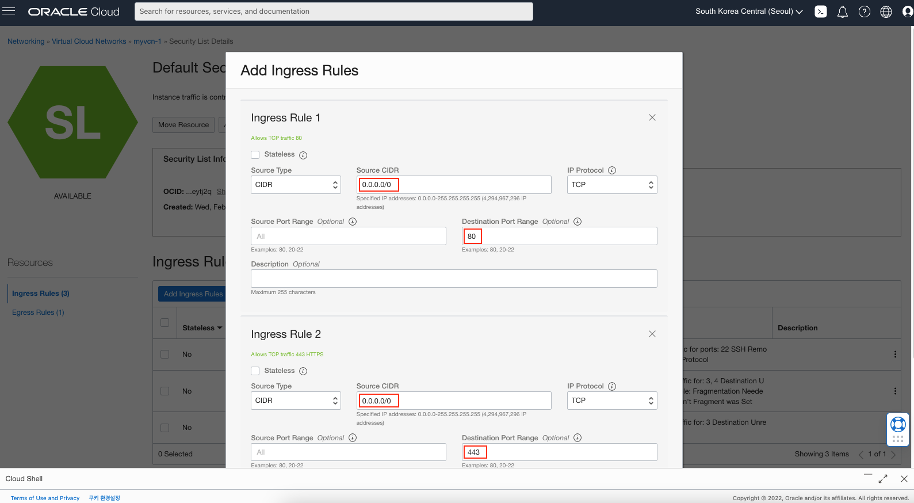

# 환경 구성 및 VCN, Subnet 생성

## 소개

Rancher 배포를 위한 네트워크 환경을 구성합니다.

소요시간: 30 minutes

### 목표

- OCI VCN 이해
- OCI VCN 생성

### 사전 준비사항

1. 실습을 위한 노트북 (Windows, MacOS)
1. Oracle Free Tier 계정

## Task 1: OCI Console 로그인

   OCI에 로그인합니다. 

1. 로그인하면 다음과 같은 홈 화면을 볼 수 있습니다. 좌측 상단의 햄버거 모양의 아이콘을 클릭하면 OCI의 모든 메뉴를 확인할 수 있습니다. 

  

1. Dashboard를 클릭하면 기본적인 사용현황을 살펴볼 수 있습니다.

  

## Task 2: OCI 인프라스트럭처 기본 설정

> **Note**: 화면 언어는 English로 설정하고 진행합니다. 언어 변경은 우측 상단의 **Language** 아이콘을 선택하고 변경할 수 있습니다.

1. 좌측 상단의 **햄버거 아이콘**을 클릭하고, **Identity & Security**을 선택한 후 **Compartments**를 클릭합니다.

 

1. **Create Compartment**를 클릭합니다.

   

1. 다음과 같이 입력:
      - Name: Enter **CloudNativeHandsOn**
      - Description: **클라우드 네이티브 실습 구획**
      - Parent Compartment: 부모 구획으로 기본 선택되는 root 구획 선택
      - **Create Compartment** 클릭

  

## Task 3: VCN과 Subnet 생성

1. 좌측 상단의 **햄버거 아이콘**을 클릭하고, **Networking**, **Virtual Cloud Networks** 선택

  

1. 이전 랩에서 생성한 Compartment (CloudNativeHandsOn) 선택를 선택.
1. **Start VCN Wizard**를 클릭하고, **VCN with Internet Connectivity** 선택, **Start VCN Wizard** 클릭

  

1. 생성할 VCN 이름 입력 (e.g. `myvcn-1`)후 **Next** 클릭 (CIDR 블럭은 기본 값을 사용합니다.)

  

1. **Create** 클릭

  

## Task 4: Security List에 Rancher를 위한 포트 추가
  Security List 는 클라우드 인프라 수준에서 제공하는 방화벽과 같은 개념입니다. 생성된 VCN의 Subnet을 선택하여 다음과 같이 **80** 포트와 **443** 포트를 추가합니다.

1. 생성한 VCN 선택 후 Public Subnet을 선택합니다.

  

1. Security List를 선택합니다.

  

1. **Add Ingress Rules를 클릭하고 다음과 같이 입력합니다.**

  Ingress Rules 1
  - Source CIDR: 0.0.0.0/0
  - Destination Port Range: 80

  Ingress Rules 2
  - Source CIDR: 0.0.0.0/0
  - Destination Port Range: 443

  

[다음 랩으로 이동](#next)
