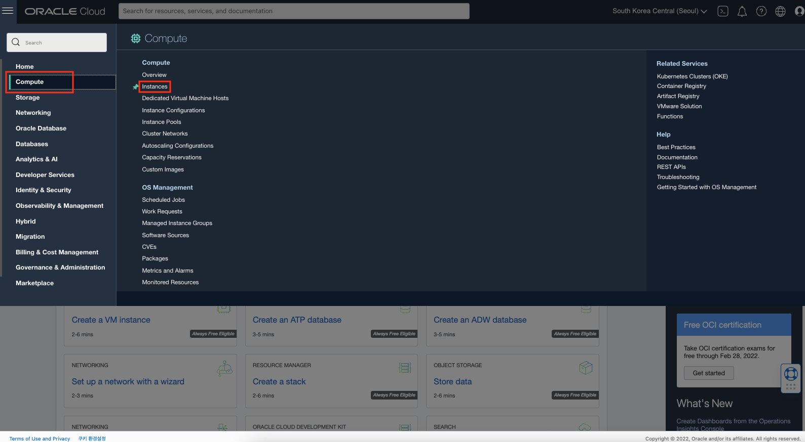
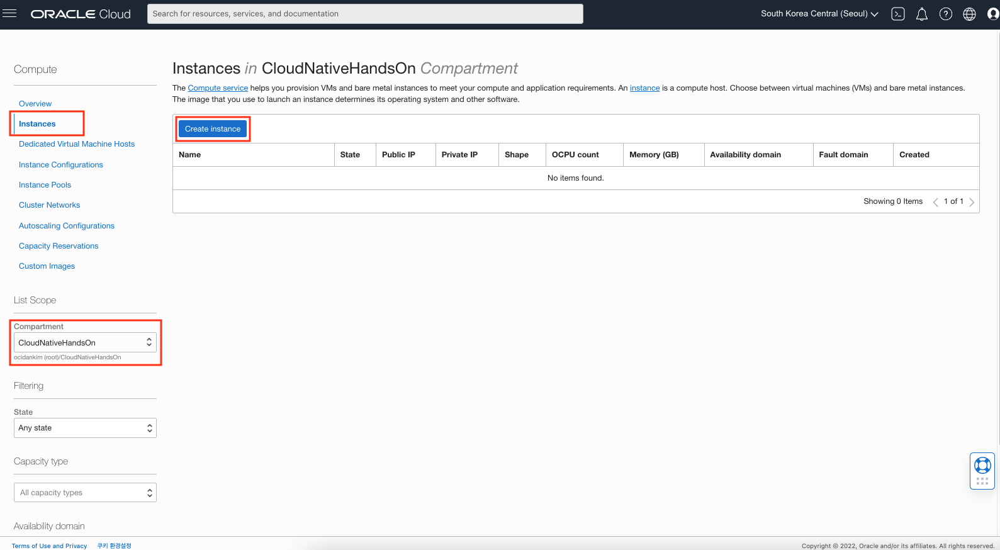
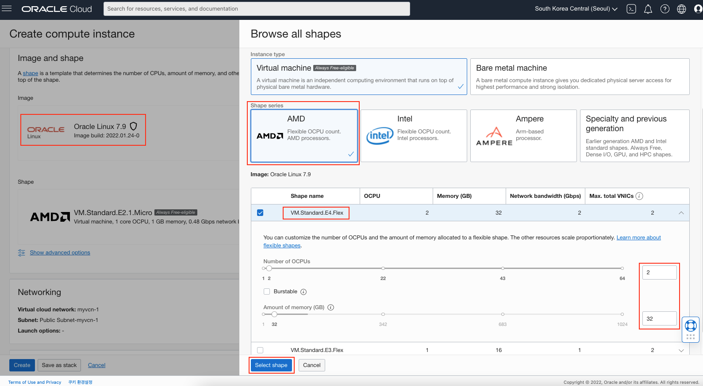
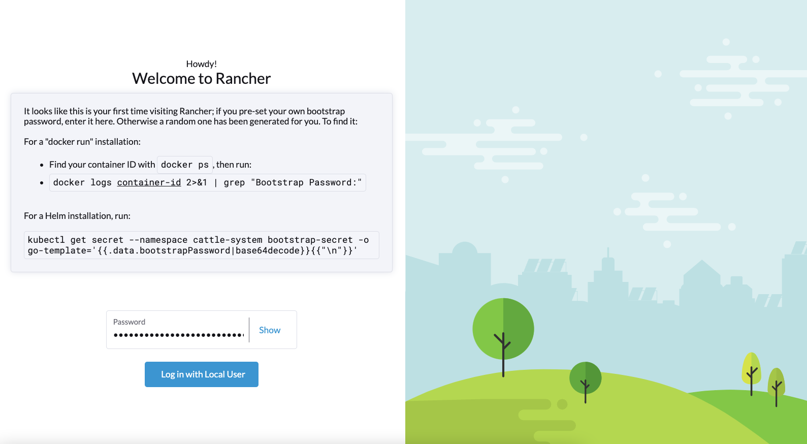
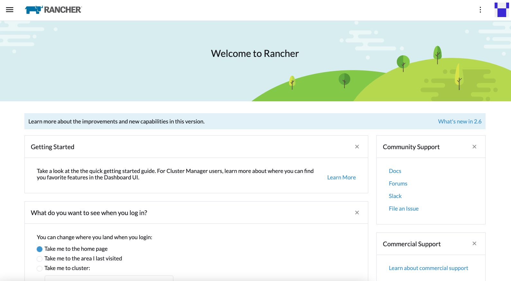

# Rancher 배포

## 소개

OCI Compute Instance에 Rancher를 배포하는 실습입니다.

소요시간: 30 minutes

### 목표

- OCI Instance 생성
- Rancher 배포

### 사전 준비사항

1. 실습을 위한 노트북 (Windows, MacOS)
1. Oracle Free Tier 계정
1. Lab 1 완료

## Task 2: OCI Compute Instance 생성

1. 좌측 상단의 **햄버거 아이콘**을 클릭하고, **Compute***을 선택한 후 **instances**를 클릭합니다.

 

1. 좌측 메뉴중에서 **Instnaces**선택하고, 앞에서 생성한 Compartment (e.g. CloudNativeHandsOn)를 선택, **Create Instance**를 클릭합니다.

   

1. 기본 정보를 다음과 같이 입력:
      - Name: Enter **Rancher**
      - Create in compartment: 앞에서 생성한 Compartment (e.g. CloudNativeHandsOn) 선택

1. Image and Shape 입력을 위해 우측 **Edit** 클릭 후 다음과 같이 선택
  
      - Image: **Oracle Linux 7.9** 선택 
      >**Note**: Oracle Linux 8.x 버전에서는 **k3s exited with: exit status 255** 이슈가 있음. [[Installing Rancher using Docker failed with error 'k3s exited with: exit status 255']](https://github.com/rancher/rancher/issues/35892)
      - shape: **Edit** 클릭 후 **Shape**을 **AMD**의 **VM.Standard.E4.Flex**

  

1. **Add SSH Keys**에서 **Generate a key pair for me** 선택 후 **Save Private Key**, **Save Public Key** 클릭하여 키 다운로도, 마지막으로 **Create** 클릭하여 인스턴스 생성

  

> **Note**: 생성되는 키는 **Open SSH Key**로 Linux 환경에서 SSH로 터미널 접속시 사용합니다. 클라이언트가 윈도우 환경에서 접속하는 경우에는 변경이 필요할 수 있습니다. (e.g. Putty 사용 시 PuttyGen을 이용하여 키변환 필요)

## Task 3: CloudShell을 활용하여 Rancher 배포
1. 본 실습에서는 **Cloud Shell**을 활용하여 생성한 인스턴스에 접속합니다. 우측 상단의 **Cloud Shell** 아이콘을 클릭한 후 Cloud Shell 메뉴에서 **SSH Key**업로드를 위해 **Upload**를 클릭합니다.

  

1. Cloud Shell에 Private SSH Key(.pub이 안붙어 있는 파일)를 업로드합니다.

  

1. 다음과 같이 키의 권한을 변경합니다.

    ````shell
    <copy>
    chmod 600 ssh-key-20xx-xx-xx.key
    </copy>
    ````

1. ssh 키를 활용하여 생성된 인스턴스에 접속합니다. 인스턴스의 Public IP는 생성된 인스턴스 목록에서 확인할 수 있습니다.

  

1. Docker CE 설치를 위한 관련 패키지 설치를 위해서 oraclelinux-deverloper-ol7 repository를 활성화합니다.

    ````shell
    <copy>
    sudo vi /etc/yum.repos.d/oraclelinux-developer-ol7.repo
    </copy>
    ````
1. [ol7_developer]를 enable 값을 0에서 1로 변경하고 저장합니다.

    ````shell
    [ol7_developer]
    name=Oracle Linux $releasever Development Packages ($basearch)
    baseurl=https://yum$ociregion.$ocidomain/repo/OracleLinux/OL7/developer/$basearch/
    gpgkey=file:///etc/pki/rpm-gpg/RPM-GPG-KEY-oracle
    gpgcheck=1
    enabled=1
    ````
1. slirp4netns, fuse-overlayfs를 설치합니다.
  ````shell
  <copy>
  sudo yum install -y slirp4netns fuse-overlayfs
  </copy>
  ````
    
1. Cloud Shell에 다음과 같은 파일을 하나 생성합니다.

    ````shell
    <copy>
    vi rancher-deploy.sh
    </copy>
    ````

1. 다음 스크립트 내용을 복사하여 위에서 생성한 파일에 붙여넣기 하고 저장합니다.
    ````shell
    <copy>
    #!/bin/sh
    sudo systemctl stop firewalld
    sudo systemctl disable firewalld
    sudo yum-config-manager --add-repo https://download.docker.com/linux/centos/docker-ce.repo
    sudo yum install -y docker-ce
    sudo systemctl start docker
    sudo systemctl enable docker
    sudo setenforce 0
    sudo docker run -d -p 80:80 -p 443:443 --privileged --restart=unless-stopped rancher/rancher:stable
    </copy>
    ````

  

1. 스크립트를 실행할 수 있도록 권한을 변경합니다.

    ````shell
    <copy>
    chmod 700 rancher-deploy.sh
    </copy>
    ````

1. 스크립트를 실행합니다.

    ````shell
    <copy>
    ./rancher-deploy.sh
    </copy>
    ````

1. Sample Response:

    ````shell
    .....
    0bbf7579a568: Pull complete 
    eaa5d6336f95: Pull complete 
    608f536609b9: Pull complete 
    fcaf65f7937c: Pull complete 
    e4ea550002d9: Pull complete 
    9d698b9289d2: Pull complete 
    caa4144aedf1: Pull complete 
    Digest: sha256:f411ee37efa38d7891c11ecdd5c60ca73eb03dcd32296678af808f6b4ecccfff
    Status: Downloaded newer image for rancher/rancher:latest
    6f963ede5758b4ae521590b0c7c300455978407108d672b925fe199faa82a108
    ````

## Task 4: 접속

1. 관리자 패스워드를 확인하기 위해서 Container ID를 확인합니다.
    ````shell
    <copy>
    sudo docker ps
    </copy>
    ````

1. 위에서 확인한 Container ID로 다음 명령어를 실행하여 패스워드를 확인합니다.
    ````shell
    <copy>
    sudo docker logs bdfcc0f1d658 2>&1 | grep "Bootstrap Password:"
    </copy>
    ````

    Sample Response:
    ````
    2022/02/22 07:51:36 [INFO] Bootstrap Password: pltb62fhjw2tjjcb4qvsg26rm62px4v9z4m68hrsqzzdm8s9srxxxx
    ````

1. 브라우저에서 **http://[Public IP]**로 접속합니다. 위에서 확인한 패스워드를 사용하여 로그인합니다.

  

1. 패스워드를 재설정한 후 **Continue**를 클릭합니다.

  

1. Rancher 설치를 완료하였습니다.

  

[다음 랩으로 이동](#next)
