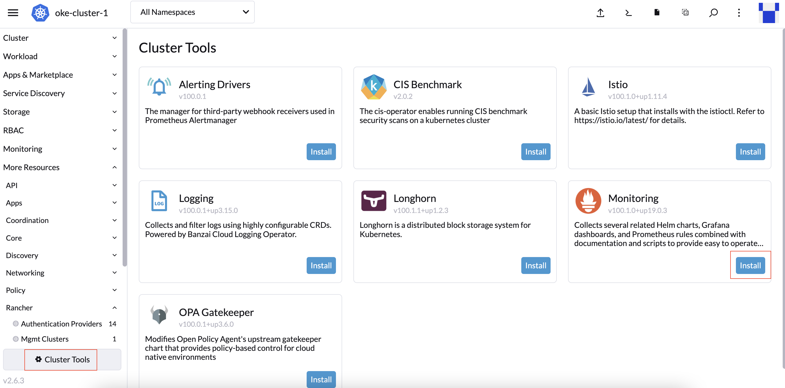
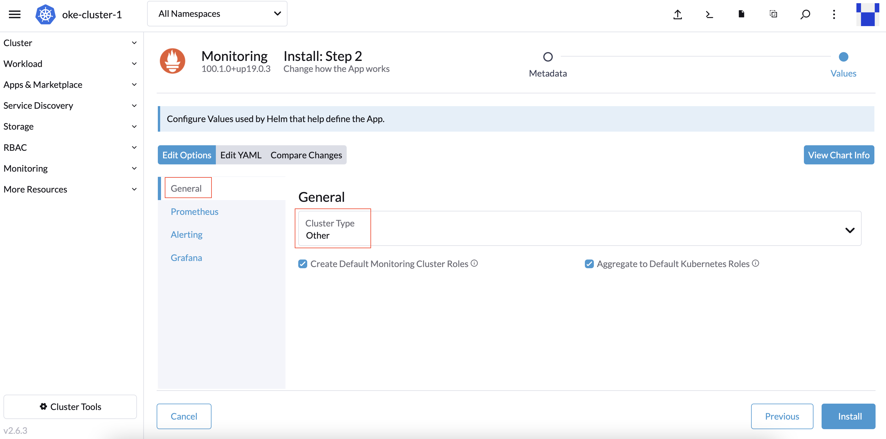
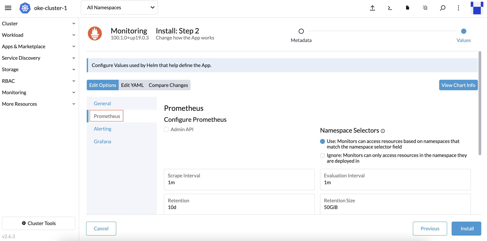
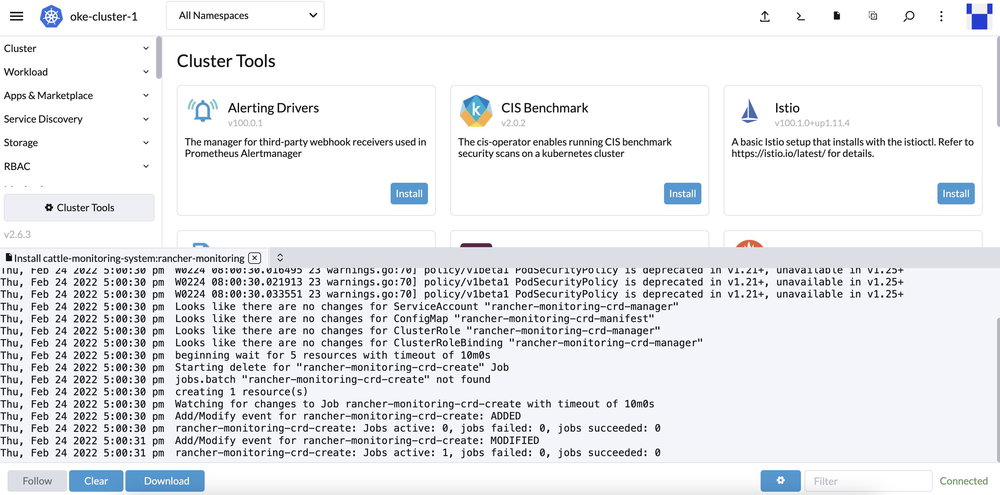
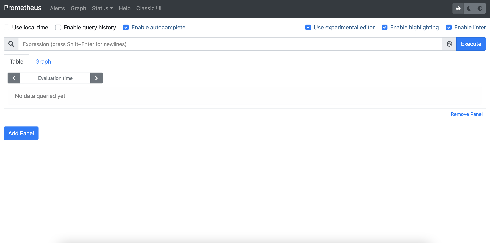

# OKE 모니터링

## 소개

OCI에서 제공되는 OKE 모니터링 대시보드에 대해서 살펴보고, Rancher 환경에서 Oracle Kubernetes Engine (OKE) 모니터링을 위한 Prometheus , Grafana 설치 및 구성을 실습힙니다.

소요시간: 30 minutes

### 목표

- OKE Dashboard 이해
- Kubernetes 클러스터 모니터링 구성 및 이해

### 사전 준비사항

1. 실습을 위한 노트북 (Windows, MacOS)
1. Oracle Free Tier 계정
1. Lab 3 완료

## Task 1: OKE Metrics 보기

1. *OKE Cluster Metrics:* **Developer Services -> Kubernetes Clusters -> <클러스터 이름>** 로 이동
> **Note**: 클러스터 이름은 Rancher에서 자동으로 할당된 이름으로 생성이 됩니다. Rancher의 Cluster이름과 OKE의 Cluster이름은 다르게 되어 있지만, Rancher의 Cluster 상세 페이지에서 실제 OKE의 클러스터 이름을 확인할 수 있습니다.

2. **Resources -> Metrics** 아래에서 다음 매트릭 대시보드 확인

      * Unschedulable Pods: Pod를 스케쥴하기 위한 리소스가 충분하지 않은 경우 노드풀 확장 작업을 트리거하는데 사용
      * API Server requests per second: Kubernetes API Server에서 발생하는 기본적인 성능문제를 확인하는데 도움
3. 이러한 매트릭은 OCI Monitoring 콘솔에서 **oci_oke**라는 네임스페이스를 통해서 볼 수 있습니다. 또한 산업 표준 통계, 트리거 작업, 시간 간격을 사용해서 알람 기능을 추가할 수 있습니다.

    

4. *OKE Node Pool Metrics:* **Developer Services -> Kubernetes Clusters -> <클러스터 이름> -> Node Pools -> <노드풀 이름>** 로 이동

    다음의 노드풀 매트릭스 정보 확인:

    * Node State (Worker 노드가 OCI Compute Service를 통해서 활성화된 상태로 인지될 때)
    * Node condition (Worker노드가 OKE API Server를 통해서 Ready 상태로 인지될 때)

    

5. *OKE Worker Node Metrics:* **Developer Services -> Kubernetes Clusters -> <클러스터 이름> -> Node Pools -> <노드풀 이름> -> Nodes -> <노드 이름>**

    다음의 노드 매트릭스 정보 확인:

    * CPU의 활동 수준. 총 시간(사용 중 및 유휴) 대 유휴 시간의 백분율로 표시됩니다. 일반적인 경보 임계값은 90%입니다.
    * 현재 사용중인 공간. 페이지로 측정됩니다. 사용된 페이지와 사용하지 않은 페이지의 비율로 표시됩니다. 일반적인 경보 임계값은 85%입니다.
    * I/O 읽기 및 쓰기의 활동 수준. 초당 읽기/쓰기로 표시됩니다.
    * 읽기/쓰기 처리량. 초당 읽기/쓰기 바이트로 표시됩니다.
    * 네트워크 수신/전송 처리량. 초당 수신/전송 바이트로 표시됩니다.

    

## Task 2: Rancher에서 Monitoring (Prometheus, Grafana) 구성

1. Rancher Home에서 생성한 클러스터를 클릭합니다.

 

1. **Cluster Tools**를 클릭한 후 **Monitoring** 항목의 **Install**버튼을 클릭합니다.

 

1. 최신 버전을 선택한 후, **Install into Project**로 **System**으로 선택하고, **Next**를 클릭합니다.

 

1. **General** 항목에서 **Cluster Type**을 **Other**로 선택합니다.

 

1. **Prometheus** 항목에서 기본으로 설정합니다.

 

1. **Grafana** 항목에서 **Grafana Storage**를 Pod 리스타트로 유실되지 않도록 **Enable with StatefulSet Template**으로 생성합니다. 이때 사용되는 PVC 템플릿을 다음과 같이 정의한 후 **Install**을 클릭합니다.

  - Size: 50GB
  - Storage Class Name: oci-bv
  - Access Mode: ReadWriteOne

 

1. 설치가 진행되는 로그 트레일을 확인할 수 있습니다.

 

## Task 3: Grafana Dashboard및 Prometheus Graph 확인

1. 설치가 완료되면 좌측 **Monitoring** 메뉴를 클릭한 후, **Grafana**의 **Metrics Dashboards**를 클릭합니다.

 

1. Grafana Dashboard를 확인합니다.

 

1. 동일하게 Prometheus Graph도 확인합니다.

 

## Task 4: 참고 (OPTIONAL)
OKE 환경에서 Grafana, Prometheus 구성에 대한 추가적인 참고자료입니다.

1. OKE에 Prometheus, Grafana 설치 블로그 포스트입니다. (영문)
    > https://blogs.oracle.com/cloudnative/post/monitoring-oke-with-prometheus-and-grafana

1. 다중 OKE Cluster 모니터링을 위해 Prometheus, Thanos, Grafana 구성에 대한 블로그 포스트입니다. (영문)
    > [PART 1] https://medium.com/oracledevs/monitoring-multiple-oke-clusters-with-prometheus-thanos-and-grafana-part-1-df11df7013f1  
    > [PART 2] https://medium.com/oracledevs/monitoring-multiple-oke-clusters-with-prometheus-thanos-and-grafana-part-2-77d2f0303ea0

1. 오라클에서 제공하는 MSA 샘플 애플리케이션인 **MuShop**과 관련된 유틸리티(Prometheus, Grafana 포함)를 한번에 설치할 수 있는 Helm Chart에 대한 가이드입니다 (한글)
    > https://mangdan.github.io/learning-library/oci-library/intro-cloud-native/livelabs/index.html?lab=msa-deploy#Task2:HelmCluster

1. 와스고수님의 OKE Cluster 모니티링을 위한 Prometheus, Grafana 구성 (한글, 유튜브)
    > https://www.youtube.com/watch?v=a02F0Fpjl8I

1. OKE외에 OCI에 대한 모니터링을 위해 오라클에서 제공하는 Grafana Plugin (영문)
    > https://github.com/oracle/oci-grafana-metrics

Congratulations!
Oracle Kubernetes Engine (OKE) with Rancher 교육을 모두 수료하였습니다.